Vol 1: Technical Proposal

Doc. Reference: BD-OSE-PROP-0843 Issue Date: 2025-05-16

Classification: OHB CONFIDENTIAL

Doc.Ref.: BD-OSE-PROP-0843

Date: 2025-05-15

Vol 1: Technical Proposal

# DISTRIBUTION LIST

| Name | No. of Copies | Company/Organisation |  |  |
|------|---------------|----------------------|--|--|
|      |               | MDA                  |  |  |
|      |               |                      |  |  |
|      |               |                      |  |  |

Vol 1: Technical Proposal

Doc.Ref.: BD-OSE-PROP-0843

Date: 2025-05-15

# TABLE OF CONTENTS

| 1. INTRODUCTION                                               | 7  |
|---------------------------------------------------------------|----|
| 2. APPLICABLE AND REFERENCE DOCUMENTS                         | 8  |
| 2.1 Applicable Documents                                      | 8  |
| 2.2 Reference Documents                                       | 8  |
| 3. ABBREVIATIONS AND DEFINITIONS                              | g  |
| 3.1 Acronyms and Abbreviations                                |    |
| 3.2 Definitions                                               |    |
| 4. AOCS SCOE OPERATIONAL MODES                                | 10 |
| 5. DESCRIPTION OF HARDWARE DESIGN                             | 14 |
| 5.1 SCOE Controller Computer                                  |    |
| 5.2 Real Time Machine                                         | 15 |
| 5.2.1 UART module - IO505                                     | 15 |
| 5.2.2 Analog module - IO131                                   | 16 |
| 5.2.3 Digital module – IO204-24-LS-Performance                | 17 |
| 5.2.4 CAN bus module – IO603                                  | 17 |
| 5.3 Power Distribution Unit                                   | 17 |
| 5.4 Spacecraft Electrical Interface Panel                     | 18 |
| 5.5 Environmental Conditions                                  | 19 |
| 6. SCOE CONTROL AND MONITORING                                | 20 |
| 6.1 Local operation - SCOE Controller applications and RAMSES | 20 |
| 6.1.1 Parameter datasets                                      |    |
| 6.2 Remote operation - EDEN and PUS-services                  | 21 |
| 6.2.1 Supported PUS-services                                  |    |
| 6.3 Mission Information Base (MIB)                            | 22 |
| 7. SIMULATION MODELS                                          | 23 |
| 7.1 Environment Model                                         | 23 |
| 7.2 Torque and Forces                                         | 23 |
| 7.3 Attitude Dynamics                                         | 23 |
| 7.4 Orbit Dynamics                                            |    |
| 7.5 Sensors                                                   | 24 |
| 7.5.1 Sun Sensor                                              | 24 |
| 7.5.2 Rate Sensor                                             | 24 |

Doc.Ref.: BD-OSE-PROP-0843

Date: 2025-05-15

# Vol 1: Technical Proposal

| 7.5.3 Magnetometer                                                                           | 25 |
|----------------------------------------------------------------------------------------------|----|
| 7.6 Actuators                                                                                | 25 |
| 7.6.1 Reaction Wheels                                                                        | 25 |
| 7.6.2 Electric Propulsion Thrusters                                                          | 27 |
| 7.6.3 Torque Rods                                                                            | 27 |
| 7.6.4 SADA                                                                                   | 28 |
| 7.7 Equipment Power Status                                                                   | 28 |
| 7.8 Initial conditions                                                                       | 28 |
| 7.9 Fault injection capabilities                                                             | 28 |
| 8. SELF-TEST AND DIAGNOSTICS                                                                 | 30 |
| 9. TRANSPORTATION AND PACKAGING                                                              | 31 |
| 10. TRAINING                                                                                 | 32 |
| 11. DOCUMENTATION                                                                            | 33 |
| 12. DEVELOPMENT PLAN                                                                         | 34 |
| 12.1 Co-engineering                                                                          | 34 |
| 12.2 Hardware Detailed Design                                                                | 35 |
| 12.3 Software Detailed Design                                                                | 35 |
| 12.4 Assembling and Testing, Safe Mode                                                       | 35 |
| 12.5 Shipment of Unit A                                                                      | 36 |
| 12.6 Development, Assembling and Testing, Remaining features                                 | 36 |
| 12.7 Test support                                                                            | 36 |
| 12.8 Long term Maintenance (Optional)                                                        | 37 |
| 12.9 Deliverables                                                                            |    |
| ANNEX A EQUIPMENT INTERFACE ANALYSIS                                                         | 40 |
| 12.9.1 Rate sensor                                                                           |    |
| 12.9.2 Magnetometer                                                                          |    |
| 12.9.3 Sun sensor                                                                            |    |
| 12.9.4 Thrusters                                                                             |    |
| 12.9.5 Reaction Wheels                                                                       |    |
| 12.9.6 SADA                                                                                  |    |
| 12.9.7 Start tracker stimulator                                                              |    |
| 12.9.8 GNSS Stimulator                                                                       | 44 |
| ANNEX B STATEMENT OF COMPLIANCE TO MDA SPECIFICATION A AURORA P/F AOCS SCOE (5039422 REV P1) |    |

Doc.Ref.: BD-OSE-PROP-0843

Date: 2025-05-15

Vol 1: Technical Proposal

Doc.Ref.: BD-OSE-PROP-0843

Date: 2025-05-15

Vol 1: Technical Proposal

# LIST OF FIGURES

| Figure 4-1: AOCS SCOE with emulated reaction wheels and internal management of         |  |
|----------------------------------------------------------------------------------------|--|
| position, velocity and time12                                                          |  |
| Figure 4-2: AOCS SCOE with reaction wheels "in the loop". GNSS Stimulator provides the |  |
| simulation with position, time and velocity13                                          |  |
| Figure 5-1: AOCS SCOE will be built in a 19" rack. (Exact configuration TBD14          |  |
| Figure 5-2: SCOE Controller (exact model TBD)14                                        |  |
| Figure 5-3: Speedgoat, real-time machine (example configuration)15                     |  |
| Figure 5-4: IO505, Speedgoat UART interface card16                                     |  |
| Figure 5-5: IO131, Speedgoat analog interface card16                                   |  |
| Figure 5-6: IO204, Speedgoat digital interface card17                                  |  |
| Figure 5-7: IO603, Speedgoat CAN-bus interface card17                                  |  |
| Figure 5-8: Power Distribution Unit example (exact unit TBD)18                         |  |
| Figure 6-1: RAMSES core modules - OHB Sweden inhouse EGSE control SW20                 |  |
| Figure 6-2: RAMSES Control SW layout screens21                                         |  |
| LIST OF TABLES                                                                         |  |
| Table 1: Applicable Documents8                                                         |  |
| Table 2: Reference Documents8                                                          |  |
| Table 3: Acronyms and Abbreviations List9                                              |  |
| Table 4: Definition List9                                                              |  |
| Table 5: SCOE modes and electrical interface11                                         |  |
| Table 6: Connectors on SCOE spacecraft connection panel19                              |  |
| Table 7: MAG TM/TC that the SCOE will support25                                        |  |
| Table 8: Reaction wheel telemetry that the AOCS SCOE will support26                    |  |
| Table 9: Reaction wheel telecommands that the SCOE will support27                      |  |
| Table 10: Assumed applicability for modes34                                            |  |

Doc.Ref.: BD-OSE-PROP-0843

Date: 2025-05-15

Vol 1: Technical Proposal

## **1. INTRODUCTION**

This document presents a proposal by OHB-Sweden for an AOCS Special Check-Out Equipment (SCOE), in response to a request from MDA. It provides both a technical overview of the proposed solution and a description of a suggested project development process, tailored to align with MDA's schedule and requirements.

The AOCS SCOE is a Hardware-in-the-Loop (HIL) testing platform designed for the Attitude and Orbit Control System (AOCS) sub-system. Its primary function is to electrically emulate the AOCS actuators and sensors in real time. By simulating both the spacecraft and its surrounding environment, the SCOE enables the on-board computer (OBC) under test to operate as if it were interacting with the actual spacecraft in orbit.

Doc.Ref.: BD-OSE-PROP-0843

Date: 2025-05-15

Vol 1: Technical Proposal

## **2. APPLICABLE AND REFERENCE DOCUMENTS**

## **2.1 APPLICABLE DOCUMENTS**

This document shall be read in conjunction with documents listed hereafter, which form part of this document to the extent specified herein. In case of a conflict between any provisions of this document and the provisions of the documents listed hereafter, the content of the contractually higher document shall be considered as superseding.

| AD    | Doc. Ref. | Issue | Title                                                  |
|-------|-----------|-------|--------------------------------------------------------|
| [AD1] | 5039422   | 1     | Specification and Mini-SoW for Aurora P/F AOCS SCOE |
| [AD2] |           |       |                                                        |
| [AD3] |           |       |                                                        |

**Table 1: Applicable Documents**

## **2.2 REFERENCE DOCUMENTS**

The following documents contain supporting information and are referenced to throughout this document.

| RD    | Doc. Ref | Issue | Title |
|-------|----------|-------|-------|
| [RD1] |          |       |       |
| [RD2] |          |       |       |
| [RD3] |          |       |       |

**Table 2: Reference Documents**

Doc.Ref.: BD-OSE-PROP-0843

Date: 2025-05-15

Vol 1: Technical Proposal

## **3. ABBREVIATIONS AND DEFINITIONS**

## **3.1 ACRONYMS AND ABBREVIATIONS**

The list in [\[RD1\]](#page-7-5) contains the general acronyms and abbreviations for this project. Additional, more specific abbreviations are listed in [Table 3](#page-8-3) of this document.

| Acronyms and Abbreviations |                                   |  |  |  |
|----------------------------|-----------------------------------|--|--|--|
| AC                         | Alternating Current               |  |  |  |
| AOCS                       | Attitude and Orbit Control System |  |  |  |
| ARW                        | Angular Random Walk               |  |  |  |
| CCS                        | Central Checkout System           |  |  |  |
| CoM                        | Centre of Mass                    |  |  |  |
| MCI                        | Mass, Interia, Centering          |  |  |  |
| MoI                        | Moment of Intertia                |  |  |  |
| OBC                        | On-board Computer                 |  |  |  |
| OSE                        | OHB-Sweden                        |  |  |  |
| RRW                        | Rate Random Walk                  |  |  |  |
| RW                         | Reaction Wheel                    |  |  |  |
| SADA                       | Solar Array Driving Assembly      |  |  |  |
| SCOE                       | Special Check-Out Equipment       |  |  |  |
| STS                        | Star Tracker Sensor               |  |  |  |

**Table 3: Acronyms and Abbreviations List**

# **3.2 DEFINITIONS**

The list in [\[RD1\]](#page-7-5) contains the general definitions for this project. Additional, more specific definitions are listed in [Table 4](#page-8-4) of this document.

| Definitions |  |  |  |  |
|-------------|--|--|--|--|
|             |  |  |  |  |
|             |  |  |  |  |
|             |  |  |  |  |
|             |  |  |  |  |

**Table 4: Definition List**

Doc.Ref.: BD-OSE-PROP-0843

Date: 2025-05-15

Vol 1: Technical Proposal

## **4. AOCS SCOE OPERATIONAL MODES**

The AOCS SCOE will be designed to provide the following operational modes (depending on the component)

- 1. **Emulation** The SCOE fully emulates the behaviour of real equipment during simulations, allowing the system to operate as if the actual hardware were present.
- 2. **Stimulation** The SCOE provides simulated data (stimuli) to incorporate real sensors into the simulation environment. This can be achieved either:
  - a. Directly, if the sensor supports stimulation input, or
  - b. Indirectly, via a dedicated sensor stimulator unit.
- 3. **Hardware-in-the-Loop** When the actual actuator is connected to the On-Board Computer (OBC), the SCOE can synchronize its internal model of the actuator with the real hardware. This ensures a representative and accurate simulation of system behaviour under realistic conditions

Additionally, the SCOE will be able to manage position, velocity, and time data through two sources:

- 1. **Internal Models** Simulated data generated within the SCOE.
- 2. **GNSS Stimulator**  Supplies SCOE with position, velocity and time.

The expected AOCS SCOE operational modes for the AOCS components, along with their corresponding electrical interfaces, are summarized in [Table 5](#page-10-0) below. This table is based on an analysis of the available documentation and a set of assumptions detailed in [Annex A](#page-39-0).

|           |       |                 | Interface   |                                              |                                                                 |                                                    |                       |
|-----------|-------|-----------------|-------------|----------------------------------------------|-----------------------------------------------------------------|----------------------------------------------------|-----------------------|
| Equipment |       | Direction       | Emulation   |                                              | Stimulation/HW in loop                                          |                                                    |                       |
| Туре      | Qty   | Equipment       | (SCOE view) | Signal                                       | Interface                                                       | Signal                                             | Interface             |
|           |       | Reaction wheels | Input       | Torque Command Direction Command Wheel Speed |                                                                 | Torque Command Direction Command Wheel Speed | 1 x RS485 (per wheel) |
| ý         | 4     |                 | Output      | Direction                                    | 2 x RS485 (per wheel, P/R)                                      | N/A                                                | N/A                   |
| Actuators |       |                 | In          | ON/OFF                                       |                                                                 | No support                                         | No support            |
| tus       | 2     | Thrusters (PPU) | Output      | State                                        | 2 x RS485 (per PPU, P/R)                                        | No support                                         | No support            |
| ۸         |       |                 | Input       | Current command                              | CAN-bus                                                         | No support                                         | No support            |
|           | 3     | Torque Rods     | Output      | N/A                                          | N/A                                                             | No support                                         | No support            |
|           |       |                 | Input       | Angle command                                | 2 x RS485 (per SADA)                                            | No support                                         | No support            |
|           | 2     | SADA            | Output      | End-stops Temperature                     | 4 x Low Side Switches (per SADA) 2 x Analog Voltages (per SADA) | No support                                         | No support            |
|           |       |                 | Input       | N/A                                          | N/A                                                             | No support                                         | No support            |
|           | 4     | Sun sensors     | Output      | Cell voltage                                 | 8 x Analog voltage (per sensor)                                 | No support                                         | No support            |
|           |       | Rate sensor     | Input       | N/A                                          |                                                                 | No support                                         | No support            |
| Sensors   | 2     |                 | Output      | Angular rate Incremental angle               | 1 x RS422 (per sensor)                                          | No support                                         | No support            |
| Sei       |       |                 | Input       | N/A                                          | N/A                                                             | No support                                         | No support            |
|           | 1     | Magnetometer    | Output      | Magnetic field                               | 2 x RS485 (per sensor)                                          | No support                                         | No support            |
|           | 1     |                 | Input       | No support                                   | No support                                                      | N/A                                                | N/A                   |
|           | (TBC) | Star tracker    | Output      | No support                                   | No support                                                      | Attitude                                           | RS422                 |
| er        |       |                 | Input       | N/A                                          | N/A                                                             | Position Velocity Time                       | TCP/IP                |
| Other     | 1     | GNSS            | Output      | N/A                                          | N/A                                                             | N/A                                                | N/A                   |
|           |       |                 | Input       | On/Off commands                              | 2 x RS485 (only primary, one per controller)                    | N/A                                                | N/A                   |
|           | 1     | Power (PDU)     | Output      | N/A                                          | N/A                                                             | N/A                                                | N/A                   |

Table 5: SCOE modes and electrical interface

[Figure 4-1](#page-11-0) illustrates the simulation mode in which the reaction wheels are emulated, and internal environment models are utilized. [Figure 4-2](#page-12-0) depicts the configuration where actual reaction wheels are integrated into the simulation loop, and the SCOE receives input from the GNSS Stimulator.

The AOCS SCOE is expected to be controlled and monitored by a Central Checkout System (CCS) over TCP/IP. The CCS is responsible for executing both automated scripts and manual test procedures across the entire system. Local control of the AOCS SCOE will also be possible. See Chapter [6](#page-19-0) for more details how the SCOE will be controlled.

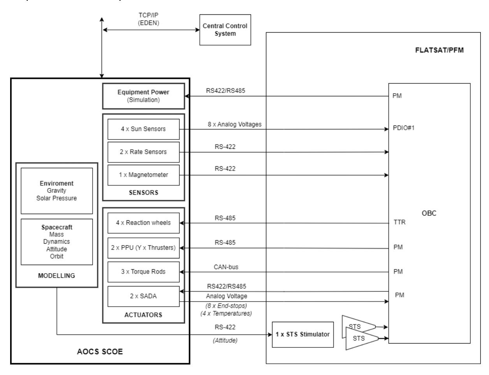

**Figure 4-1: AOCS SCOE with emulated reaction wheels and internal management of position, velocity and time.**

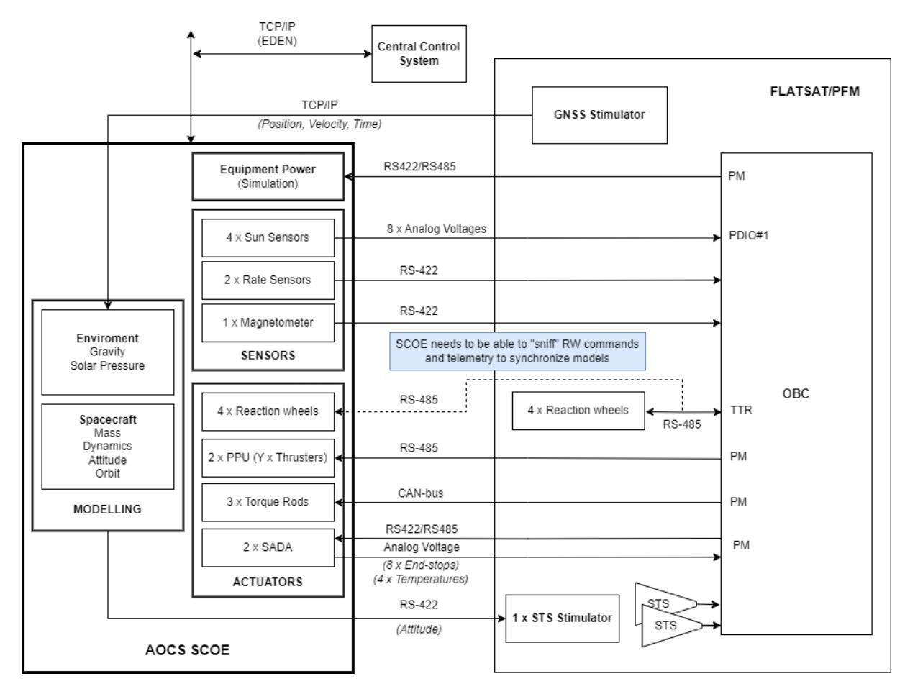

**Figure 4-2: AOCS SCOE with reaction wheels "in the loop". GNSS Stimulator provides the simulation with position, time and velocity.**

## **5. DESCRIPTION OF HARDWARE DESIGN**

The AOCS SCOE will consists of a rack computer (SCOE Controller), a real-time machine with I/O modules and interfacing connectors. The real-time machine and I/O modules are COTS items from Speedgoat. The units will be fitted into a 19″ rack.

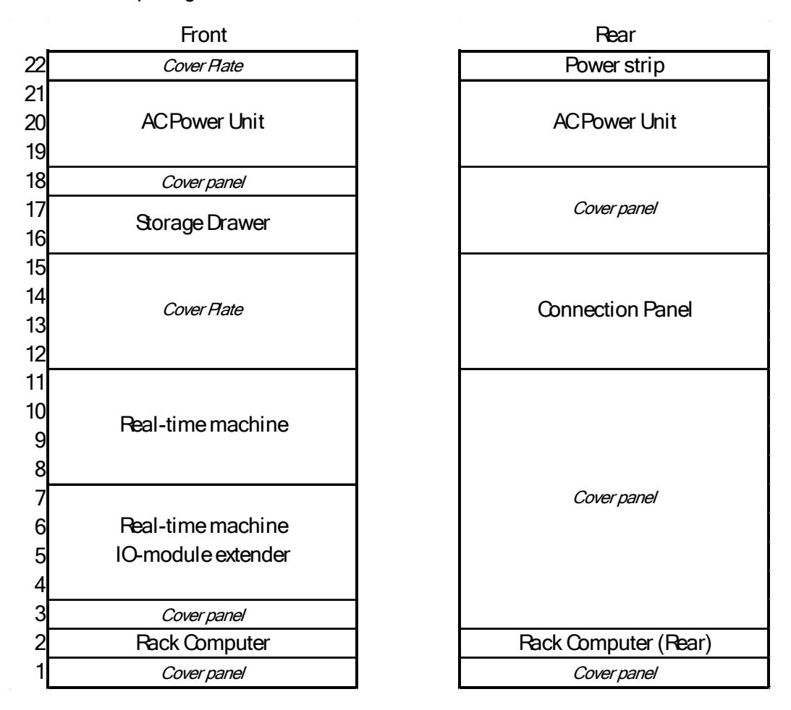

**Figure 5-1: AOCS SCOE will be built in a 19" rack. (Exact configuration TBD**

## **5.1 SCOE CONTROLLER COMPUTER**

The SCOE controller will be based on a rack-mounted workstation (exact model TBD) running Windows 11. It will be equipped with a software suite that enables simulation control, data logging, network connectivity, and includes a graphical user interface (see Chapter [6](#page-19-0) for more details).

The SCOE controller will be operated using standard desktop peripherals. 2 x Monitors, a mouse, and a keyboard (sourced locally by costumer, not included in delivery).

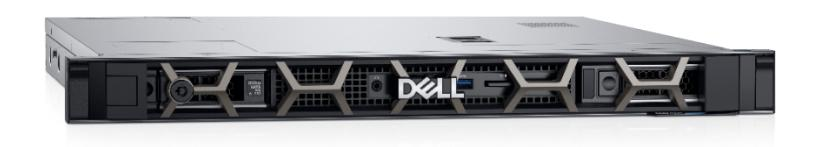

**Figure 5-2: SCOE Controller (exact model TBD).**

## **5.2 REAL TIME MACHINE**

The real-time machine is a "Performance real-time target machine P3" from the company Speedgoat. The machine is developed for hardware-in-the-loop (HIL) simulation and rapid control prototyping and provides a straightforward MATLAB & Simulink workflow integration through Simulink Real-Time.

The main unit is based on an x86 platform and is running the QNX operating system. It is capable of running simulation models with a 10ms loop time and can perform minor tasks such as I/O polling down to a 1ms loop time.

The status of the real-time machine is monitored by a standard computer monitor (sourced locally by costumer, not included in delivery).

**Figure 5-3: Speedgoat, real-time machine (example configuration)**

The base unit supports up to eleven I/O modules, with the option to expand further if needed. These modules provide a variety of electrical interfaces and are available as Simulink blocks, allowing for easy integration and automatic code generation to access the I/O hardware with minimum effort.

To meet the interface requirements identified in [Table 5,](#page-10-0) the Speedgoat system will have to be configured to support the following:

- 23 x RS422/RS485 channels
- 2 x CAN-bus channels
- 36 x Analog Voltage Out
- 8 x Digital Voltage Out

To fulfil these requirements, the Speedgoat will be equipped with the following IO-modules:

- 6 x UART Modules IO505 (see details in section [5.2.1](#page-14-1))
- 5 x Analog Modules IO131 (see details in section [5.2.2](#page-15-0))
- 1 x Digital Module IO204 (see details in section [5.2.3\)](#page-16-0)
- 1 x CAN-Bus Module IO603 (see details in section [5.2.4](#page-16-1))

## *5.2.1 UART module - IO505*

The IO505 I/O module is a galvanically isolated 4-channel, RS232-, RS422- and RS485 capable asynchronous serial module with Simulink driver blocks. The drivers are short-circuit current limited and thermally limited to protect them against excessive power dissipation. The module has a ±15 kV ESD rating.

The serial channels are individually programmable and the maximum supported baud rate for RS232 is 921.6 kbps and 5.5296 Mbps for RS422/RS485. The termination is software selectable for RS422 and RS485.

The AOCS SCOE will includes 6 of these cards.

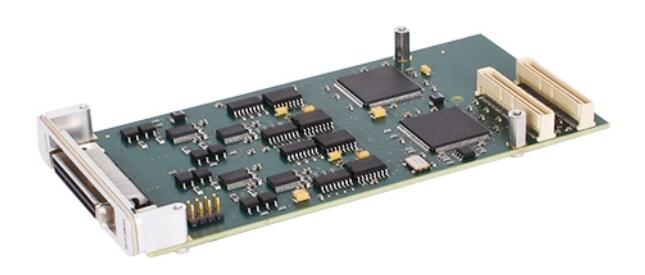

**Figure 5-4: IO505, Speedgoat UART interface card**

## *5.2.2 Analog module - IO131*

The IO131 I/O module is a simultaneous-sampling, 16-bit isolated analog input and output module with Simulink driver blocks. IO131 has 16 input channels and 8 output channels.

The analog inputs offer software selectable ±5 V and ±10 V bipolar input voltage ranges. It is are over-voltage protected up to ±16.5 V and have a 7kV ESD rating.

The analog outputs offer software selectable 0-5 V, 0-10 V, ±5 V and ±10 V output voltage ranges and has a 20 mA current limit.

The AOCS SCOE will includes 5 of these cards.

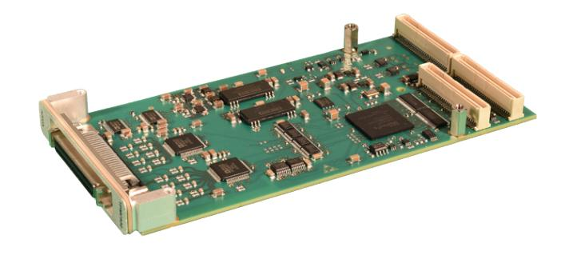

**Figure 5-5: IO131, Speedgoat analog interface card**

# *5.2.3 Digital module – IO204-24-LS-Performance*

The IO204 I/O module is a galvanically isolated digital input and output module with Simulink® driver blocks. The 16 digital inputs offer a 12 V or 24 V input range. The 16 digital outputs are available as high-side or low-side switches with a 6 V to 48 V output range.

All channels are galvanically isolated by opto-couplers. All outputs are protected against short-circuit and thermal overload and can output up to 0.5 A per channel.

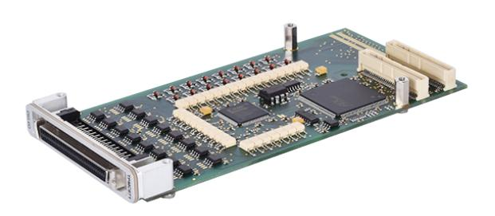

**Figure 5-6: IO204, Speedgoat digital interface card**

# *5.2.4 CAN bus module – IO603*

The IO603 I/O module offers an intelligent CAN interface with four channels supporting flexible data-rate CAN (CAN FD) and high-speed CAN (CAN HS), along with two additional LIN interfaces. This allows the real-time target machine to connect to any CAN and LIN device in automotive, industrial automation, machinery, and various other industries. Each channel supports software-configurable CAN bus terminations

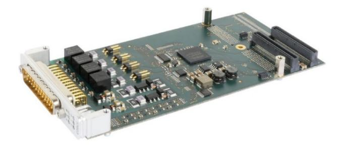

**Figure 5-7: IO603, Speedgoat CAN-bus interface card**

## **5.3 POWER DISTRIBUTION UNIT**

The power to all equipment in AOCS SCOE will be distributed from an AC power distribution unit. This unit has an AC mains inlet which connects to the wall socket in test facility. This unit will also have a manual emergency shut down button which when activated will cut off the AC power to all SCOE equipment.

The specific requirements of this unit will have to be agreed with MDA.

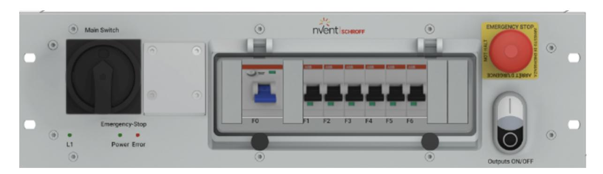

**Figure 5-8: Power Distribution Unit example (exact unit TBD).**

# **5.4 SPACECRAFT ELECTRICAL INTERFACE PANEL**

The IO-cards will connect to the interfacing spacecraft hardware via a connection panel, mounted on the rear of the rack, with several individual connectors.

The SCOE is expected to have the following connectors, [Table 6.](#page-18-1) To the largest extent possible DE-9 connectors will be used.

| Connector          | Unit             | Electrical          | Description                                               |
|--------------------|------------------|---------------------|-----------------------------------------------------------|
| ARS1               | Rate sensor 1    | 1xRS422             | Emulated sensor                                           |
| ARS2               | Rate sensor 2    | 1xRS422             | Emulated sensor                                           |
| MAG P              | Magnetometer     | 1xRS422             | Emulated sensor                                           |
| MAG R              | Magnetometer     | 1xRS422             | Emulated sensor                                           |
| FSS 1 P            | Sun Sensor 1     | 4 x Analog Voltages | Emulated sensor                                           |
| FSS 1 R            | Sun Sensor 1     | 4 x Analog Voltages | Emulated sensor                                           |
| FSS 2 P            | Sun Sensor 2     | 4 x Analog Voltages | Emulated sensor                                           |
| FSS 2 R            | Sun Sensor 2     | 4 x Analog Voltages | Emulated sensor                                           |
| FSS 3 P            | Sun Sensor 3     | 4 x Analog Voltages | Emulated sensor                                           |
| FSS 3 R            | Sun Sensor 3     | 4 x Analog Voltages | Emulated sensor                                           |
| FSS 4 P            | Sun Sensor 4     | 4 x Analog Voltages | Emulated sensor                                           |
| FSS 4 R            | Sun Sensor 4     | 4 x Analog Voltages | Emulated sensor                                           |
| PPU1 P             | PPU1 (Thrusters) | 1xRS485             | Emulated actuator                                         |
| PPU1 R             | PPU1 (Thrusters) | 1xRS485             | Emulated actuator                                         |
| PPU2 P             | PPU2 (Thrusters) | 1xRS485             | Emulated actuator                                         |
| PPU2 R             | PPU2 (Thrusters) | 1xRS485             | Emulated actuator                                         |
| RW1 P              | Reaction wheel 1 | 1xRS485             | Emulated actuator                                         |
| RW1 R / RW1 Mon | Reaction wheel 1 | 1xRS485             | Emulated actuator/ Monitoring during HW-in the loop |
| RW2 P              | Reaction wheel 2 | 1xRS485             | Emulated actuator                                         |
| RW2 R / RW2 Mon | Reaction wheel 2 | 1xRS485             | Emulated actuator/ Monitoring during HW-in the loop |
| RW3 P              | Reaction wheel 3 | 1xRS485             | Emulated actuator                                         |
| RW3 R / RW3 Mon | Reaction wheel 3 | 1xRS485             | Emulated actuator/ Monitoring during HW-in the loop |
| RW4 P              | Reaction wheel 4 | 1xRS485             | Emulated actuator                                         |

| RW4 R / RW4 Mon | Reaction wheel 4       | 1xRS485                                                                                    | Emulated actuator/ Monitoring during HW-in the loop |
|--------------------|------------------------|--------------------------------------------------------------------------------------------|-----------------------------------------------------------|
| STS Stim           | STS Stimulator data | 1xRS422                                                                                    | Stimuli output for STS Stimulator                      |
| SADA 1             | SADA 1                 | 4 x Low Side Switches (end-stops) 2 x Analog Voltages (temperatures) 2 x RS422/RS485 | Emulated actuator                                         |
| SADA 2             | SADA 2                 | 4 x Low Side Switches (end-stops) 2 x Analog Voltages (temperatures) 2 x RS422/RS485 | Emulated actuator                                         |
| PDU A              | PDU Controller A       | 1 x RS422/RS485                                                                            | Input for equipment power status                       |
| PDU B              | PDU Controller B       | 1 x RS422/RS485                                                                            | Input for equipment power status                       |
| CAN                | OBC                    | CAN-bus                                                                                    | For SCOE to get actuator commands and telemetry        |

**Table 6: Connectors on SCOE spacecraft connection panel**

The harness to interface the SCOE to the rest of the system will not be included in the delivery. Specification of the connectors will be shared by OHB-Sweden by the end of Phase 2 (see Chapter [12\)](#page-33-0) that enables MDA to design the harness they need for their rig.

## **5.5 ENVIRONMENTAL CONDITIONS**

The AOGNC SCOE is intended to be used within a controlled indoor environment of a test facility.

- Maximum altitude: 2000 m above sea level.
- Ambient operating temperature: 10 °C to 35 °C
- Ambient storage temperature: -20 °C to 65 °C
- Maximum relative humidity of 80% for temperatures up to 31 °C, decreasing linearly to 50% at 40 °C.

These values are based on the equipment described in this chapter.

# **6. SCOE CONTROL AND MONITORING**

The SCOE will be controllable both locally and remotely. Locally using the applications installed on the SCOE Controller, see Section [6.1](#page-19-1) below. The AOCS SCOE will also have a control interface over TCP/IP, see section [6.26.2.](#page-20-1)

## **6.1 LOCAL OPERATION - SCOE CONTROLLER APPLICATIONS AND RAMSES**

The AOCS SCOE will utilize the following RAMSES application to provide various features:

- **Sphinx**  Local GUI application to control and monitor the simulation. Provides customizable interface as the for the user.
- **Anubis** Archiving tool, stores all housekeeping data locally.
- **Nut**  Conversion tool for the Archive files stored by Anubis.
- **Obelisk** Overview tool that stores the transmission on the local RAMSES network.
- **Osiris** provides playback function of achieved data.
- **Ankh** System synchronizer (NTP server synchronization).

OHB Sweden's RAMSES suit of tools offers a highly capable satellite control, monitoring and test software solution used throughout industry leading space and rocket programs. Derived from over 30 years of experience in the space industry and used today inhouse by OHB Sweden since 2006, RAMSES is a well-established EGSE and Mission Control System.

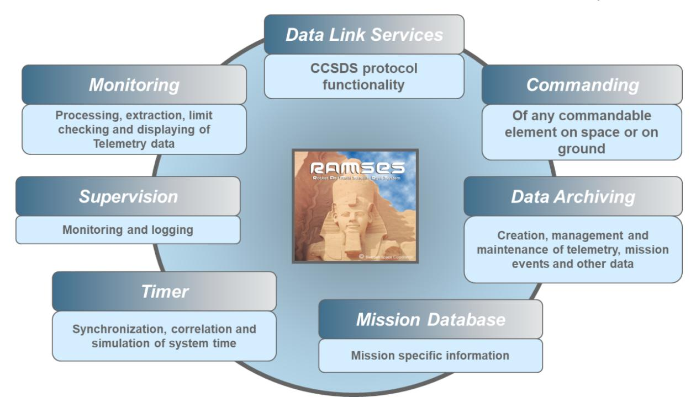

**Figure 6-1: RAMSES core modules - OHB Sweden inhouse EGSE control SW**

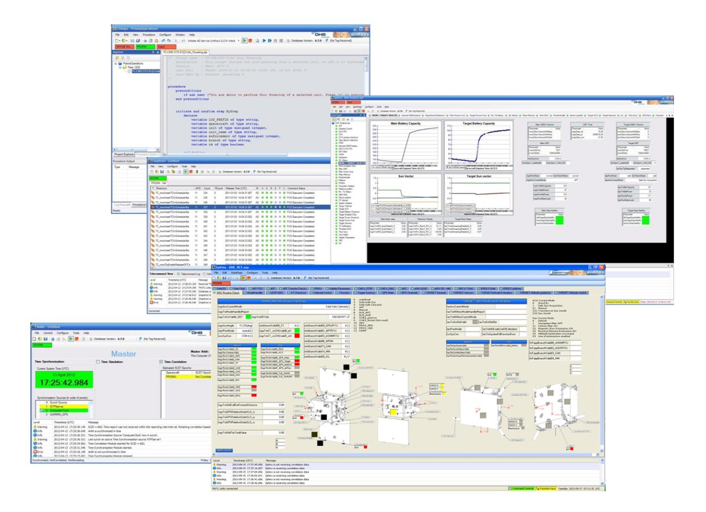

**Figure 6-2: RAMSES Control SW layout screens**

In addition to the RAMSES applications, the SCOE Controller will also host a custom-built application designed to manage the real-time machine and other backend operations, called SCCS.exe.

## *6.1.1 Parameter datasets*

Parameter calibration for the simulation will be stored as calibration files in the MATLAB ".mat" file format. A MATLAB license will not be provided as part of the AOCS SCOE; however, GNU Octave can be used as a free and compatible alternative for viewing and editing these files.

The SCOE will be delivered with a default dataset, which can serve as a baseline for further calibration activities. It is expected that MDA will be responsible for adapting the SCOE calibration to suit the requirements of various tests.

# **6.2 REMOTE OPERATION - EDEN AND PUS-SERVICES**

The AOCS SCOE will also have a control interface over TCP/IP, utilizing EDEN and PUS, services to control the system. The SCOE disc, with logged data, will be accessible as a shared drive.

## *6.2.1 Supported PUS-services*

The following PUS service types will be supported by the AOCS SCOE.

## **Service 1 - Request verification**:

TM[1,1] - Reporting successful acceptance.

- TM[1,2] Reporting failed acceptance.
- TM[1,7] Reporting successful completion of execution.
- TM[1,8] Reporting failed completion of execution.

## **Service 3 - Housekeeping**

- TC[3,1] Create housekeeping parameter reports structure.
- TC[3,3] Delete housekeeping parameter reports structure.
- TC[3,5] Enable the periodic generation of housekeeping parameter reports.
- TC[3,6] Disable the periodic generation of housekeeping parameter reports.
- TM[3,25] Housekeeping parameter report.
- TC[3,27] Generate a one-shot report for housekeeping parameter reports.
- TC[3,31] Modify the collection interval of housekeeping parameter reports.

## **Service 8 – Function Management**

- TC[8,1] Perform a function. Available functions:
  - o Control Simulation Function to start and stop the simulation.
  - o Set default parameters Function to update all parameters to specific calibration.
  - o Apply parameters Apply parameters "staged" by TC[20,3] to the simulation.
  - o Start self-test Start the self-test of the AOCS SCOE.

## **Service 17 – Connection test**

- TC[17,1] Perform connection test
- TM[17,2] Connection report

## **Service 20 – Parameter Management**

 TC[20,3] – Set ("stage") parameter values. Values will be applied to the simulation by TC[8,1].

## **6.3 MISSION INFORMATION BASE (MIB)**

The AOCS SCOE will be delivered with a SCOS-2000 Mission Information Base (MIB) that describes the how to interface with the SCOE.

If MDA want the AOCS to use specific ID-ranges in the MIB then that must be specified to OHB-Sweden by the start of Phase 3, Chapter [12.](#page-33-0)

 &quot;Mode" will not be supported in report.

## **7. SIMULATION MODELS**

The AOCS SCOE will incorporate a simulation model that represents the space environment, the satellite platform, and its associated sensors and actuators. OHB-Sweden possesses a library of heritage models that can be adapted to meet many of the Aurora project's requirements. However, it is expected that MDA will supply project-specific satellite data, particularly for the unique sensors and actuators.

It is important to note that the AOCS SCOE is intended for functional verification only and is not designed for performance verification, which is expected to occur in other more adequate environments (e.g. SVF or Monte-Carlo performance analysis). Consequently, advanced features such as flexible-mode satellite dynamics and a detailed solar array deployment model have been deliberately excluded from the scope. For the same reasons, detailed hi-fidelity models of equipment and environmental disturbances are outside of the scope.

The model operates at a sampling rate of 80 Hz.

## **7.1 ENVIRONMENT MODEL**

The environmental model will include the following characteristics

 Earth gravity field: EIGEN‐GLO4C Magnetic field: IGRF-14 model

Atmosphere: NRLMSISE-00 model

Sun and Moon positions as function of date

The environment model can be executed either as a stand-alone component or with time and position input provided by the GNSS Stimulator.

# **7.2 TORQUE AND FORCES**

External torque and forces will have the following characteristics:

- Solar Radiation Pressure Torque and Force: Can be based on simplified face/vertex model provided by MDA including opto-mechanical properties of the main surfaces. Simplified model should be discussed based on the intended use of the SCOE simulator.
- Aerodynamic Torque and Force: Based on aerodynamic coefficients provided by MDA. Possibly attitude dependent.
- Gravity Gradient Torque: Based on orbit position, MoI, and attitude.
- Magnetic Torque: Based on magnetic dipole moment provided by MDA.

## Expected input from MDA:

 Spacecraft layout, opto-mechanical properties, aerodynamic coefficients, magnetic dipole moment.

# **7.3 ATTITUDE DYNAMICS**

Attitude dynamics will have the following characteristics:

- Simplified double integrator based on rigid model
- MCI properties (Mass, CoM, MoI) based on amount of propellant in tank. Assumes a homogeneous distribution of the propellant in a simplified tank geometry (cylinder).
- Actuation torques from thrusters, magnetorquer and reaction wheels

 Disturbance torques from SRP, aerodynamic drag, gravity gradient, residual magnetic moment, gyroscopic torque.

# Expected input from MDA:

- Dry and static MCI properties
- MoI dependency on SADA-angles
- Tank simplified geometry (height, radius) and position

## Excluded from scope:

- Flexible body disturbances
- Impact of solar panels deployment on the S/C attitude dynamics

# **7.4 ORBIT DYNAMICS**

Orbit dynamics will have the following characteristics:

- Simplified double integrator orbit dynamics considering applied delta-V.
- Disturbance forces from SRP and aerodynamic drag
- Third-body perturbations from Sun and Moon

The space model can be executed either as a stand-alone component or with the velocity input provided by the GNSS Stimulator. Thruster actuation and attitude dependent disturbances are not considered in the GNSS Stimulation mode.

## **7.5 SENSORS**

## *7.5.1 Sun Sensor*

OHB-Sweden does not have heritage models for the sensors baselined for Aurora. Existing models for analogue Sun sensors can however be adapted with appropriate inputs provided by MDA covering sensor response curves and associated geometries describing the FoV.

- Sensor response to Sun direction: Sensor response signal look-up table based on Sun direction described in Sensor-specific coordinates (typically provided as a 2 dimenstional look-up table w.r.t. Sun azimuth elevation).
- Albedo response: If considered necessary, the sensor model can be fitted with a secondary illumination source representing Earth albedo, including an albedo-specific look-up table similar to that of the response to solar illumination.
- Eclipse and Penumbra response as per orbital position.

## Expected input from MDA:

- Look-up tables as described above. Note that these tables need to describe
  - o Electrical response from the sensor elements
  - o Geometric properties of the sensor itself including its FoV
  - o Shadowing and reflection from the spacecraft body (different for each sensor)

# *7.5.2 Rate Sensor*

The rate sensor model will include the following characteristics:

- Misalignment
- ARW, RRW
- Quantization
- Bias

- Scale factor non-linearity
- If applicable, a representation of the sensor's anti-alias filter

## TM/TC protocol support:

- The AOCS SCOE will provide emulated angular rates and incremental angles. The accuracy of these signals is inherently limited by the simulation model's sampling rate of 80 Hz, regardless of the telemetry transmission rate of 600 Hz
- Other telemetry such as housekeeping data, temperatures, error codes etc. will be non-dynamic values, either static or configurable via parameters.

# Expected input from MDA:

Data describing the above characteristics

## *7.5.3 Magnetometer*

The magnetometer model will include the following characteristics:

- State machine: Init mode, Service Mode, Operational Mode
- Scale factor error (non-linearity), bias and white noise
- Misalignment

# TM/TC protocol support:

The SCOE will provide emulated three axes measurement of the magnetic field. The telemetry and telecommand messages will be supported are described in [Table 7](#page-24-3) below.

| Name     | Description              | SCOE          |
|----------|--------------------------|---------------|
| MAGDATA  | Magnetometer Data        | Supported     |
| MAGID    | Magnetometer ID          | Not supported |
| MAGTEMP  | Magnetometer Temperature | Not supported |
| MEMREAD  | Read Memory              | Not supported |
| MEMWRITE | Write Memory             | Not supported |
| MEMCMD   | Memory Command           | Not supported |
| OPMODE   | Operation Mode           | Supported     |

**Table 7: MAG TM/TC that the SCOE will support**

Other telemetry such as housekeeping data, temperatures, error codes etc. will be nondynamic values, either static or configurable via parameters

# **7.6 ACTUATORS**

## *7.6.1 Reaction Wheels*

## 7.6.1.1 Emulation

The reaction wheels are understood to be digital and to include internal loss-torque compensation functionality. Detailed information about the characteristics of this functionality as well as their detailed noise and friction properties is not known to OHB Sweden and will need to be provided by MDA.

The reaction wheels model will include the following characteristics, based on inputs from MDA:

Reaction torque

- Loss-torque
- Loss-torque compensation dynamics
- Motor torque control dynamics
- Torque noise
- Speed-measurement performance model
- Misalignment
- Inertia error

# Expect input from MDA:

- A description of the intended model implementation, provided through equations, pseudocode, or a similar format, covering:
  - o Loss torque model and compensation dynamics
  - o Motor torque control dynamics
  - o Speed-measurement dynamics (tachometer resolution and noise)
  - o Torque noise

Since the RW model will not be used for performance verification, simplified models are expected.

 Specification of the control mode for the wheel: either torque control or wheel speed control. Details and need for emulated functionality to be agreed.

## TM/TC Protocol support:

The SCOE will provide emulated telemetry needed during nominal operation, according to [Table 8](#page-25-0) below.

| Commands        | Code | Description                                         | SCOE          |
|-----------------|------|-----------------------------------------------------|---------------|
| Motor Control   | 0x00 | This command enables/disables the motor             | Supported     |
|                 |      | This command transitions the RWA from Standby to    |               |
| Mode Control    | 0x0E | Operate mode.                                       | Supported     |
| Speed/Torque    |      | This command enables/disables the speed/torque      |               |
| Timeout Monitor | 0x02 | timeout monitor feature.                            | Not Supported |
|                 |      | This command resets the RWA, disables the motor,    |               |
| Reset Control   | 0x03 | and places the RWA in standby mode.                 | Supported     |
|                 |      | This command sets the operating speed or torque     |               |
| Torque and      |      | depending on command type specified in word         |               |
| Speed Control   | 0x04 | DAT0.                                               | Supported     |
|                 |      | This command clears the fault flags in the Health & |               |
| Clear Faults    | 0x05 | Status message.                                     | Not Supported |
| Change RWA      |      | This command writes the specified address to RWA    |               |
| Address         | 0x0C | MRAM.                                               | Not Supported |

**Table 8: Reaction wheel telemetry that the AOCS SCOE will support.**

## The AOCS SCOE will have support for the telecommands described in [Table 9](#page-26-2) below.

| Commands        | Code | Description                             | SCOE          |
|-----------------|------|-----------------------------------------|---------------|
| Motor Control   | 0x00 | This command enables/disables the motor | Supported     |
|                 |      | This command transitions the RWA from   |               |
| Mode Control    | 0x0E | Standby to Operate mode.                | Supported     |
| Speed/Torque    |      | This command enables/disables the       |               |
| Timeout Monitor | 0x02 | speed/torque timeout monitor feature.   | Not Supported |

|               |      | This command resets the RWA, disables the     |               |
|---------------|------|-----------------------------------------------|---------------|
| Reset Control | 0x03 | motor, and places the RWA in standby mode.    | Supported     |
|               |      | This command sets the operating speed or      |               |
| Torque and    |      | torque depending on command type specified in |               |
| Speed Control | 0x04 | word DAT0.                                    | Supported     |
|               |      | This command clears the fault flags in the    |               |
| Clear Faults  | 0x05 | Health & Status message.                      | Not Supported |
| Change RWA    |      | This command writes the specified address to  |               |
| Address       | 0x0C | RWA MRAM.                                     | Not Supported |

**Table 9: Reaction wheel telecommands that the SCOE will support**

# 7.6.1.2 Hardware "in the loop"

When a physical reaction wheel is included in the test setup, its corresponding simulated counterpart will be synchronized using both the command and telemetry data from the real wheel. The rest of the flatsat / PFM architecture must be designed with this in mind to ensure that the SCOE can monitor and interface with these signals.

## *7.6.2 Electric Propulsion Thrusters*

The thruster model needs to be adapted to the specific thruster, based on the customer needs. We assume that the model will include:

- Simple state machine
- Main thrust force and torque
- Mass flow if considered necessary
- Misalignment, thrust level error, noise, swirl torque
- Plume impingement forces and torques based on lookup tables (depending on SADA angle)

Expect input from MDA: A description of the intended model implementation, provided through equations, pseudocode, or a similar format. The following properties are expected to be covered:

- State descriptions and transition conditions, including timing
- Thruster properties (force, direction, noise levels and other uncertainties, isp)
- Plume impingement look-up tables

## TM/TC protocol support:

It is assumed that only commands and telemetry used during nominal operation will be supported. This excludes, diagnostics, error codes, equipment configuration etc.

## *7.6.3 Torque Rods*

The torque rod model will have the following characteristics.

Magnetic dipole moment based on command

# Expected input from MDA:

 Detailed command interface functional definition covering conversion to diploe moment and its non-linearities and saturation

# Excluded from scope:

 Impact of the torque rods actuation on the magnetometer measurements. It is expected that the correct synchronization between torque rods actuation and magnetometer measurement is verified in another environment.

## *7.6.4 SADA*

The SADA model will include the following characteristics:

- Dynamic behavior of SADA angle
- Satellite inertia behavior based on SADA angle
- Temperature.
- Deployed/Stowed State

# Excluded from scope:

Solar array deployment emulator.

## Expected input from MDA:

Data describing the above characteristics

## **7.7 EQUIPMENT POWER STATUS**

Each emulated component will support two discrete states: ON and OFF, which will be controlled by monitoring PDU UART commands. Additionally, these states can be overridden manually using configurable SCOE parameters.

# **7.8 INITIAL CONDITIONS**

The simulation will be initialized by the parameters in the list below.

- Reaction wheels initial speed
- Initial SADA angle and state
- Initial simulation time
- Initial angular rate
- Initial attitude
- Initial position
- Initial velocity

# **7.9 FAULT INJECTION CAPABILITIES**

Some basic fault injections will be implemented, and the following list gives an indication of the type of failures that are proposed. The exact list of failures to be implemented can be discussed with MDA during the co-engineering phase.

- Thrusters
  - o Thruster failure (stuck on and off)
- Reaction wheel
  - o Wheel speed telemetry failure
  - o Telemetry sign error
  - o RW commanded torque sign error
  - o RW Runaway (stuck torque) failure
- Rate sensor
  - o Rate stuck failure

- Sun sensor
  - o Sensor stuck failure
  - o Sensor out of range (high/low)

# **8. SELF-TEST AND DIAGNOSTICS**

On startup, the SCOE will automatically perform a self-test, that includes:

- SCOE Controller communication link to Real-time computer
- Realtime computer I/O card initialization checks.
- Realtime computer memory check.

The AOCS SCOE will also have continuous self-monitoring of analog outputs. RS422/RS485 and CAN-bus channels will have no continuous monitoring.

| 9. TRANSPORTATION AND PACKAGING                                                                                                                                      |
|----------------------------------------------------------------------------------------------------------------------------------------------------------------------|
| The AOCS will be delivered in a dedicated, reusable transport container weighing less than 300 kg. This container will be designed to be lifted using a forklift. |
|                                                                                                                                                                      |
|                                                                                                                                                                      |
|                                                                                                                                                                      |
|                                                                                                                                                                      |
|                                                                                                                                                                      |
|                                                                                                                                                                      |
|                                                                                                                                                                      |
|                                                                                                                                                                      |
|                                                                                                                                                                      |
|                                                                                                                                                                      |
|                                                                                                                                                                      |
|                                                                                                                                                                      |
|                                                                                                                                                                      |
|                                                                                                                                                                      |
|                                                                                                                                                                      |
|                                                                                                                                                                      |
|                                                                                                                                                                      |
|                                                                                                                                                                      |
|                                                                                                                                                                      |
|                                                                                                                                                                      |
|                                                                                                                                                                      |
|                                                                                                                                                                      |
|                                                                                                                                                                      |
|                                                                                                                                                                      |
|                                                                                                                                                                      |
|                                                                                                                                                                      |
|                                                                                                                                                                      |
|                                                                                                                                                                      |
|                                                                                                                                                                      |
|                                                                                                                                                                      |
|                                                                                                                                                                      |
|                                                                                                                                                                      |

## **10. TRAINING**

OHB-Sweden will provide a 2-day training for MDA on-site in conjunction with the delivery of Unit A:

- Presentation of AOCS SCOE
- RAMSES Applications demonstration
- Calibration files

# **11. DOCUMENTATION**

The following documents will be delivered with the AOCS SCOE, during the development process.

- 1. Specification
- 2. Design Description
- 3. User Manual
- 4. Failure mode, effects, and criticality analysis, FMECA (At satellite interface level)
- 5. Electrical Interface Control Document
- 6. Digital Interface Control Document
- 7. Parameter Interface Control Document
- 8. CE Declaration of Conformity
- 9. Hardware Validation Plan
- 10. Simulation Model Validation plan
- 11. Simulation Model Validation Report
- 12. Hardware Test Report
- 13. Software Test Report
- 14. Software Release Document
- 15. Verification Control Document

## **12. DEVELOPMENT PLAN**

The development plan outlined in this section is designed to align with the project's tight schedule. To meet project needs despite this constraint, a staggered delivery approach is proposed. This involves the construction of two physical AOCS SCOE units: **Unit A** and **Unit B**.

- **Unit A** will be delivered to MDA ahead of the Safe Mode tests. This unit will include all H/W components of the final SCOE version, but will be equipped with a limited set of software features, sufficient for those specific test activities.
- **Unit B** will remain with OHB-Sweden, allowing continued development and integration of the remaining features. After final delivery, it is proposed that this unit remains at OHB Sweden's premises, and can be used to ease possible required support during the maintenance phase. If needed, this unit could also be dismantled and used as spare parts (as needed).

As development progresses on Unit B, software updates will be provided to Unit A to ensure both units remain aligned and up to date with the latest capabilities. This approach ensures that critical project milestones can be met without delaying the overall development timeline.

An assessment of the equipment support required from the AOCS SCOE at the various project milestones has been conducted by OHB-Sweden. This assessment is summarized in [Table 10](#page-33-2) below. For a more detailed breakdown of the required features and other deliverables, please refer to corresponding sub-sections [12.9](#page-36-2).

|           |              | Applicability |                |                 |  |  |  |
|-----------|--------------|---------------|----------------|-----------------|--|--|--|
|           | Equipment    |               | Recove ry / | Orbit Transf |  |  |  |
| Typ e  | Equipment    | Safe Mode  | Normal Mode | er Mode      |  |  |  |
|           | RW           | X             | X              | X               |  |  |  |
| Actuators | Thrusters    |               |                | X               |  |  |  |
|           | Torque Rods  | X             | X              | X               |  |  |  |
|           | SADA         | X             | X              | X               |  |  |  |
|           | Sun sensors  | X             | X              | X               |  |  |  |
|           | Rate sensor  | X             | X              | X               |  |  |  |
| Sensors   | Magnetometer | X             | X              | X               |  |  |  |
|           | STS          |               | X              | X               |  |  |  |
|           | GNSS         |               |                |                 |  |  |  |
| Other     | Stimulator   |               | X              | X               |  |  |  |
|           | Power        | X             | X              | X               |  |  |  |

**Table 10: Assumed applicability for modes**

## **12.1 CO-ENGINEERING**

Starting Milestone: Kick-Off

Final milestone: Co-Engineering Closeout

Duration: 4 weeks

To better facilitate the co-engineering and establish connection between key persons, two persons from OHB-Sweden plan to visit MDA on-site during this phase

Inputs required to initialize phase:

Contract or ATP

## Expected outcomes:

- Agreed specification and consolidated list of requirements and scope of work.
- Defined general system architecture and electrical interface, enabling procurement of the real-time machine (long lead item).

# **12.2 HARDWARE DETAILED DESIGN**

Starting Milestone: Co-Engineering Closeout

Final milestone: Hardware Design freeze

Duration: 6 weeks

Inputs required to initialize phase:

- AOCS SCOE Specification (output from previous phase)
- Electrical ICDs for all units (flight H/W, stimulators, other GSEs)

## Expected outcomes:

- Design Description V1 (focusing on Hardware Design)
- Finalized and agreed detailed electrical interface, including connector specifications.
  - o Enables MDA to begin harness design.
  - o Enables OHB-Sweden to procure the remaining hardware and initiate production.

## **12.3 SOFTWARE DETAILED DESIGN**

Starting Milestone: Co-Engineering Closeout

Final milestone: Design review

Duration: 11 weeks

Inputs required to initialize phase:

- AOCS SCOE Specification (output from previous phase)
- Technical description and TM/TC ICD for:
  - o Reaction wheels
  - o Torque Rods
  - o SADA
  - o Sun sensors
  - o Rate Sensor
  - o Magnetometer
- CAN-bus protocol documentation
- Also input for those features planned to be included in Unit A when first shipped, detailed in Chapter [7](#page-22-0).

## Expected outcomes:

- Design Description V2 (including software design)
- Verification Plans
- Simulation models (non deliverable)

# **12.4 ASSEMBLING AND TESTING, SAFE MODE**

Starting Milestone: Design review

Final milestone: DRB SCOE unit A (Safe Mode)

Duration: 6 weeks

Inputs required to start phase:

- Agreed Design (Software + Hardware)
- Simulation models
- Verification Plans
- Any specific requirements of parameter range etc. for the SCOS-2000 MIB to be provided by MDA.

# Expected outcomes:

- SCOE Hardware ready to ship
- Verification Reports
- User Manual
- CoC
- Achievement of "Consent to Ship" milestone for Unit A.

## **12.5 SHIPMENT OF UNIT A**

Starting Milestone: DRB SCOE unit A (Safe Mode)

Final milestone: N/A

Duration: 2 weeks

Inputs required to initialize phase:

Formal "consent to ship"

## Expected outcomes:

- Delivery of SCOE Unit A to MDA facilities (Safe Mode functionality).
- On-site support from OHB-Sweden for installation and training

## Final milestone:

N/A

## **12.6 DEVELOPMENT, ASSEMBLING AND TESTING, REMAINING FEATURES**

Starting Milestone: DRB SCOE unit A (Safe Mode)

Final milestone: Final DRB – Remaining Features

Duration: 12 weeks

## Input required to start phase:

- Technical description and TM/TC ICD for:
  - o GNSS Stimulator
  - o Propulsion system
  - o Startracker Stimulator
- Remaining input detailed in Chapter [7.](#page-22-0)

## Expected outcomes:

- Updated version of the AOCS SCOE software, including all features.
- Updated documentation

# **12.7 TEST SUPPORT**

Starting Milestone: Final DRB – Remaining Features

Duration: 6 months

Phase where OHB-Sweden is standby to support with ongoing test and solve potential problems and/or develop additional requested features. The SCOE Unit B remains at OHB-Sweden facilities during this period, to ease delta development (as needed), or to be used as spare parts (if needed).

Input required to start phase:

None

Expected outcomes:

Unit B is delivered to MDA or scraped.

## **12.8 LONG TERM MAINTENANCE (OPTIONAL)**

Starting Milestone: 6 months after final DRB

Duration: 5 Years

Optional phase during which OHB Sweden retains expertise, maintains the software toolchain, and preserves source files for the AOCS SCOE equipment. Can support and solve potential problems and/or develop additional requested features (competence will be maintained in the scope of this contract, but the new features development themselves would be subject to a separate contract).

During the long-term maintenance phase, OHB Sweden will provide online assistance within 2 OHB Sweden's working days. One travel to MDA is budgeted to provide on-site assistance during the long-term maintenance phase.

It is recommended that the SCOE Unit B remains at OHB Sweden facilities to support the maintenance activities during this period.

## **12.9 DELIVERABLES**

Specific deliverables and features at the project phases are summarized in table below.

| Deliverable/Feature | Co-engineering | Hardware Detailed Design | Software Detailed Design | mbling, Testing - Safe Mode Asse | ment unit A Ship | maining features mbling, ment, Asse Testing – Re Develop | Test Support |
|---------------------|----------------|--------------------------|--------------------------|----------------------------------------|---------------------|----------------------------------------------------------------------|--------------|
| HARDWARE            |                |                          |                          |                                        |                     |                                                                      |              |
| AOCS SCOE Unit A    |                |                          |                          |                                        | x                   |                                                                      |              |
| AOCS SCOE Unit B    |                |                          |                          |                                        |                     |                                                                      | x            |

| SIMULATION FEATURES                                                 |   |   |   |   |   |  |
|---------------------------------------------------------------------|---|---|---|---|---|--|
| Actuators                                                           |   |   |   |   |   |  |
| Reaction Wheels Emulation                                           |   |   | x |   |   |  |
| Reaction Wheel "HW in loop"                                         |   |   | x |   |   |  |
| Thruster emulation                                                  |   |   |   |   | x |  |
| Torque Rods emulation                                               |   |   | x |   |   |  |
| SADA emulation                                                      |   |   | x |   |   |  |
| Sensors                                                             |   |   |   |   |   |  |
| Sun sensor emulation                                                |   |   | x |   |   |  |
| Rate sensor emulation                                               |   |   | x |   |   |  |
| Magnetometer emulation                                              |   |   | x |   |   |  |
| Star tracker stimulation                                            |   |   |   |   | x |  |
| Environment model                                                   |   |   |   |   |   |  |
| Earth gravity field: EIGEN-GLO4C                                    |   |   | x |   |   |  |
| Magnetic field: IGRF-14 model                                       |   |   | x |   |   |  |
| Atmosphere: NRLMSISE-00 model                                       |   |   |   |   | x |  |
| Sun and moon positions                                              |   |   | x |   |   |  |
| Torque and forces                                                   |   |   |   |   |   |  |
| Solar Radiation Pressure Torque and Force                           |   |   |   |   | x |  |
| Aerodynamic Torque and Force                                        |   |   |   |   | x |  |
| Gravity Gradient Torque:                                            |   |   | x |   |   |  |
| Magnetic Torque:                                                    |   |   | x |   |   |  |
| Attitude dynamics                                                   |   |   |   |   |   |  |
| Double integrator rigid model                                       |   |   | x |   |   |  |
| MCI properties based on tank propellant                             |   |   |   |   | x |  |
| Orbit dynamics                                                      |   |   |   |   |   |  |
| Double integrator orbit dynamics                                    |   |   | x |   |   |  |
| Disturbance forces from SRP and aerodynamic drag                    |   |   |   |   | x |  |
| Third-body perturbation from sun and moon.                          |   |   |   |   | x |  |
| Other simulation features                                           |   |   |   |   |   |  |
| PVT from GNSS Stimulator                                            |   |   |   |   | x |  |
| Equipment power emulation                                           |   |   | x |   |   |  |
|                                                                     |   |   |   |   |   |  |
| OTHER FEATURES                                                      |   |   |   |   |   |  |
| Start-up test                                                       |   |   | x |   |   |  |
| Self diagnostics of analog signals                                  |   |   |   |   | x |  |
| Local operation (RAMSES applications)                               |   |   | x |   |   |  |
| Remote operation (EDEN and PUS-services)                            |   |   | x |   |   |  |
| OTHER DELIVERABLES                                                  |   |   |   |   |   |  |
| OHB-Sweden support with installation                                |   |   |   | x |   |  |
| 2-day training for MDA                                              |   |   |   | x |   |  |
| Documents                                                           |   |   |   |   |   |  |
| AOCS SCOE Specification                                             | x |   |   |   |   |  |
| AOCS SCOE Electrical Interface Control Document                     |   | x |   |   |   |  |
| AOCS SCOE Failure mode, effects, and criticality analysis, FMECA |   | x |   |   |   |  |

|                                            |        | x    |   |                |
|--------------------------------------------|--------|------|---|----------------|
| AOCS SCOE Design Description               | x (V1) | (V2) |   |                |
| AOCS SCOE Hardware validation plan         |        | x    |   |                |
| AOCS SCOE Simulation model validation plan |        | x    |   |                |
| Digital Interface Control Document         |        | x    |   |                |
| Parameter Interface Control Document       |        |      | x | x (updates) |
| AOCS SCOE User Manual                      |        |      | x | x (updates) |
| CE Declaration of Conformity               |        |      | x |                |
| Simulation Model Validation Report         |        |      | x | x (updates) |
| Hardware Test Report                       |        |      | x |                |
| Software Test Report                       |        |      | x | x (updates) |
| Software Release Document                  |        |      | x | x (updates) |
| Verification Control Document              |        |      | x | x (updates) |

## **ANNEX A EQUIPMENT INTERFACE ANALYSIS**

This annex presents an analysis of the equipment interfaces that the AOCS SCOE is expected to emulate or interact with. It outlines the conclusions and assumptions based on the documentation received by OHB-Sweden to date.

## *12.9.1 Rate sensor*

5035435\_P4 indicates that the rate sensor has an analog interface, but the ICD of the sensor (DS36134-60 rev B) provided to OHB-Sweden only describes RS422. It's assumed that RS422 will be used. It is assumed that the AOCS SCOE is expected to have emulation support for the signals below.

| Signal Name    | Signal Function                                               | SCOE                  |
|----------------|---------------------------------------------------------------|-----------------------|
| DGND           | Digital Power and Signal Return                               | Emulated (RS-422 GND) |
| +5VDC          | + 5 VDC Power                                                 | Not supported         |
| RESET          | Reset Input discrete - Active High (CMOS compatible input) | Not supported         |
| SER_DATA_OUT_H | Serial Data High Output (RS-422/485)                          | Emulated              |
| SER_DATA_OUT_L | Serial Data Low Output (RS-422/485)                           | Emulated              |

## *12.9.2 Magnetometer*

5035435\_P4 indicates that MAG is interfaced over CAN-bus, but ICD of MAG (ICD56011974- RS) provided to OHB-Sweden only describes RS422. It's assumed that RS422 will be used. It is assumed that the AOCS SCOE is expected to have emulation support for the signals below.

| Signal Name           | Signal Function                                     | SCOE                                   |
|-----------------------|-----------------------------------------------------|----------------------------------------|
| MAG_5V                | 5V Power Input                                      | Not supported                          |
| MAG_FLIP_Y_TEST       | Internal factory use only. No flight connection. | Not supported                          |
| MAG_FLIP_COM_TE ST | Internal factory use only. No flight connection. | Not supported                          |
| P3V3_A_TEST           | Internal factory use only. No flight connection. | Not supported                          |
| P3V3_D_TEST           | Internal factory use only. No flight connection. | Not supported                          |
| TERM_H                | Termination top resistor, 120 ohm                   | Not supported                          |
| RS_OUT_H              | RS-422/485 bus line for high level output        | Emulated                               |
| CAN_RS_IN_H           | RS-422/485 bus line for high level input         | Emulated                               |
| MAG_5V_RTN            | 5V Power Return                                     | SCOE will provide one GND for RS422 |
| MAG_FLIP_X_TEST       | Internal factory use only. No flight connection. | Not supported                          |
| MAG_FLIP_Z_TEST       | Internal factory use only. No flight connection  | Not supported                          |
| CHASSIS_GND           | Chassis ground                                      | SCOE will provide one GND for RS422 |
| TERM_L                | Termination bottom resistor, 120 ohm             | Not supported                          |
| RS_OUT_L              | RS-422/485 bus line for low level output         | Emulated                               |
| CAN_RS_IN_L           | RS422/285 bus line for low level input           | Emulated                               |

## *12.9.3 Sun sensor*

Fig. 7 in ACSS-10-MAN-106 (shown below) illustrates the recommended signal acquisition method for the photodiodes of the sun sensor. When illuminated, the photodiode generates a current. The resistor labelled "R-design" (inside the OBD) should be sized to convert this photocurrent into a voltage level compatible with the input range of the spacecraft's OBC:s Analog-to-Digital Converter.

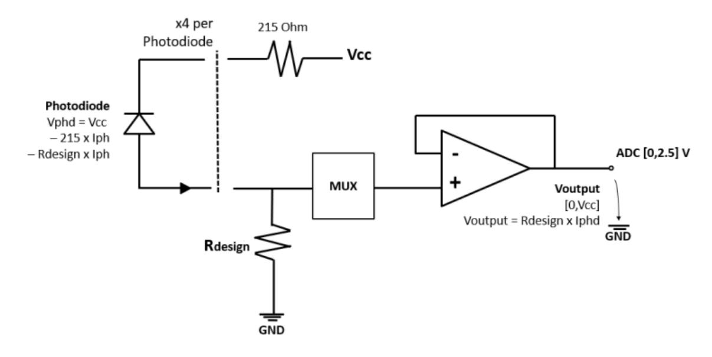

Based on this analysis, OHB-Sweden proposes to emulate the sensor behaviour using a Digital-to-Analog Converter (DAC) that controls the voltage across R-design, as depicted in the figure below. For this emulation to function correctly, the signal ground of the OBC must be accessible.

The electrical interface of the ACOS for the sun sensor emulation would then have the following signals. Note that this is different from the actual sensor where the nom is not GND-level.

| Signal SCOE            | Spacecraft             |
|------------------------|------------------------|
| Sun Sensor X Out 1 Nom | Signal acquisition     |
| Sun Sensor X Out 2 Nom | Signal acquisition     |
| Sun Sensor X Out 3 Nom | Signal acquisition     |
| Sun Sensor X Out 4 Nom | Signal acquisition     |
| Sun Sensor X GND Nom   | Signal acquisition GND |
| Sun Sensor X Out 1 Red | Signal acquisition     |
| Sun Sensor X Out 2 Red | Signal acquisition     |
| Sun Sensor X Out 3 Red | Signal acquisition     |
| Sun Sensor X Out 4 Red | Signal acquisition     |
| Sun Sensor X GND Red   | Signal acquisition GND |

## *12.9.4 Thrusters*

It is assumed that the AOCS SCOE is expected to have emulation support for the signals below.

| Signal Name        |        | Signal Function                                    | SCOE                     |
|--------------------|--------|----------------------------------------------------|--------------------------|
| -                  | -      | 1 Ohm to 28V_FRTN                                  | Not supported            |
| RS485B_TX_P        | Output | RS-485 Microcontroller Secondary UART TX (+)    | Emulated                 |
| RS485B_TX_N        | Output | RS-485 Microcontroller Secondary UART TX (-)    | Emulated                 |
| RS485A_TX_P        | Output | RS-485 Microcontroller Primary UART TX (+)      | Emulated                 |
| RS485A_TX_N        | Output | RS-485 Microcontroller Primary UART TX (-)      | Emulated                 |
| -                  | -      | 100k Ohm to 28V_FRTN                               | Not supported            |
| -                  | -      | 100k Ohm to 28V_FRTN                               | Not supported            |
| -                  | -      | 1 Ohm to 28V_FRTN                                  | Not supported            |
| SC_RST             | Input  | Active High Reset. 10k Ohm pulldown to 28V_FRTN | Not supported            |
| -                  | -      | 1 Ohm to 28V_FRTN                                  | Not supported            |
| COMM_RTN           | Power  | BPU-1000RT Board Ground.                           | Emulated (RS-485 GND) |
| RS485B_RX_P        | Input  | RS-485 Microcontroller Secondary UART RX (+)    | Emulated                 |
| RS485B_RX_N        | Input  | RS-485 Microcontroller Secondary UART RX (-)    | Emulated                 |
| RS485A_RX_P        | Input  | RS-485 Microcontroller Primary UART RX (+)      | Emulated                 |
| RS485A_RX_N        | Input  | RS-485 Microcontroller Primary UART RX (+)      | Emulated                 |
| 28V_SC_RAW_RT N | Power  | 28V power supply return                            | Not supported            |
| 28V_SC_RAW         | Power  | 28V power supply input                             | Not supported            |
| 28V_SC_RAW_RT N | Power  | 28V power supply return                            | Not supported            |
| 28V_SC_RAW         | Power  | 28V power supply input                             | Not supported            |

## *12.9.5 Reaction Wheels*

It is assumed that the AOCS SCOE is expected to have emulation support for the signals below.

| Pin | Signal Name    | Type   | Description                                                   | SCOE             |
|-----|----------------|--------|---------------------------------------------------------------|------------------|
| 1   | VBUS           | Power  | Bus Input                                                     | Not supported    |
| 2   | VBUS           | Power  | Bus Input                                                     | Not supported    |
| 3   | VBUS           | Power  | Bus Input                                                     | Not supported    |
| 4   | REMOVED        | -      | Contact removed                                               | Not supported    |
| 5   | VBUS-RTN       | Ground | Bus Return                                                    | Not supported    |
| 6   | VBUS-RTN       | Ground | Bus Return                                                    | Not supported    |
| 7   | VBUS-RTN       | Ground | Bus Return                                                    | Not supported    |
|     |                |        |                                                               |                  |
| 8   | REMOVED        | -      | Contact removed Power Ground (for DTI interface, test      | Not supported    |
| 9   | PGND           | Ground | use only)                                                     | Not supported    |
|     |                |        |                                                               | Emulated (RS-485 |
| 10  | ISO-GND        | Signal | Isolated Ground (for comm interfaces)                         | GND)             |
| 11  | COMM-PRI 2L | Signal | RS485: Primary Inverted I/O (internally tied to Pin 12)    | Emulated         |
|     | COMM-PRI       |        | RS485: Primary Inverted I/O (internally                       |                  |
| 12  | 1L             | Signal | tied to Pin 11)                                               | Emulated         |
| 13  | DTI-TLM-DAT    | Signal | DTI Telemetry Data (Test use only)                            | Not supported    |
| 14  | DTI-CMD DAT | Signal | DTI Command Data (Test use only)                              | Not supported    |
|     | COMM-SEC       |        | RS485: Secondary Inverted I/O                                 |                  |
| 15  | 2L             | Signal | (internally tied to Pin 16)                                   | Emulated         |
| 16  | COMM-SEC 1L | Signal | RS485: Secondary Inverted I/O (internally tied to Pin 15)  | Emulated         |
| 17  | VBUS           | Power  | Bus Input                                                     | Not supported    |
| 18  | VBUS           | Power  | Bus Input                                                     | Not supported    |
| 19  | VBUS           | Power  | Bus Input                                                     | Not supported    |
| 20  | REMOVED        | -      | Contact removed                                               | Not supported    |
| 21  | VBUS-RTN       | Ground | Bus Return                                                    | Not supported    |
| 22  | VBUS-RTN       | Ground | Bus Return                                                    | Not supported    |
| 23  | VBUS-RTN       | Ground | Bus Return                                                    | Not supported    |
| 24  | REMOVED        | -      | Contact removed                                               | Not supported    |
| 25  | REMOVED        | -      | Contact removed                                               | Not supported    |
|     | COMM-PRI       |        | RS485: Primary Noninverted I/O                                |                  |
| 26  | 2H             | Signal | (internally tied to Pin 27)                                   | Emulated         |
| 27  | COMM-PRI 1H | Signal | RS485: Primary Noninverted I/O (internally tied to Pin 26) | Emulated         |
| 28  | DTI-TLM-CLK    | Signal | DTI Telemetry Clock (Test use only)                           | Not supported    |
| 29  | DTI-CMD-CLK    | Signal | DTI Command Clock (Test use only)                             | Not supported    |
|     | COMM-SEC       |        | RS485: Secondary Noninverted I/O                              |                  |
| 30  | 2H             | Signal | (internally tied to Pin 31)                                   | Emulated         |
|     | COMM-SEC       |        | RS485: Secondary Noninverted I/O                              |                  |
| 31  | 1H             | Signal | (internally tied to Pin 30)                                   | Emulated         |

## *12.9.6 SADA*

No detailed information about this unit has been provided to OHB-Sweden at this time.

5035435\_P4 indicates that each SADA will have 4 end-stop switches and two temperature sensors as telemetry and that the commands are provided via RS422/RS485

The following is assumed:

- That the end-stops can be emulated by low-side drivers with maximum voltage of 48V.
- That the temperature sensors can be emulated by analog voltages from DA-converters, with ±10V output range.

## *12.9.7 Start tracker stimulator*

No detailed information about this unit has been provided to OHB-Sweden at this time.

It is assumed that the AOCS SCOE will provide this unit with simulation information (LOS, angular rates, velocity and position) via RS-422. It is also assumed that control of the stimulator itself is done through a dedicated interface, locally on the unit. The assumed number of units is 1.

## *12.9.8 GNSS Stimulator*

No detailed information about this unit has been provided to OHB-Sweden at this time.

It is assumed that this unit will provide the following information to the AOCS SCOE via TCP/IP:

- Position
- Velocity
- Time

# **ANNEX B STATEMENT OF COMPLIANCE TO MDA SPECIFICATION AND MINI-SOW FOR AURORA P/F AOCS SCOE (5039422 REV P1)**

| Requirement/Text                                                                                                                                                                                                                                                                                                                                                                                                                                                                                                                                                                                                                                                                                                                                                                                                                  | Compliance | Remark                                                                                                                                          |
|-----------------------------------------------------------------------------------------------------------------------------------------------------------------------------------------------------------------------------------------------------------------------------------------------------------------------------------------------------------------------------------------------------------------------------------------------------------------------------------------------------------------------------------------------------------------------------------------------------------------------------------------------------------------------------------------------------------------------------------------------------------------------------------------------------------------------------------|------------|-------------------------------------------------------------------------------------------------------------------------------------------------|
| 1. INTRO                                                                                                                                                                                                                                                                                                                                                                                                                                                                                                                                                                                                                                                                                                                                                                                                                       | I          |                                                                                                                                                 |
| The Satellite Closed-Loop Simulator plays a critical role in controlling, monitoring, and analyzing satellite operations in a simulated environment. Ensuring the reliability, accuracy, and compliance of the HMI requires a rigorous verification process that encompasses functional validation, regulatory compliance, environmental testing, cybersecurity, and long-term reliability assessments. This document outlines the essential verification requirements needed to certify the Closed Loop Simulator for industrial, aerospace, and mission-critical applications. It covers key areas such as system functionality testing, electromagnetic compatibility (EMC), electrical safety, ITAR/export control compliance, environmental durability, cybersecurity, and maintainability. | I          |                                                                                                                                                 |
| By adhering to these verification requirements, the system can be validated for operational readiness, regulatory acceptance, and long-term performance in various deployment scenarios. The structured approach ensures that the system meets global aerospace, defense, and industrial standards, making it suitable for both commercial and government space programs.                                                                                                                                                                                                                                                                                                                                                                                                                                          |            |                                                                                                                                                 |
| 1.1 Timeline                                                                                                                                                                                                                                                                                                                                                                                                                                                                                                                                                                                                                                                                                                                                                                                                                      | I          |                                                                                                                                                 |
| Closed Loop Simulator must be delivered prior by October 1, 2025 or sooner.                                                                                                                                                                                                                                                                                                                                                                                                                                                                                                                                                                                                                                                                                                                                                       | NC         | Delivery time: - T0 + 6 months for the first version (Safe Mode) - T0+ 9months for the full version (all functionalities included). |
| 2. OVERVIEW                                                                                                                                                                                                                                                                                                                                                                                                                                                                                                                                                                                                                                                                                                                                                                                                                    | I          |                                                                                                                                                 |
| The Closed-Loop Simulator (CLS) is a hardware-in-the-loop (HIL) testing environment designed to validate and verify satellite firmware and software by simulating realistic mission scenarios. The CLS will interface with a FlatSat, which consists of flight hardware laid out in a testbed configuration.                                                                                                                                                                                                                                                                                                                                                                                                                                                                                                             | I          |                                                                                                                                                 |

| 3. FUNCTIONAL AND PERFORMANCE TEST SCENARIOS                           | I |                                      |
|---------------------------------------------------------------------------|---|--------------------------------------|
| 3.1 Open loop Testing                                                     | I |                                      |
| Unit Interface Functional Testing                                         | C |                                      |
| Sensor and actuator test to validate basic functionality.                 |   |                                      |
| Unit Polarity Testing                                                     | C |                                      |
| Sensor and actuator test to validate orientation and proper installation. |   |                                      |
| Open Loop ST Testing                                                      | C | Assuming the Star-Field generator is |
| Open-loop test of ST within:                                              |   | CFI                                  |
| • GNC Nominal/Orbit Transfer Mode algorithms                              |   |                                      |
| In-loop:                                                                  |   |                                      |
| • ST - Dynamic/Static Star Field generator                                |   |                                      |
| Open Loop GNSS-R Testing                                                  | C | Assuming the GNSS Stimulator is CFI  |
| Open-loop test of GNSS-R within:                                          |   |                                      |
| • GNC Nominal/Orbit Transfer Mode algorithms                              |   |                                      |
| In loop:                                                                  |   |                                      |
| • GNSS-R - GNSS stimulator                                                |   |                                      |
| Open Loop SS Testing                                                      | C | Our understanding is that the Sun    |
| Open-loop test of SS within:                                              |   | Generator is a separate unit, not    |
| • GNC Hibernation and GNC Safe Mode algorithms                            |   | controlled by the SCOE. To be        |
| Open-loop stimulators:                                                    |   | consolidated during the co           |
| • SS - Sun generator (Static/Dynamic TBC)                                 |   | engineering phase.                   |
| Open Loop RW Testing                                                      | C |                                      |
| Open-loop test of RW within:                                              |   |                                      |
| • GNC Safe Mode                                                           |   |                                      |
| • GNC Hibernation Mode                                                    |   |                                      |
| • GNC Nominal Mode                                                        |   |                                      |
| • GNC Orbit Transfer Mode                                                 |   |                                      |
| • GNC Recovery Mode                                                       |   |                                      |
| In loop:                                                                  |   |                                      |
| • RW actuation and monitoring                                             |   |                                      |

| Open Loop TR Testing (TBC) Open-loop test of TR within: • GNC Safe Mode • GNC Hibernation Mode • GNC Nominal Mode • GNC Orbit Transfer Mode • GNC Recovery Mode In loop: • TR actuation and monitoring                                                                                                                            | C      |                                                                                                                                                                                                                                                                                                                                                                                                                                                                                                 |
|-----------------------------------------------------------------------------------------------------------------------------------------------------------------------------------------------------------------------------------------------------------------------------------------------------------------------------------------------------------|--------|-------------------------------------------------------------------------------------------------------------------------------------------------------------------------------------------------------------------------------------------------------------------------------------------------------------------------------------------------------------------------------------------------------------------------------------------------------------------------------------------------|
| 3.2 Closed Loop Testing Post Separation GNC Safe Mode Testing Post Separation GNC Safe Mode closed loop test. In-loop: • SS - Sun Generator (TBC1 ) • RW Out-of-loop: • SS emulator (TBC1 ) • MAG emulator • ARS emulator • TR emulator • Solar array deployment emulator • SADA emulator Other EGSE models: | I C | Expected level of detail of the environmental models, S/C opto mechanical and drag properties needs to be clarified. As tests are expected to be short-term, simplified models are expected for closed-loop testing. E.g. it is assumed that the "dynamic SA" corresponds to the orientation of the SA but does not mean modelling of the flexible modes. "Solar array deployment emulator" is understood as a possible to run simulators with different SA |
| • SC Dynamics o Plate Model including dynamic SA (for SRP, albedo, drag disturbances) o Deployed and Stowed configurations for both SC variants.                                                                                                                                                                                                 |        | deployment configurations, but not to model the S/C dynamics under the S/A deployment.                                                                                                                                                                                                                                                                                                                                                                                                    |

1 SS will be either HIL or out-of-loop, not both

| General GNC Safe Mode Testing                             | C | Same as above                            |
|-----------------------------------------------------------|---|------------------------------------------|
| General GNC Safe Mode closed loop test.                   |   |                                          |
| In-loop:                                                  |   |                                          |
| • SS - Sun Generator (TBC1 )                           |   |                                          |
| • RW                                                      |   |                                          |
| Out-of-loop:                                              |   |                                          |
| • SS emulator (TBC1 )                                  |   |                                          |
| • MAG emulator                                            |   |                                          |
| • TR emulator                                             |   |                                          |
| • ARS emulator                                            |   |                                          |
| • SADA emulator                                           |   |                                          |
| Other EGSE models:                                        |   |                                          |
| • SC Dynamics                                             |   |                                          |
| o Plate Model including dynamic SA (for SRP, albedo, drag |   |                                          |
| disturbances)                                             |   |                                          |
| o Deployed configuration for both SC variants             |   |                                          |
| General GNC Nominal Mode Testing                          | C | It is assumed that the GNSS              |
| General GNC Nominal Mode closed loop test.                |   | stimulator is in the loop, but not in    |
| In-loop:                                                  |   | closed loop, i.e. thruster actuation and |
| • ST - Dynamic Star Field generator                       |   | attitude-dependent disturbances are      |
| • RW                                                      |   | not taken into account in the GNSS       |
| • GNSS - GNSS stimulator                                  |   | stimulation.                             |
| Out-of-loop:                                              |   |                                          |
| • MAG emulator                                            |   |                                          |
| • ARS emulator                                            |   |                                          |
| • TR emulator                                             |   |                                          |
| • SADA emulator                                           |   |                                          |
| Other EGSE models:                                        |   |                                          |
| • SC Dynamics                                             |   |                                          |
| o Plate Model including dynamic SA (for SRP, albedo, drag |   |                                          |
| disturbances)                                             |   |                                          |
| o Deployed configuration for both SC variants             |   |                                          |

| General GNC Orbit Transfer Mode Testing                    | C (TBC) | As above                            |
|------------------------------------------------------------|---------|-------------------------------------|
| General GNC Orbit Transfer Mode closed loop test.          |         |                                     |
| In-Loop:                                                   |         |                                     |
| • ST - Dynamic Star Field generator                        |         |                                     |
| • RW                                                       |         |                                     |
| • GNSS - GNSS stimulator                                   |         |                                     |
| Out-of-loop:                                               |         |                                     |
| • MAG emulator                                             |         |                                     |
| • ARS emulator                                             |         |                                     |
| • TR emulator                                              |         |                                     |
| • HET emulator                                             |         |                                     |
| • SADA emulator                                            |         |                                     |
| Other EGSE models:                                         |         |                                     |
| • SC Dynamics                                              |         |                                     |
| o Plate Model including dynamic SA (for SRP, albedo, drag  |         |                                     |
| disturbances)                                              |         |                                     |
| o Deployed configuration for both SC variants              |         |                                     |
| Modes Transitions Testing                                  | C       |                                     |
| • Transitions into GNC Safe Mode from:                     |         |                                     |
| o GNC Hibernation                                          |         |                                     |
| o GNC Nominal                                              |         |                                     |
| o GNC Orbit Transfer                                       |         |                                     |
| o GNC Recovery                                             |         |                                     |
| • GNC Recovery to GNC Nominal transition                   |         |                                     |
| • Other transitions (TBD)                                  |         |                                     |
| Fault Injection Testing                                    | N/A     | Descoped by e-mail 2025-04-21 (cost |
| • Ensure fault injections to test failure modes including: |         | reduction)                          |
| o Sensor noise                                             |         |                                     |
| o Communication delays                                     |         |                                     |
| • Actuator failure                                         |         |                                     |
| INTERFACES 4.                                           | I       |                                     |
| 4.1 Block Diagram                                          | I       |                                     |

| See drawing 5035435 rev P3 in PLM - to be attached to the package.                                                                               | TBD | Proposal is based on our understanding of 5035435, but also the equipment documentation received (some contradictions between them), and assumptions of the setup, to be consolidated during the co-engineering phase. |
|--------------------------------------------------------------------------------------------------------------------------------------------------|-----|------------------------------------------------------------------------------------------------------------------------------------------------------------------------------------------------------------------------------------------|
| 5. ENVIRONMENTAL                                                                                                                              | I   |                                                                                                                                                                                                                                          |
| 5.1 Temperature & Humidity:                                                                                                                      | I   |                                                                                                                                                                                                                                          |
| • Maintain a stable temperature (e.g., 20-22°C) and controlled humidity (40-60%) to prevent hardware overheating and electrostatic discharge. | C   | This requirement is understood as the environmental conditions for the SCOE.                                                                                                                                                       |
| 5.2 Electromagnetic Shielding (EMI/EMC):                                                                                                         | I   |                                                                                                                                                                                                                                          |
| • Use Faraday cages or shielded enclosures to minimize external RF interference                                                                  | N/A | Descoped by e-mail 2025-04-21 (cost                                                                                                                                                                                                      |
| that could affect satellite communication simulations.                                                                                           |     | reduction)                                                                                                                                                                                                                               |
| 5.3 Vibration & Noise Isolation:                                                                                                                 | I   |                                                                                                                                                                                                                                          |
| • Implement vibration-dampening flooring and noise reduction to prevent                                                                          | N/A | Descoped by e-mail 2025-04-21 (cost                                                                                                                                                                                                      |
| disturbances in sensitive hardware testing.                                                                                                      |     | reduction)                                                                                                                                                                                                                               |
| 5.4 Power Systems:                                                                                                                               | I   |                                                                                                                                                                                                                                          |
| • Redundant UPS and isolated power circuits to protect sensitive electronics.                                                                    | N/A | Descoped by e-mail 2025-04-21 (cost reduction)                                                                                                                                                                                        |
| 5.5 Secure Networking:                                                                                                                           | I   |                                                                                                                                                                                                                                          |
| • Dedicated and segmented networks with cybersecurity protections to prevent                                                                     | N/A | Descoped by e-mail 2025-04-21 (cost                                                                                                                                                                                                      |
| external access or interference.                                                                                                                 |     | reduction)                                                                                                                                                                                                                               |
| 6. HUMAN MACHINE INTERFACE (HMI)                                                                                                              | I   |                                                                                                                                                                                                                                          |
| Core Functionalities                                                                                                                             | I   |                                                                                                                                                                                                                                          |
| 6.1 Real-Time Telemetry & Visualization                                                                                                          | I   |                                                                                                                                                                                                                                          |
| • Live telemetry display of satellite subsystems (propulsion, attitude control,                                                                  | C   |                                                                                                                                                                                                                                          |
| communications), FlatSat and                                                                                                                     |     |                                                                                                                                                                                                                                          |
| simulated environment including orbit and attitude dynamics.                                                                                     |     |                                                                                                                                                                                                                                          |
| • Customizable dashboards with interactive graphs, gauges, and alerts.                                                                           |     |                                                                                                                                                                                                                                          |
| • 3D visualization of satellite position, orientation, and trajectory.                                                                           |     |                                                                                                                                                                                                                                          |
| • Real-time and post-simulation analysis tools: Supplier to provide heritage                                                                     |     |                                                                                                                                                                                                                                          |
| solutions.                                                                                                                                       |     |                                                                                                                                                                                                                                          |
| 6.2 Simulation Control & Configuration                                                                                                           | I   |                                                                                                                                                                                                                                          |

| • Scenario setup: Orbit parameters, environmental conditions, mission timeline.                                                                                                                                                                                                                                                                                                                   | C | "fast-forward" descoped by e-mail                                                                                                                                                                                                                                                                                                                                                                                                                                                         |
|---------------------------------------------------------------------------------------------------------------------------------------------------------------------------------------------------------------------------------------------------------------------------------------------------------------------------------------------------------------------------------------------------|---|-------------------------------------------------------------------------------------------------------------------------------------------------------------------------------------------------------------------------------------------------------------------------------------------------------------------------------------------------------------------------------------------------------------------------------------------------------------------------------------------|
| • Parameter tuning: Ability to modify actuator gains, sensor biases, and software                                                                                                                                                                                                                                                                                                                 |   | 2025-04-21 (accelerated delivery)                                                                                                                                                                                                                                                                                                                                                                                                                                                         |
| settings.                                                                                                                                                                                                                                                                                                                                                                                         |   |                                                                                                                                                                                                                                                                                                                                                                                                                                                                                           |
| • Start, pause, fast-forward, and reset simulation features.                                                                                                                                                                                                                                                                                                                                      |   |                                                                                                                                                                                                                                                                                                                                                                                                                                                                                           |
| 6.3 Fault Injection & Debugging                                                                                                                                                                                                                                                                                                                                                                   | I |                                                                                                                                                                                                                                                                                                                                                                                                                                                                                           |
| • Controlled failure modes (e.g. sensor drift, actuator failure, communication                                                                                                                                                                                                                                                                                                                    | C |                                                                                                                                                                                                                                                                                                                                                                                                                                                                                           |
| blackout).                                                                                                                                                                                                                                                                                                                                                                                        |   |                                                                                                                                                                                                                                                                                                                                                                                                                                                                                           |
| • Step-by-step debugging with breakpoints for analyzing satellite behavior.                                                                                                                                                                                                                                                                                                                       |   |                                                                                                                                                                                                                                                                                                                                                                                                                                                                                           |
| • Log replay for post-simulation analysis.                                                                                                                                                                                                                                                                                                                                                        |   |                                                                                                                                                                                                                                                                                                                                                                                                                                                                                           |
| 6.4 Hardware & Software Integration                                                                                                                                                                                                                                                                                                                                                               | I |                                                                                                                                                                                                                                                                                                                                                                                                                                                                                           |
| • Interface with Hardware-in-the-Loop (HIL, FlatSat) components (reaction wheels, star trackers, power modules, etc.). • Integration with Software-in-the-Loop (SIL) systems for testing flight software. • Synchronize with FlatSat hardware clock to maintain deterministic behavior. • Compatibility with real satellite communication protocols (CCSDS, UART, CAN, SpaceWire). | C | Assumptions / our understanding:  I/F to "power modules": we assume that the AOCS SCOE does not provide the power supply to any units, this is part of the flatsat.  We expect the I/F to the OBSW to be via the "flight representative" connections, e.g. the serial ports, or communication busses such as CAN or SpaceWire. Is it also expected that we "emulate" these on e.g. a network TCP/IP line to close the loop on a SIL. |
| 6.5 Sensor and Actuator Emulation                                                                                                                                                                                                                                                                                                                                                                 | I |                                                                                                                                                                                                                                                                                                                                                                                                                                                                                           |

| • Provide simulated sensor inputs for ARS, MAG, SS (TBC). • Provide emulations of actuator responses for TR, HET, SADA. • Ensure closed-loop feedback between actuators and simulated satellite state.                                                                                                                                                                                                                                                | C | "emulation of actuator responses" understood as that we shall provide the command interface of these units and that the simulator shall be affected by the commands accordingly. For pricing, we need to quantify the                                        |
|-------------------------------------------------------------------------------------------------------------------------------------------------------------------------------------------------------------------------------------------------------------------------------------------------------------------------------------------------------------------------------------------------------------------------------------------------------------|---|--------------------------------------------------------------------------------------------------------------------------------------------------------------------------------------------------------------------------------------------------------------------------------|
| 6.6 Realistic Space Environment                                                                                                                                                                                                                                                                                                                                                                                                                             | I | number and type of interfaces.                                                                                                                                                                                                                                                 |
| • Ephemerid (Eclipse status, Moon/Sun positions). • Earth environment (magnetic field, atmosphere density). • External disturbances: Gravity gradient, Magnetic dipole moment (residual SC, parasitic HET, SA), Aerodynamic drag, Solar radiation pressure and albedo. • Internal disturbances: HET deviation torque and swirling torque, RW and TR misalignment, Flexible body disturbances (TBC).                                    | C | The detail of these models needs to be discussed. We propose simplified models since we don't really expect the purpose of the SCOE is to verify long-term behavior.                                                                                               |
| 6.7 UI/UX Design Principles                                                                                                                                                                                                                                                                                                                                                                                                                                 | I |                                                                                                                                                                                                                                                                                |
| • Multi-screen support: Separate interfaces for mission control, telemetry monitoring, and detailed diagnostics. • Modular & Configurable UI: Drag-and-drop widgets for engineers to tailor displays. • Color-coded alerts & alarms: Critical failures (e.g., loss of attitude control) should be immediately distinguishable. • Touchscreen & keyboard controls: Support for both touchscreen panels and traditional command-line input. | C | It is assumed that Mission Control I/F is NOT part of the SCOE and should NOT be part of the requirement. Configurability as far as supported by our RAMSES control system (can be presented). Touchscreen descoped by e-mail 2025-04-21 (cost reduction) |
| 6.8 Security & Access Control                                                                                                                                                                                                                                                                                                                                                                                                                               | I |                                                                                                                                                                                                                                                                                |

| • Role-based authentication: Operators, engineers, and administrators should have different access levels. • Data encryption & logging: Secure handling of sensitive mission parameters and simulator logs. Support exporting logs in standard formats (CSV, JSON, MATLBAB, etc.). • Remote operation capability: Secure VPN access for off-site testing and analysis. Enable remote operation for automated CI/CD integration. | N/A | Descoped by e-mail 2025-04-21 (cost reduction)                                                                                                                                                                                                                                                                                                                                                                                           |
|------------------------------------------------------------------------------------------------------------------------------------------------------------------------------------------------------------------------------------------------------------------------------------------------------------------------------------------------------------------------------------------------------------------------------------------------------|-----|---------------------------------------------------------------------------------------------------------------------------------------------------------------------------------------------------------------------------------------------------------------------------------------------------------------------------------------------------------------------------------------------------------------------------------------------|
| 7. PHYSICAL                                                                                                                                                                                                                                                                                                                                                                                                                                       | I   |                                                                                                                                                                                                                                                                                                                                                                                                                                             |
| Rack-Mounted HMI (For Embedded System Testing) • Form Factor: 19-inch rack-mount control interface with touchscreen or external display. • Size: Rack Unit: 2U–6U (standard 19" width, ~0.9m depth). • Touchscreen panel: 15"–24". • Mass: 10–25 kg per unit. • Power Consumption: 500W–1kW.                                                                                                                                       | C   | Dimensions requirements and touchscreen descoped by e-mail 2025-04-21 (cost reduction)                                                                                                                                                                                                                                                                                                                                                |
| 8. LOGISTIC                                                                                                                                                                                                                                                                                                                                                                                                                                       | I   |                                                                                                                                                                                                                                                                                                                                                                                                                                             |
| 8.1 Lifetime                                                                                                                                                                                                                                                                                                                                                                                                                                         | I   |                                                                                                                                                                                                                                                                                                                                                                                                                                             |
| The expected operational lifetime of a satellite Closed-Loop Special Check-Out Equipment (SCOE) is 7-12 years Regular calibration, software updates, and hardware refurbishments every few years can help extend its longevity. Proper maintenance and the availability of spare parts are needed to ensure optimal performance throughout their lifecycle.                                                                           | C   | It is proposed to build a second SCOE, to be used to speed-up to development process (allows a staged delivery) and as spare parts after final delivery (either at OHB Sweden's premises, or at MDA's premises). Storage in optimal conditions (i.e. dry nitrogen bagging) of spare parts needed to fulfill this requirement. Maintenance and calibration to be done by the customer as per a User Manual. |
| 8.2 Warranty                                                                                                                                                                                                                                                                                                                                                                                                                                         | I   |                                                                                                                                                                                                                                                                                                                                                                                                                                             |

| The warranty for a satellite Closed-Loop Special Check-Out Equipment (SCOE) is 1 year, covering defects in materials and workmanship. Propose a manufacturers extended warranties or service agreements lasting 5 to 10 years, including repairs, software updates, and technical support. Availability: Spare parts stocked for 5–10 years after deployment. Key spare components include: - Displays (touchscreens, LCD panels) - Input devices (keyboards, trackballs, touchpads) - Power supplies and cables - Compute modules (GPU/CPU upgrade kits) - Connectors and interface cards (USB, CAN, Ethernet, SpaceWire) Customization: Mission-specific parts should be modular for easy replacement. | C | It is proposed to build a second SCOE, to be used to speed-up to development process (allows a staged delivery) and as spare parts after final delivery (either at OHB Sweden's premises, or at MDA's premises). Storage in optimal conditions (i.e. dry nitrogen bagging) of spare parts needed to fulfill this requirement. |
|----------------------------------------------------------------------------------------------------------------------------------------------------------------------------------------------------------------------------------------------------------------------------------------------------------------------------------------------------------------------------------------------------------------------------------------------------------------------------------------------------------------------------------------------------------------------------------------------------------------------------------------------------------------------------------------------------------------------------------------------|---|-------------------------------------------------------------------------------------------------------------------------------------------------------------------------------------------------------------------------------------------------------------------------------------------------------------------------------------------------------|
| 8.3 Calibration                                                                                                                                                                                                                                                                                                                                                                                                                                                                                                                                                                                                                                                                                                                              | I |                                                                                                                                                                                                                                                                                                                                                       |
| • Frequency: Standard Calibration Cycle: Every 12–24 months, depending on usage. Mission-Critical Components (e.g., precision touchscreens, sensors): Every 6–12 months. • Calibration Parameters: Display brightness, color accuracy, and touchscreen responsiveness. Input device sensitivity (trackball, joystick, or custom controllers). Communication interface signal integrity (for hardware-in-the-loop systems). • Calibration Methods: Software-driven auto-calibration routines where applicable. Manufacturer-certified calibration tools and service agreements.                                                                                                                                 | C | We propose to describe calibration in User Manual.                                                                                                                                                                                                                                                                                                 |
| 8.4 Maintenance                                                                                                                                                                                                                                                                                                                                                                                                                                                                                                                                                                                                                                                                                                                              | I |                                                                                                                                                                                                                                                                                                                                                       |

| • Routine Maintenance (Quarterly & Annually): • Quarterly: Visual inspection of connectors, cables, and displays. Cleaning of input devices and air filters (for fan-cooled systems). • Annually: System firmware and software updates. Hardware stress testing and performance benchmarking. Verification of redundancy systems (e.g., backup power supplies). • Predictive Maintenance: AI-based diagnostic monitoring to predict failures before they occur. Real-time logging and analysis of system performance. | PC | Maintenance to be done by customer according to User Manual. NC to the AI-based diagnostic (no heritage). Real-time logging and analysis of system performance to be discussed. |
|-----------------------------------------------------------------------------------------------------------------------------------------------------------------------------------------------------------------------------------------------------------------------------------------------------------------------------------------------------------------------------------------------------------------------------------------------------------------------------------------------------------------------------------------------------|----|------------------------------------------------------------------------------------------------------------------------------------------------------------------------------------------------|
| 8.5 Markings & Compliance                                                                                                                                                                                                                                                                                                                                                                                                                                                                                                                           | I  |                                                                                                                                                                                                |
| Supply the following Operational Markings:                                                                                                                                                                                                                                                                                                                                                                                                                                                                                                          | C  |                                                                                                                                                                                                |
| - Port & Connector Labels: Clear identification of power, data, and I/O connections.                                                                                                                                                                                                                                                                                                                                                                                                                                                                |    |                                                                                                                                                                                                |
| - Warning Labels: High-voltage, ESD-sensitive areas, and maintenance instructions.                                                                                                                                                                                                                                                                                                                                                                                                                                                                  |    |                                                                                                                                                                                                |
| - System Serial Number & QR Code: For asset tracking and digital documentation.                                                                                                                                                                                                                                                                                                                                                                                                                                                                     |    |                                                                                                                                                                                                |
| 9. VERIFICATION REQUIREMENTS FOR A SATELLITE CLOSED-LOOP SIMULATOR HMI                                                                                                                                                                                                                                                                                                                                                                                                                                                                        | I  |                                                                                                                                                                                                |
| To ensure that the Human-Machine Interface (HMI) for a Satellite Closed-Loop                                                                                                                                                                                                                                                                                                                                                                                                                                                                        | I  |                                                                                                                                                                                                |
| Simulator meets compliance, performance, and operational reliability, it must                                                                                                                                                                                                                                                                                                                                                                                                                                                                       |    |                                                                                                                                                                                                |
| undergo a structured verification process. The following verification requirements                                                                                                                                                                                                                                                                                                                                                                                                                                                                  |    |                                                                                                                                                                                                |
| are categorized into functional, regulatory, environmental, safety, and reliability                                                                                                                                                                                                                                                                                                                                                                                                                                                                 |    |                                                                                                                                                                                                |
| testing.                                                                                                                                                                                                                                                                                                                                                                                                                                                                                                                                            |    |                                                                                                                                                                                                |
| 9.1 Functional Verification                                                                                                                                                                                                                                                                                                                                                                                                                                                                                                                         | I  |                                                                                                                                                                                                |

| System Functionality Testing - Verify real-time telemetry display, command inputs, and system responses. - Test interface controls (touchscreen, keyboard, joystick, or trackball) for accuracy and latency. - Ensure that HMI software correctly processes and visualizes satellite data (position, attitude, telemetry). - Validate data logging, replay, and failure recovery mechanisms. Hardware-in-the-Loop (HIL) & Software-in-the-Loop (SIL) Testing - Test the HMI integration with real satellite hardware components (actuators, sensors, GNSS modules). - Run simulated mission scenarios with external flight software. - Verify latency between user input and system response. Fault Injection & Failure Mode Testing - Simulate communication failures, hardware malfunctions, and incorrect operator inputs. - Test automatic error handling, alarms, and safety responses. - Validate system logging and diagnostic capabilities. | PC (TBC) | Display of "satellite data" is interpreted as "simulated data". Not the data provided from the EGSE. Failure recovery functionality of the SCOE needs to be further detailed. Currently, we assume no such functionality. OSE believes that integration with real satellite units should not be part of the verification process. The SCOE should be verified "sand alone", and we should not take the risk of operating the "real" units for verification of the SCOE (especially as these are stated to be FM). Running simulated mission scenarios should not be part of the SCOE verification. To be excluded. General: Functionality of HW, OBSW, FlatSat etc. are to be excluded since these are DUTs for the test campaigns. |
|-----------------------------------------------------------------------------------------------------------------------------------------------------------------------------------------------------------------------------------------------------------------------------------------------------------------------------------------------------------------------------------------------------------------------------------------------------------------------------------------------------------------------------------------------------------------------------------------------------------------------------------------------------------------------------------------------------------------------------------------------------------------------------------------------------------------------------------------------------------------------------------------------------------------------------------------------------------------------------------------------------|----------|----------------------------------------------------------------------------------------------------------------------------------------------------------------------------------------------------------------------------------------------------------------------------------------------------------------------------------------------------------------------------------------------------------------------------------------------------------------------------------------------------------------------------------------------------------------------------------------------------------------------------------------------------------------------------------------------------------------------------------------------------------------------------------------------------|
| 9.2 Regulatory & Compliance Verification                                                                                                                                                                                                                                                                                                                                                                                                                                                                                                                                                                                                                                                                                                                                                                                                                                                                                                                                                            | I        |                                                                                                                                                                                                                                                                                                                                                                                                                                                                                                                                                                                                                                                                                                                                                                                                    |
| Export Control & ITAR Verification                                                                                                                                                                                                                                                                                                                                                                                                                                                                                                                                                                                                                                                                                                                                                                                                                                                                                                                                                                  | I        |                                                                                                                                                                                                                                                                                                                                                                                                                                                                                                                                                                                                                                                                                                                                                                                                    |
| - Check for ITAR/EAR-controlled components in hardware and software. - Ensure access control restrictions for ITAR-classified data. - Verify that export documentation meets Canada's Controlled Goods Program (CGP).                                                                                                                                                                                                                                                                                                                                                                                                                                                                                                                                                                                                                                                                                                                                                                      | C        | No ITAR / EAR-controlled component foreseen.                                                                                                                                                                                                                                                                                                                                                                                                                                                                                                                                                                                                                                                                                                                                                    |
| 9.3 Environmental & Durability Testing                                                                                                                                                                                                                                                                                                                                                                                                                                                                                                                                                                                                                                                                                                                                                                                                                                                                                                                                                              | I        |                                                                                                                                                                                                                                                                                                                                                                                                                                                                                                                                                                                                                                                                                                                                                                                                    |
| If the HMI must meet the following environmental verification requirements. - Operate at room temperature. - Must withstand 20% - 60% relative humidity without performance degradation. - Compliant with MIL-STD-810G (shock, vibration for ruggedized hardware) or similar                                                                                                                                                                                                                                                                                                                                                                                                                                                                                                                                                                                                                                                                                                            | C (TBC)  | Verification method/approach to be agreed.                                                                                                                                                                                                                                                                                                                                                                                                                                                                                                                                                                                                                                                                                                                                                      |

| 9.4 Reliability & Maintainability Verification                                     | I   |                                        |
|------------------------------------------------------------------------------------|-----|----------------------------------------|
| Mean Time Between Failures (MTBF) Testing                                          | PC  | Accelerated lifetime testing on SCOE   |
| - Run accelerated lifecycle tests to determine expected MTBF (goal: 50,000+        |     | not proposed. Reliability based on the |
| operational hours).                                                                |     | COTS-components.                       |
| - Identify failure points in power supplies, cooling systems, and input devices.   |     |                                        |
| Maintenance & Field Serviceability                                                 |     |                                        |
| - Modular design verification: Ensure easy replacement of key components (display, |     |                                        |
| power supply, connectors).                                                         |     |                                        |
| - Self-diagnostics & Logging: Verify system's ability to detect and report         |     |                                        |
| hardware/software issues.                                                          |     |                                        |
| 9.5 Transportability & Deployment Verification                                     | I   |                                        |
| Packaging & Shock Resistance                                                       | C   |                                        |
| - Verify safe transport in protective cases (if portable HMI).                     |     |                                        |
| Power Supply Compatibility                                                         |     |                                        |
| - Test adaptability to different power sources:                                    |     |                                        |
| - 110V/220V AC.                                                                    |     |                                        |
| - Verify UPS backup operation and runtime.                                         |     |                                        |
| 9.6 Software Verification & Cybersecurity                                          | I   |                                        |
| Cybersecurity Testing                                                              | N/A | Descoped by e-mail 2025-04-21          |
| - Verify compliance with ISO 27001 (Information Security).                         |     | (accelerated delivery)                 |
| - Perform penetration testing to prevent unauthorized access.                      |     |                                        |
| - Ensure encryption for sensitive mission data.                                    |     |                                        |
| Software Certification & Code Validation                                           |     |                                        |
| - Code quality verification: Static and dynamic code analysis.                     |     |                                        |
| - Software regression testing: Ensure updates don't introduce new issues.          |     |                                        |
| - Firmware validation: Test BIOS/firmware integrity and update procedures.         |     |                                        |
| 9.7 Marking & Labeling Verification                                                | I   |                                        |
| Compliance Labels                                                                  | PC  | Marking for CE only (not FCC, ISED,    |
| - Ensure proper markings for CE, FCC, ISED, CSA, UL, and MIL-STD where             |     | CSA, UL or MIL-STD).                   |
| applicable.                                                                        |     |                                        |
| - Apply ITAR or CGP markings if export-controlled.                                 |     |                                        |
| User Instruction Labels                                                            |     |                                        |
| - Port and connector labels.                                                       |     |                                        |
| - Safety and warning labels (high voltage, restricted access).                     |     |                                        |
| 10. REFERENCES AND BIBLIOGRAPHY                                                    | I   |                                        |

| RD-1 FROM A CUSTOMIZED AOCS SCOE TO A MULTIPURPOSE EGSE ARCHITECTURE https://indico.esa.int/event/93/sessions/823/attachments/2792/3235/P15_Albe rti.pdf | TBD | Not referred to. Is it AD?                  |
|----------------------------------------------------------------------------------------------------------------------------------------------------------------------|-----|---------------------------------------------|
| RD-2 ECSS AOCS Requirements Standard Sections of interest: • Section 5.4 Verification Requirements ECSS-E-ST-60-30C30August2013.pdf                   | TBD | Not referred to. Is it AD?                  |
| RD-3 DSS vs. FS (Openloop) vs. FS (Closed Loop) by Bruce Entus DSS & FS v2.pptx                                                                                | TBD | Not referred to. Is it AD? Not provided. |
| RD-4 VISIO Drawing SCOE.vsdx                                                                                                                                   | TBD | Not referred to. Is it AD? Not provided. |