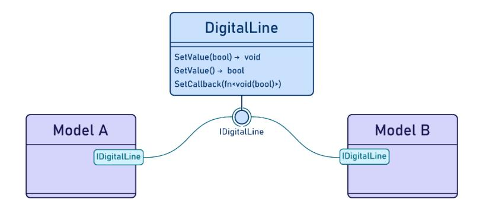
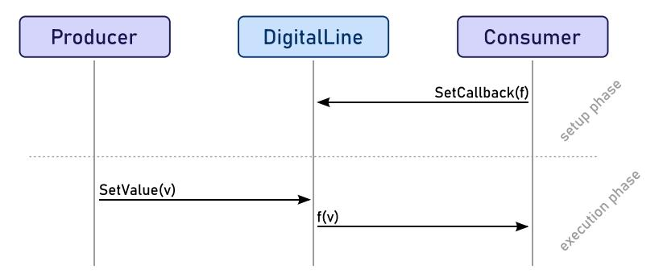

**Title DSS SW Interface Control Document**

**Document Number** AUR-OHB-DSS-ICD-0002

**Issue / internal Revision** 03 / 03

**Author** Martin Lück

**Status/Release Date** Released / 04.12.2025

**CI Number**

**DRL Number** DSS-4

**Data Classification** Internal - Restricted usage strictly limited according to NDA, Contract or

Purchase Order

**Export Classification** Not Controlled

**U.S. Export Classification** Not Restricted

| Name       | Responsibility                | Signature/Date                                              |
|------------|-------------------------------|-------------------------------------------------------------|
| F.Möhle    | Software Product<br>Assurance | ELECTRONICALLY SIGNED BY Frank Möhle on<br>04.12.2025       |
| G.Spagnolo | DSS Product Owner             | ELECTRONICALLY SIGNED BY Giuseppe Spagnolo on<br>04.12.2025 |
| M.Lück     | DSS Software Engineer         | ELECTRONICALLY SIGNED BY Martin Lück on<br>04.12.2025       |

**THIS DOCUMENT HAS BEEN SIGNED ELECTRONICALLY AND IS VALID WITHOUT HANDWRITTEN SIGNATURES**


Doc. No.: AUR-OHB-DSS-ICD-0002 Issue: 03 Page: 2 of 47

### **Document Change Record**

| Issue | Release Date | Change Description/Reason (Ref.)                                                                                                                                                                                                                                                                                                                                                                                                                                                                                                                                                                                                                                                   | Page/Chapter<br>Affected |
|-------|--------------|------------------------------------------------------------------------------------------------------------------------------------------------------------------------------------------------------------------------------------------------------------------------------------------------------------------------------------------------------------------------------------------------------------------------------------------------------------------------------------------------------------------------------------------------------------------------------------------------------------------------------------------------------------------------------------|--------------------------|
| 01    | 12.06.2025   | Initial Aurora DSS version for PDR                                                                                                                                                                                                                                                                                                                                                                                                                                                                                                                                                                                                                                                 |                          |
| 02    | 07.11.2025   | Updated for the PDR Part1 Closeout:<br>§1.2, §5.1, §6, §7: fixed references as per PDR1-DSS-ICD-02<br>Table 2: updated as per PDR1-DSS-ICD-02<br>Table 3: Reference Document List updated<br>Table 5: updated interface type for reqs 0451 and 1035 as per<br>PDR1-DSS-ICD-03 and PDR1-DSS-ICD-04<br>§5.1: clarified the [AD01] meaning in req 588<br>§5.2.1, §5.3.1: updated to support only one NctrsIf as per<br>PDR1-DSS-ICD-06<br>§5.2.6: added as per PDR1-DSS-ICD-01 (and a reference has<br>been added to it in §5.3.3)<br>§5.3.1.2.2: updated description as per PDR1-DSS-ICD-08<br>§5.3.5: updated to include more details as per PDR1-DSS<br>SDD-09                     |                          |
| 03    | 04.12.2025   | §2: updated applicable and reference documents as per RID<br>EXTMSO-460<br>§5.2.9 added to explain the Rufos file loading at startup<br>§5.2.12 adapted to fulfil reqs DSS-SRS-1474, -1492 and -1495<br>(Zulu time to be logged as host time)<br>§5.2.15 added as per EXTMSO-437<br>§5.2.16 added to describe the feature to send TCs/TMs directly<br>without any dedicated ground tool<br>§5.3.1.2.1 added TMDU Header Layout for version 0<br>§5.3.3 modified and §5.3.3.2 added to describe the TCP/IP<br>socket interface available in the Payload model as per RID<br>EXTMSO-437<br>§5.3.5 text reworded and GNC math model content moved to<br>the SDD as per RID EXTMSO-466 |                          |


Doc. No.: AUR-OHB-DSS-ICD-0002 Issue: 03 Page: 3 of 47

### **Table of Contents**

| 1 | INTRO      | DUCTION                                           | 5  |
|---|------------|---------------------------------------------------|----|
|   | 1.1<br>1.2 | Purpose of this Document                          |    |
| 2 | REFER      | RENCES                                            |    |
| _ |            |                                                   |    |
|   | 2.1<br>2.2 | Applicable Documents                              |    |
|   |            |                                                   |    |
| 3 | ABBRE      | EVIATIONS & NOMENCLATURE                          | 8  |
| 4 | SOFTV      | VARE OVERVIEW                                     | 10 |
|   | 4.1        | Purpose                                           | 10 |
| 5 | REQUI      | REMENTS AND DESIGN                                | 11 |
|   | 5.1        | General provisions to the requirements in the IRD | 11 |
|   | 5.2        | Interface requirements                            | 15 |
|   | 5.2.       | ·                                                 |    |
|   | 5.2.       |                                                   |    |
|   | 5.2.       |                                                   |    |
|   | 5.2.       |                                                   |    |
|   | 5.2.       |                                                   |    |
|   | 5.2.       | 6 Simulation Model API                            | 18 |
|   | 5.2.       | 7 Scripting Interface                             | 18 |
|   | 5.2.       | 8 Simulation Environment                          | 21 |
|   | 5.2.       | 9 Simulation Directories                          | 21 |
|   | 5.2.       |                                                   |    |
|   | 5.2.       | <b>0</b>                                          |    |
|   | 5.2.       | 00 0                                              |    |
|   | 5.2.       | 1 7                                               |    |
|   | 5.2.       | 00 0                                              |    |
|   | 5.2.       | 3                                                 |    |
|   | 5.2.       |                                                   |    |
|   | 5.3        | Interface design                                  |    |
|   | 5.3.       |                                                   |    |
|   | 5.3.       |                                                   |    |
|   | 5.3.       | ,                                                 |    |
|   | 5.3.       | 5 5                                               |    |
|   | 5.3.       |                                                   |    |
| 6 | VALIDA     | ATION REQUIREMENTS                                | 46 |
| _ | TD 4 0 F   |                                                   | 4- |


Doc. No.: Issue:

Page:

AUR-OHB-DSS-ICD-0002

03 4 of 47

### **List of Tables**

| Table 1: Scope of Document                  | 5  |
|---------------------------------------------|----|
| Table 2: Applicable Documents               | 6  |
| Table 3: Reference Documents                | 6  |
| Table 4: Abbreviations & Nomenclature       | 8  |
| Table 5: System Interface Requirements      | 11 |
| Table 6: SRS Interface Requirements         | 13 |
| Table 7: TC/TM TCP/IP Ports                 | 16 |
| Table 8: SCOE TCs                           | 16 |
| Table 9: SCOE TMs                           | 17 |
| Table 10: Rufos Scripting API               | 18 |
| Table 11: Command-line options              | 21 |
| Table 12: Log Level Types                   | 23 |
| Table 13: Simulation Time Log Format        | 24 |
| Table 14: Host Time Log Format              | 25 |
| Table 15: Recording Script Commands         | 26 |
| Table 16: Parameter Logging Script Commands | 27 |
| Table 17: TC CLTU DU                        | 30 |
| Table 18: TC CLTU Response DU               | 30 |
| Table 19: CLTU Layout                       |    |
| Table 20: TMDU Header Layout (Version 0)    | 32 |
| Table 21: TMDU Header Layout (Version 1)    |    |
| Table 22: TM Frame Layout                   |    |
| Table 23: TC PDU                            |    |
| Table 24: TM PDU                            |    |
|                                             |    |

# **List of Figures**

| Figure 5-1: Synchronization Message Format                            | 17 |
|-----------------------------------------------------------------------|----|
| Figure 5-2: File format of recording text files                       | 26 |
| Figure 5-3: Assembly of two models and a digital line to connect them | 37 |
| Figure 5-4: Sequence of communication through a digital line          | 37 |


Doc. No.: AUR-OHB-DSS-ICD-0002 Issue: 03 Page: 5 of 47

### <span id="page-4-0"></span>**1 INTRODUCTION**

### <span id="page-4-1"></span>**1.1 Purpose of this Document**

This document provides the Dynamic Satellite Simulator Interface Control Document (DSS ICD) for the Dynamic Satellite Simulator (DSS) for the Aurora platform. It contains information to identify the internal and external interfaces used by the DSS and how these interfaces can be connected to extend the DSS with additional simulation models, like the Program A & B payloads, or interact with the DSS from the SOCC.

The DSS is a pure software simulator of a spacecraft which is used to:

- support the validation and verification of satellite operation procedures,
- validate flight-software patches and updates prior to upload,
- in-orbit satellite support and anomaly investigation,
- training and support of satellite operators.

For this purpose, the DSS represents the behaviour of the spacecraft and its payload such that its effects in the telemetry are indistinguishable (as far as practicable) from the real spacecraft.

This document is in response to Statement of Work [\[RD01\],](#page-5-5) Section 15, Item E-12 ICDs, Item DSS-4 *DSS to SCS ICD* as well as Item DSS-5 *DSS Interface (API) definition for payload simulator module*.

The structure of the document is according to Annex E *Interface Control Document (ICD) - DRD* of [\[RD08\]](#page-5-6).

### <span id="page-4-2"></span>**1.2 Scope**

[Table 1](#page-4-3) regulates for whom within the OHB Group the document is applicable and therefore valid. The applicability for external parties is not defined here.

<span id="page-4-3"></span>**Table 1: Scope of Document**

| Company                                       | Location | Remark |
|-----------------------------------------------|----------|--------|
| ☐ OHB Group                                   |          |        |
| ☐ OHB SE                                      |          |        |
| ☒ OHB System AG                               | Bremen   |        |
| ☐ OHB Digital Connect GmbH                    |          |        |
| ☐ OHB Teledata GmbH                           |          |        |
| ☐ OHB Information Technology<br>Services GmbH |          |        |

This document is applicable within the DSS related activities of the Aurora satellite mission. It is derived from interface requirements of the simulator specification [\[RD02\]](#page-5-7).

NOTE: No dedicated IRD exists, and interface requirements are part of the SRS [\[RD03\]](#page-5-8) and derived from the system-level requirements [\[RD02\].](#page-5-7)


Doc. No.: AUR-OHB-DSS-ICD-0002 Issue: 03 Page: 6 of 47

# <span id="page-5-0"></span>**2 REFERENCES**

#### <span id="page-5-1"></span>**2.1 Applicable Documents**

This document shall be read in conjunction with documents listed hereafter, which form part of this document to the extent specified herein. In case of a conflict between any provisions of this document and the provisions of the documents listed hereafter, the content of the contractually higher document shall be considered as superseding.

<span id="page-5-3"></span>**Table 2: Applicable Documents**

| AD No. / Title                   | Doc. No.            | Issue   |
|----------------------------------|---------------------|---------|
| [AD01]<br>deleted                | deleted             | deleted |
| [AD02]<br>DSS SW Design Document | AUR-OHB-DSS-DD-0001 | 05      |

<span id="page-5-12"></span>It should be noted that all requirements listed in the documents of [Table 2](#page-5-3) are applicable unless noted otherwise or exceptions are identified and agreed.

### <span id="page-5-2"></span>**2.2 Reference Documents**

The following documents contain additional information that is relevant to the scope of this document.

<span id="page-5-4"></span>**Table 3: Reference Documents**

<span id="page-5-15"></span><span id="page-5-14"></span><span id="page-5-13"></span><span id="page-5-11"></span><span id="page-5-10"></span><span id="page-5-9"></span><span id="page-5-8"></span><span id="page-5-7"></span><span id="page-5-6"></span><span id="page-5-5"></span>

| RD No. / Title |                                                                                                    | Doc. No.                 | Issue        |
|----------------|----------------------------------------------------------------------------------------------------|--------------------------|--------------|
| [RD01]         | Statement of Work (SOW), Flight SW &<br>Dynamic<br>Satellite<br>Simulator,<br>LEO<br>Constellation | 5029856                  | P5           |
| [RD02]         | Specifications, Dynamic Satellite Simulator,<br>Aurora Platform                                    | 5029854                  | P2           |
| [RD03]         | DSS Software Requirements Specification                                                            | AUR-OHB-DSS-SP-0002      | 05           |
| [RD04]         | DSS SW User Manual                                                                                 | AUR-OHB-DSS-MAN<br>0002  | 01           |
| [RD05]         | cOBC; User Manual                                                                                  | P-1324937-BGS            | 19           |
| [RD06]         | cOBC; Mission Configuration [CF2]                                                                  | P-1540371-BGS            | 3            |
| [RD07]         | cOBC Model Development Software Design<br>Document                                                 | MDA-TER-COBC-SDD<br>0001 | 2            |
| [RD08]         | Space Engineering – Software                                                                       | ECSS-E-ST-40C            | 6 March 2009 |
| [RD09]         | Simulation Modelling Platform                                                                      | ECSS-E-ST-40-07C         | 2 March 2020 |
| [RD10]         | Telemetry transfer frame protocol                                                                  | ECSS‐E‐ST‐50‐03C         | 31 July 2008 |


## **DSS SW Interface Control Document**

Doc. No.: AUR-OHB-DSS-ICD-0002

Issue: 03 Page: 7 of 47

<span id="page-6-5"></span><span id="page-6-4"></span><span id="page-6-3"></span><span id="page-6-2"></span><span id="page-6-1"></span><span id="page-6-0"></span>

| RD No. / Title |                                                                                | Doc. No.             | Issue              |
|----------------|--------------------------------------------------------------------------------|----------------------|--------------------|
| [RD11]         | Space data links – Telecommand<br>protocols synchronization and channel coding | ECSS-E-ST-50-04C     | 31 July 2008       |
| [RD12]         | Telemetry and telecommand packet utilization                                   | ECSS-E-70-41A        | 30 January<br>2003 |
| [RD13]         | FSW Interface Control Document                                                 | AUR-OHB-FSW-ICD-0001 | 02                 |
| [RD14]         | cOBC; Security User's Manual                                                   | P-1452285-BGS        | 05                 |
| [RD15]         | ISIS Training Operation And Maintenance<br>(TOMS) Interface Specification      | ISIS-SIM-IF-305-CNES | 7.1                |
| [RD16]         | Harness list                                                                   | 5036934              | P5                 |


Doc. No.: AUR-OHB-DSS-ICD-0002 Issue: 03

Page: 8 of 47

## <span id="page-7-0"></span>**3 ABBREVIATIONS & NOMENCLATURE**

For all terms, definitions and conventions used, if available.

<span id="page-7-1"></span>**Table 4: Abbreviations & Nomenclature**

| Abbreviation | Meaning                                          |
|--------------|--------------------------------------------------|
| AD           | Applicable Document                              |
| APID         | Application Process Identifier                   |
| CFI          | Customer Furnished Item                          |
| CI           | Configuration Item                               |
|              |                                                  |
| CLTU         | Communications Link Transmission Unit            |
| DSS          | Dynamic Satellite Simulator                      |
| EDEN         | EGSE Data Exchange Network                       |
| EGSE         | Electrical Ground Support Equipment              |
| ICD          | Interface Control Document                       |
| IRD          | Interface Requirements Document                  |
| FSW          | Flight Software                                  |
| NCTRS        | Network Control and Telemetry Routing System     |
| PDU          | Protocol Data Unit                               |
| PUS          | Packet Utilization Standard ([RD10])             |
| RD           | Reference Document                               |
| Rufos        | Runtime For Simulators, OHB's simulation runtime |
| SCOE         | Special Check-Out Equipment                      |
| SCS          | Satellite Control Segment                        |
| SMP          | Simulation Modelling Platform ([RD09])           |
| SOCC         | Satellite Operations Control Centre              |
| SRS          | Software Requirements Specification              |
| SUM          | Software User Manual                             |
| SW           | Software                                         |
| TMDU         | Telemetry Data Unit                              |


Doc. No.: AUR-OHB-DSS-ICD-0002 Issue: 03 Page: 9 of 47

| Abbreviation | Meaning         |
|--------------|-----------------|
| VM           | Virtual Machine |


Doc. No.: AUR-OHB-DSS-ICD-0002 Issue: 03 Page: 10 of 47

### <span id="page-9-0"></span>**4 SOFTWARE OVERVIEW**

The DSS is a purely software-based simulator of the spacecraft in operation, which simulates the spacecraft components as well as its dynamics and the space environment. The simulator also includes real flight-software (FSW) which controls the simulated spacecraft with the purpose to represent the behaviour of the spacecraft and its payload such that its effects in the telemetry are indistinguishable (as far as practicable) from the real spacecraft.

The DSS is a pure software product developed in a Linux operating system environment, which can be installed on each user's PC or run in a Virtual Machine (VM), Docker container, or similar solution.

#### <span id="page-9-1"></span>**4.1 Purpose**

The DSS is developed for Ground/Operations activities. For this it provides the user with the control and observability features necessary for

- the preparation of the satellite validation procedures,
- the training of the spacecraft personnel,
- the support the maintenance phase.

As such, it provides a cycle-accurate simulation of the on-board processor and the flight software, simulations of the flight computer hardware, functional models of the spacecraft equipment and behavioural models of the environment, disturbances, and spacecraft dynamics. The simulation of environment, disturbances and spacecraft dynamics models provides the capability of the DSS to support closed loop testing: each model is connected in consistence with the spacecraft harness connections and its outputs are propagated as inputs of other simulated units.

During the Ground/Operations development process, the DSS provides a target environment that is both more convenient and more flexible than the real target hardware. One of the advantages is that the DSS provides an execution environment that can be controlled down to the level of a single processor cycle. The simulation can be started, stopped, paused, resumed, and be saved and restored at any point.

The Satellite Operations Control Centre (SOCC) can be connected directly to the DSS to exchange space TCs and receive space TMs as on the real spacecraft, using the NCTRS protocol as described in Section [5.2.1](#page-14-1) and [5.3.1](#page-29-1).


Doc. No.: AUR-OHB-DSS-ICD-0002 Issue: 03 Page: 11 of 47

### <span id="page-10-0"></span>**5 REQUIREMENTS AND DESIGN**

### <span id="page-10-1"></span>**5.1 General provisions to the requirements in the IRD**

No dedicated IRD exists. Instead, the system-level interface requirements are contained in Section 2, 8, 15, 16, 17 and 18 of the specification [RD02].

The following system-level interface requirements were identified. Every requirement has the ID MDA\_REQ\_DSS\_N in [\[RD02\]](#page-5-7), where N is the requirement number specified in the first column.

<span id="page-10-2"></span>**Table 5: System Interface Requirements**

| ID   | Requirement Text                                                                                                                                                                                                                                                                                                                                                                                                                                                                                                                                                 | Interface Type            |
|------|------------------------------------------------------------------------------------------------------------------------------------------------------------------------------------------------------------------------------------------------------------------------------------------------------------------------------------------------------------------------------------------------------------------------------------------------------------------------------------------------------------------------------------------------------------------|---------------------------|
| 0030 | The DSS shall interface with the SOCC to receive<br>telecommands and send telemetry.                                                                                                                                                                                                                                                                                                                                                                                                                                                                             | SOCC                      |
| 0040 | The DSS shall accommodate customer<br>provision/installation of payload simulation models.                                                                                                                                                                                                                                                                                                                                                                                                                                                                       | Simulation<br>Environment |
| 0430 | The DSS shall expose an API allowing customer addition<br>of a payload model, including support for simulated<br>OBC/payload data interfaces, payload power<br>consumption, payload thermal dissipation, and model<br>time synchronization.                                                                                                                                                                                                                                                                                                                      | Simulation<br>Environment |
| 0451 | The DSS payload model API shall support DSS user<br>controls (pause/resume, run speed, fault activation, state<br>save/restore), status feedback, and configuration.                                                                                                                                                                                                                                                                                                                                                                                             | Simulation<br>Environment |
| 0630 | The DSS shall allow user configured ground station<br>elevation limits (independent minimum transmit and<br>reception elevation for each ground station). Uplink below<br>the transmit elevation limit will be suppressed. Downlink<br>below the reception elevation limit will not be received.<br>These limits will be applied independent of the satellite<br>link constraints.                                                                                                                                                                               | Scenarios                 |
| 0680 | The DSS shall allow the user to replace the FSW, and to<br>select among different FSW versions (if multiple versions<br>or updates of FSW are available, it will be possible to<br>select which one to use without rebuilding the DSS).                                                                                                                                                                                                                                                                                                                          | FSW                       |
| 0780 | The encoding/decoding function shall be compliant with<br>the CCSDS protocol.                                                                                                                                                                                                                                                                                                                                                                                                                                                                                    | SOCC                      |
| 0840 | The DSS shall support all TM/TC encryption/decryption<br>modes, including pseudo encrypted, and clear modes.<br>Pseudo encryption allows commands to be sent to the<br>DSS formatted as for the encryption unit but without actual<br>encryption; in this case the DSS should verify the security<br>counters<br>and<br>allow<br>simulation<br>of<br>failed<br>decryption/authentication (e.g. due to key mismatch).<br>Where<br>applicable<br>the<br>DSS<br>will<br>be<br>able<br>to<br>use<br>encryption/decryption functions provided by the OBC<br>emulator. | SOCC                      |
| 0842 | The DSS shall generate spacecraft telemetry in the frame<br>based format as expected to be generated by the<br>spacecraft.                                                                                                                                                                                                                                                                                                                                                                                                                                       | SOCC                      |
| 0845 | The DSS shall allow configuration of the spacecraft ID.<br>Distinguishing between spacecraft IDs from live<br>spacecraft telemetry or the telemetry from another<br>simulated satellite will be at the discretion of the DSS<br>operator.                                                                                                                                                                                                                                                                                                                        | Scenarios                 |


*AURORA*

Doc. No.: AUR-OHB-DSS-ICD-0002 Issue: 03 Page: 12 of 47

| ID   | Requirement Text                                                                                                                                                                                                                                                                                                                                                                                                                                                                                                                  | Interface Type            |
|------|-----------------------------------------------------------------------------------------------------------------------------------------------------------------------------------------------------------------------------------------------------------------------------------------------------------------------------------------------------------------------------------------------------------------------------------------------------------------------------------------------------------------------------------|---------------------------|
| 0860 | The DSS shall support all the interfaces between the<br>SOCC and DSS over a LAN or a routed network using<br>the TCP/IP protocol.                                                                                                                                                                                                                                                                                                                                                                                                 | SOCC                      |
| 0870 | The DSS shall run a simulation session providing remote<br>access to a single simulation control console, a single<br>SOCC telecommand connection, and one or more SOCC<br>telemetry connections.<br>In this context remote access means interfacing over<br>network connections to consoles and equipment external<br>and not directly connected to the DSS host.                                                                                                                                                                | SOCC                      |
| 0885 | The DSS shall provide a user interface to activate faster<br>than real-time simulation until a designated simulation<br>time or for a specified simulated duration.                                                                                                                                                                                                                                                                                                                                                               | GUI, Scripting            |
| 0890 | The simulation timestamp and host system timestamp<br>shall be distinguishable from each other in DSS displays<br>and logs.                                                                                                                                                                                                                                                                                                                                                                                                       | Logging                   |
| 0900 | The DSS shall support running multiple independent<br>simulation sessions (concurrent or otherwise), allowing<br>individual configuration and control of each session. It will<br>be possible to configure each session to use different<br>data file directories and network ports. This capability will<br>allow for different activities to be conducted in parallel; for<br>example, one user could verify a contingency procedure<br>in one session while a team conducted an unrelated<br>rehearsal in a different session. | Simulation<br>Environment |
| 0920 | The DSS shall provide a graphical user interface to<br>enter/modify simulation/equipment parameters/scenarios.                                                                                                                                                                                                                                                                                                                                                                                                                    | GUI                       |
| 0930 | The DSS shall provide a graphical user interface to view<br>values of simulated spacecraft reported telemetry,<br>adjustable model parameters, and simulation status.                                                                                                                                                                                                                                                                                                                                                             | GUI                       |
| 0941 | The DSS shall provide a Graphical User Interface to<br>support monitoring the flow (virtual channel, counter,<br>reception time) and raw (hexadecimal format) content of<br>spacecraft telemetry frames.                                                                                                                                                                                                                                                                                                                          | GUI                       |
| 0942 | The DSS shall provide a Graphical User Interface to<br>support starting the simulation with time and orbit<br>synchronized to the current system time, within +/-1<br>second.                                                                                                                                                                                                                                                                                                                                                     | GUI                       |
| 0970 | The DSS shall provide a Graphical User Interface (GUI)<br>to support entering and transmitting S/C commands.                                                                                                                                                                                                                                                                                                                                                                                                                      | GUI                       |
| 0990 | The DSS shall provide a live 3D rendition of the<br>simulation environment including the S/C, ground station,<br>Earth, Moon, Sun, and Celestial environment. Different<br>user reference frames shall be supported, such as S/C<br>orbit normal frame, ground station frame. Detailed<br>emphasis on the S/C hardware and orientation shall be<br>modeled.                                                                                                                                                                       | GUI                       |
| 1021 | The DSS shall periodically check and update the<br>computer system clock against an external time source<br>reference. The synchronization of the DSS internal clock<br>to external time standard shall be within +/-100ms. The<br>DSS shall use PTP protocol for time synchronization.                                                                                                                                                                                                                                           | Time                      |
| 1022 | The DSS shall interface to the Satellite Control Center for<br>transmitting/receiving spacecraft commands                                                                                                                                                                                                                                                                                                                                                                                                                         | SOCC                      |
| 1030 | The DSS shall allow the user to start, stop, pause, and<br>resume a simulation.                                                                                                                                                                                                                                                                                                                                                                                                                                                   | GUI, Scripting            |


Doc. No.: AUR-OHB-DSS-ICD-0002 Issue: 03 Page: 13 of 47

| ID   | Requirement Text                                                                                                                                                                                                                                                                                                                                                                                                                              | Interface Type   |
|------|-----------------------------------------------------------------------------------------------------------------------------------------------------------------------------------------------------------------------------------------------------------------------------------------------------------------------------------------------------------------------------------------------------------------------------------------------|------------------|
| 1035 | The DSS shall allow coordination of multiple sessions<br>from a single control point such that the simulations can<br>be synchronized to the same time base, started with<br>controlled time offsets, and paused/resumed<br>concurrently. The intent of this capability is to facilitate<br>exercises involving multiple satellites of a constellation<br>(simulation of multiple satellites within a single DSS<br>session is not required). | Instance Control |
| 1050 | The DSS shall be capable of saving/exporting a<br>simulation state file, which can be re- imported, and<br>contains all of the necessary information to resume the<br>full simulation.                                                                                                                                                                                                                                                        | Breakpoints      |
| 1060 | The DSS shall save time-stamped logs of simulation<br>results including telecommands (received from SOCC or<br>simulation operator), telemetry generated, changes in<br>operational mode/state of modelled units, and simulation<br>controls (start/pause/resume, equipment failures<br>activation, etc.) exercised.                                                                                                                          | Logging          |
| 1070 | The DSS shall have the ability to export all configured<br>parameters and logged results of a simulation session in<br>a structured human readable format (e.g. structured text<br>file)<br>suitable for searching, data extraction and rendering (e.g.<br>tabulation and plotting).                                                                                                                                                          | Archiving        |

The following interface requirements were derived as part of [\[RD03\]](#page-5-8). Every requirement has the ID DSS-SRS-N in [\[RD03\]](#page-5-8), where N is the requirement number specified in the first column.

<span id="page-12-0"></span>**Table 6: SRS Interface Requirements**

| ID   | Requirement Text                                                                                                                                                                                                                            | Interface<br>Type |
|------|---------------------------------------------------------------------------------------------------------------------------------------------------------------------------------------------------------------------------------------------|-------------------|
| 182  | All simulation models shall be persistent in the simulation environment such that<br>all model data can be stored to a file. This file can be loaded in a later simulation<br>to be restored the same state of the simulation without loss. | Breakpoints       |
| 1474 | Each log message shall be stored with its simulation timestamp and host system<br>timestamp.                                                                                                                                                | Logging           |
| 1492 | The simulator shall allow to configure the logging format.                                                                                                                                                                                  | Logging           |
| 1495 | The logging format shall allow to include the simulation time, host system time,<br>log severity, message, and logging simulation component or model.                                                                                       | Logging           |
| 190  | It shall be possible to load any version of spacecraft software to be run within the<br>cOBC simulation model of the DSS.                                                                                                                   | FSW               |
| 432  | It shall be possible to record all Telecommands received from Ground System to<br>a playback file.                                                                                                                                          | Replay            |
| 433  | It shall be possible to modify a playback file to<br>⦁<br>remove commands,<br>change timestamps,<br>⦁<br>change delays.<br>⦁                                                                                                                | Replay            |
| 435  | It shall be possible to record all user commands (from GUI or python interface)<br>sent to the Simulator to a playback file.                                                                                                                | Replay            |
| 437  | It shall be possible to view commands in a playback file.                                                                                                                                                                                   | Replay            |
| 438  | All commands recorded in a playback file will be stored with<br>simulation time,<br>⦁<br>epoch time,<br>⦁<br>⦁<br>mission time,                                                                                                             | Replay            |


Doc. No.: AUR-OHB-DSS-ICD-0002 Issue: 03 Page: 14 of 47

| ID   | Requirement Text                                                                                                                                                                                                                                                                                | Interface<br>Type |
|------|-------------------------------------------------------------------------------------------------------------------------------------------------------------------------------------------------------------------------------------------------------------------------------------------------|-------------------|
|      | Zulu time.<br>⦁                                                                                                                                                                                                                                                                                 |                   |
| 1491 | It shall be possible to export a configurable set of parameters into a structured<br>human-readable file format.                                                                                                                                                                                | Archiving         |
| 443  | The DSS shall provide a GUI to allow the user to configure the startup state of the<br>Simulator.                                                                                                                                                                                               | GUI               |
| 444  | The DSS shall provide predefined scenarios that can be customized before<br>starting the simulation                                                                                                                                                                                             | Scenarios         |
| 480  | The simulator facility shall provide indication of the loaded version of FSW in the<br>GUI.                                                                                                                                                                                                     | GUI               |
| 481  | The simulator facility shall be capable to execute python scripts.                                                                                                                                                                                                                              | Scripting         |
| 483  | The simulator facility shall provide the user with functions for saving and restoring<br>of the simulation context.                                                                                                                                                                             | GUI               |
| 485  | The simulator facility shall provide features to look up the loaded instances of<br>every simulation model as well as their fields and current values.                                                                                                                                          | GUI,<br>Scripting |
| 486  | The simulator facility shall provide features to execute the models operations on<br>every instance.                                                                                                                                                                                            | GUI,<br>Scripting |
| 487  | During the simulation execution, the simulator facility shall record commands and<br>events in a logbook file in text format.                                                                                                                                                                   | Archiving         |
| 488  | The simulator facility shall provide the capability to add (user) comments to the<br>logbook.                                                                                                                                                                                                   | Scripting         |
| 490  | The user shall be able to record and playback Telecommands and Telemetries<br>sent/received by the simulator.                                                                                                                                                                                   | Replay            |
| 491  | The user shall be able to configure the simulation prior to starting the simulation.                                                                                                                                                                                                            | GUI               |
| 1487 | The simulator shall be able to periodically synchronize its host time against a<br>configurable external time source with the PTP protocol, with at most +/-100ms<br>time difference.                                                                                                           | SOCC              |
| 1572 | The simulator shall be able to periodically send CCSDS unsegmented (CUC) or<br>day-segmented (CDS) time codes with the current simulation time to a<br>configurable UDP address and port.<br>This capability shall also support pause, resume, store, restore and faster-than<br>realtime mode. | SOCC              |
| 505  | The simulator facility shall be capable to connect to an external monitoring and<br>control facility via TCP/IP.                                                                                                                                                                                | SOCC              |
| 1465 | The simulator shall accept EDEN clients over TCP/IP.                                                                                                                                                                                                                                            | SOCC              |
| 508  | The simulator shall respond to EDEN TC messages with TC Acceptance<br>messages.                                                                                                                                                                                                                 | SOCC              |
| 514  | The simulator shall handle a SCOE TC message to allow Pause and Resume of<br>the simulator according to DSS ICD.                                                                                                                                                                                | SOCC              |
| 515  | The simulator shall handle a SCOE TC message to allow simulation model<br>commanding, state changes and state reading via python interface according to<br>DSS ICD.                                                                                                                             | SOCC              |
| 517  | The simulator shall generate housekeeping telemetry containing the simulation<br>time and simulation state at a configurable rate.                                                                                                                                                              | SOCC              |
| 519  | The simulator shall accept a single TCP/IP client on the NCTRS TC port.                                                                                                                                                                                                                         | SOCC              |
| 520  | The simulator shall accept up to 5 TCP/IP clients on the NCTRS TM port.                                                                                                                                                                                                                         |                   |
| 521  | The simulator shall accept incoming NCTRS TC messages of type CLTU.                                                                                                                                                                                                                             | SOCC              |
| 523  | The simulator shall respond each NCTRS TC CLTU with a NCTRS TC CLTU<br>response Data Unit.                                                                                                                                                                                                      | SOCC              |


Doc. No.: AUR-OHB-DSS-ICD-0002 Issue: 03 Page: 15 of 47

| ID   | Requirement Text                                                                                                                                                                     | Interface<br>Type         |
|------|--------------------------------------------------------------------------------------------------------------------------------------------------------------------------------------|---------------------------|
| 524  | The simulator shall send NCTRS TM Data Units with an embedded TM Transfer<br>Frame according to DSS ICD with the configured interval to each connect client<br>on the NCTRS TM port. | SOCC                      |
| 536  | The simulator facility shall provide the capability to Start, Pause, Resume, Stop a<br>simulation via the simulator environment graphical user interface.                            | GUI                       |
| 1126 | The graphical user interface shall indicate, at any moment, whether the simulation<br>is running, paused or terminated.                                                              | GUI                       |
| 1470 | The graphical user interface shall indicate the current speed factor (real-time or<br>faster than real-time).                                                                        | GUI                       |
| 1471 | The graphical user interface shall allow to switch between real-time and faster<br>than-realtime mode.                                                                               | GUI                       |
| 1472 | The graphical user interface shall allow to run in faster-than-realtime mode until a<br>specified simulation time.                                                                   | GUI                       |
| 1473 | The graphical user interface shall allow to run in faster-than-realtime mode for a<br>specified simulation duration.                                                                 | GUI                       |
| 1127 | The graphical user interface shall allow to view the value of SMP properties/fields<br>of a model.                                                                                   | GUI                       |
| 1128 | The graphical user interface shall allow to modify the value of SMP<br>properties/fields of a model.                                                                                 | GUI                       |
| 1129 | The graphical user interface shall allow to execute any published SMP operation<br>declared in a simulation model.                                                                   | GUI                       |
| 1130 | The graphical user interface shall present the contents of the log.                                                                                                                  | GUI                       |
| 1475 | The graphical user interface shall show the simulation timestamp and the host<br>system timestamp for each log message.                                                              | GUI                       |
| 1481 | The graphical user interface shall allow to enter and transmit spacecraft<br>telecommands.                                                                                           | GUI                       |
| 1479 | The graphical user interface shall allow to monitor spacecraft telemetry frames<br>including virtual channel, counter, reception time and raw content.                               | GUI                       |
| 1480 | The graphical user interface shall allow to start the simulation with time and orbit<br>synchronized to the current system time, within +/-1 second.                                 | GUI                       |
| 1477 | It shall be possible to start each instance of the DSS with user-provided directories<br>for data and configuration files.                                                           | Simulation<br>Environment |
| 588  | The Payload model instance shall be connected to other equipment model<br>instances as specified in [AD01] (*)                                                                       | Simulation<br>Environment |

[AD01] in req -588 refers actually to the document [\[RD16\]](#page-6-0).

### <span id="page-14-0"></span>**5.2 Interface requirements**

### <span id="page-14-1"></span>**5.2.1 NCTRS/EDEN Interfaces**

The DSS provides two types of interfaces to the ground segment:

- NCTRS I/F, for monitoring and control of the simulated spacecraft,
- EDEN I/F, for monitoring and control of the DSS.

Both interfaces act as TCP/IP server and listen for incoming network connections to communicate with the ground segment. The DSS can run with or without clients connected, which does not alter the simulation behaviour.

The NCTRS works on a frame basis. Frames are generated by the COBC and forwarded to the SOCC by the NCTRS interface. Frames can be encrypted, pseudo-encrypted, or clear.


Doc. No.: AUR-OHB-DSS-ICD-0002 Issue: 03 Page: 16 of 47

The DSS provides one NCTRS interface for both the LSL and HSL modes: in the LSL (Low-Speed Link) mode the traffic will be affected by the configurable visibility model and frame dropping, whereas in the HSL (High-Speed Link) mode it will be unaffected. Communication delay and bandwidth can be always configured by the user.

The port used by each interface is configurable. The following default ports are used.

<span id="page-15-2"></span>**Table 7: TC/TM TCP/IP Ports**

| Interface Type     | TCP/IP default port |
|--------------------|---------------------|
| EDEN               | 64000               |
| NCTRS Telecommands | 64100               |
| NCTRS Telemetry    | 64200               |

The EDEN protocol works on packet basis. It distinguishes two types of packets:

- SPACE TM/TC for monitoring and commanding of the FSW directly on the packet layer, by injecting PUS TC packets and forwarding TM packets. This type of interface is not needed when frame-based commanding (NCTRS) is used.
- SCOE TM/TC for monitoring and control of the DSS itself as an alternative to the GUI, for example for simulation pausing/resuming. These packets are processed by the DSS and not forwarded to the FSW.

#### <span id="page-15-0"></span>**5.2.2 NCTRS Interface Telecommands and Telemetries**

The NCTRS accepts telecommands for the FSW in the form of CLTUs and sends telemetries of the FSW in form of TMDUs, which act as layers around the respective TC Transfer Frames and TM Transfer Frames as by [\[RD10\]](#page-5-9) and [\[RD11\].](#page-6-1)

For the respective format, please see Section [5.3.1.](#page-29-1)

For the list of all TCs and TMs supported by the FSW please consult the FSW ICD [\[RD13\].](#page-6-2)

#### <span id="page-15-1"></span>**5.2.3 EDEN Interface Telecommands and Telemetries**

The DSS can be controlled through SCOE TCs which are sent over the EDEN interface. The TCs are in PUS packet format and addressing APID 1888, which is reserved for DSS control.

The EDEN Interface expects telecommands to be sent in the form of EDEN PDU and sends telemetry back in the same format (see Section [5.3.2](#page-33-0)).

The packet format of all enclosed packets from the FSW and DSS follows the PUS-A standard .DSS SCOE Telecommands

The following PUS services are implemented as SCOE TCs.

<span id="page-15-3"></span>**Table 8: SCOE TCs**

| Service Type | Telecommand | Description                                        |
|--------------|-------------|----------------------------------------------------|
| TC(8,128)    | EXEC_CMD    | Executes a script command (see Section 5.2.7).     |
| TC(8,134)    | GET_STAT    | Request a TM(5,128) with current DSS status.       |
| TC(8,129)    | PAUSE       | Request the DSS to pause the simulation.           |
| TC(8,130)    | RESUME      | Request the DSS to start or resume the simulation. |


Doc. No.: AUR-OHB-DSS-ICD-0002 Issue: 03 Page: 17 of 47

#### **5.2.3.1 DSS SCOE Telemetries**

The following PUS services are implemented as SCOE TMs.

<span id="page-16-1"></span>**Table 9: SCOE TMs**

| Service Type | Telemetry    | Description                                                                                                                               |
|--------------|--------------|-------------------------------------------------------------------------------------------------------------------------------------------|
| TM(1,1)      | ACC_ACC_OK   | Telecommand Acceptance Success                                                                                                            |
| TM(1,2)      | ACC_ACC_NOK  | Telecommand Acceptance Failure                                                                                                            |
| TM(1,3)      | ACK_STA_OK   | Telecommand Execution Started Success                                                                                                     |
| TM(1,7)      | ACK_EXE_OK   | Telecommand Execution Completed Success                                                                                                   |
| TM(1,8)      | ACK_EXE_NOK  | Telecommand Execution Completed Failure                                                                                                   |
| TM(3,128)    | SIM_TM       | Report the simulation time. This can be used to synchronise the<br>simulator and SOCC in certain SOCC systems.                            |
| TM(5,1)      | EVT_NORMAL   | Report a normal event. If log forwarding through EDEN is enabled, log<br>messages of Information level or lower are forwarded as this TM. |
| TM(5,2)      | EVT_ERR_LOW  | Report a low severity error event. If log forwarding through EDEN is<br>enabled, log messages of Warning level are forwarded as this TM.  |
| TM(5,3)      | EVT_ERR_MED  | Report a medium severity error event.                                                                                                     |
| TM(5,4)      | EVT_ERR_HIGH | Report a high severity error event. If log forwarding through EDEN is<br>enabled, log messages of Error level are forwarded as this TM.   |
| TM(5,128)    | STATUS       | Report the status of the DSS (Standby, Running, …)                                                                                        |
| TM(8,136)    | EXEC_RP      | Response of a script command executed with EXEC_CMD.                                                                                      |

#### <span id="page-16-0"></span>**5.2.4 Time Synchronization**

The DSS can periodically announce its simulated time over UDP datagrams to ground systems that support the format (for example TSC/CCS) for synchronization purposes. Timeouts in the SOCC will not expire while the DSS is paused. For this synchronization, the DSS sends the following 9 bytes UPD datagram by default every 100 ms.

<span id="page-16-2"></span>**Figure 5-1: Synchronization Message Format**

| Time Synchronisation Message: 9 bytes |      |                                                        |  |
|---------------------------------------|------|--------------------------------------------------------|--|
| Synchronisation<br>Marker             |      | Simulation Time in CUC format with<br>implicit P-field |  |
| 2 bytes                               |      | 7 bytes                                                |  |
| 0x0B                                  | 0x01 | 4 bytes coarse time+3 bytes fine time                  |  |

For synchronizing wall-clock time of the system with an external time source, furthermore the PTP (Precision Time Protocol) is supported. This protocol will be implemented by external software that is bundled with the DSS.


Doc. No.: AUR-OHB-DSS-ICD-0002 Issue: 03 Page: 18 of 47

#### <span id="page-17-0"></span>**5.2.5 Graphical User Interface**

The graphical user interface is provided by the simulation runtime environment *Rufos*. Its layout and usage are described in the DSS Software User Manual [\[RD04\]](#page-5-11) [NOTE: To be provided at CDR].

#### <span id="page-17-1"></span>**5.2.6 Simulation Model API**

The Simulation Modelling Platform (SMP), defined in ECSS-E-ST-40-07C [\[RD09\],](#page-5-10) is a European space industry standard that provides a framework for the integration and execution of simulation models. It enables simulation components developed independently to be reused, exchanged, and integrated between different parties. SMP-compliant models can run in different simulation environments (e.g. SIMSAT, Basiles, Rufos) and can be developed in different editors (e.g. SIMULUS UMF, MPS).

SMP-compliant models implement a set of standardized C++ interfaces defined by the SMP standard. At a minimum, each model class must inherit from the Smp::IModel interface. This typically defines

- unique identification of the model's concrete type through a UUID,
- the model's lifecycle management, e.g., construction, destruction, store, restore, etc.
- the model's published data and functions, in SMP called "fields", "properties", and "operations",
- and dynamic interaction points within the simulation framework, so called "entry points" that can be posted to the discrete event queue that is managed by the simulation environment.

The counterpart of the Smp::IModel interface on one side is the interface Smp::ISimulator on the other side, which allows to create and retrieve models and use all SMP services provided in the simulator, like Logger, or Scheduler. This role is played by the Rufos simulation environment, which is OHB's SMP simulator runtime and which is used for the DSS.

For a model to be loaded by the simulator, it needs to be compiled into a shared library that follows the specification of [\[RD09\].](#page-5-10) For a shared library to be loaded, it should have "Initialise" and "Finalise" function that are defined "extern C". These functions are called with a pointer to the Smp::ISimulator environment.

While any compiled model can be loaded if it implements the Smp::IModel interface, there are modelling tools based on UML or other domain-specific languages that generate a C++ model skeleton. OHB's proprietary modelling tool is the SESAM tool, which uses the open-source JetBrains Meta Programming System (MPS) framework. Developers can quickly prototype and model simulation units, and configure model connections via events, buses or discrete lines, and generate code from these in MPS/SESAM.

Model interconnections and configuration are stored in .smpasb files ("simulation assembly"), which is an XML format that is defined in [\[RD09\]](#page-5-10) and can be modelled in the MPS/SESAM toolchain as well. The produced XML files are then loaded by Rufos in similar way to the models and are applied to the simulation.

Like the model C++ code, the XML files can also be edited by hand if needed to produce a different simulation assembly or configuration without the need to recompile the simulator.

#### <span id="page-17-2"></span>**5.2.7 Scripting Interface**

The simulator contains an embedded Python Interpreter that allows users to execute Python commands and scripts within the GUI environment and through EDEN TCs. This allows to observe and change the current simulation state and time, simulation model parameters and operations.

The embedded interpreter is compatible with Python 3.9.16.

The simulation API defined in the DSS is exposed by the Rufos runtime as a built-in Python module rufos. The following commands are available.

#### **5.2.7.1 Simulation Commanding**

<span id="page-17-3"></span>**Table 10: Rufos Scripting API**

| Command       | Description                                                                  |
|---------------|------------------------------------------------------------------------------|
| rufos.abort() | Abnormal termination of the simulation. This will not close the application. |


Doc. No.: AUR-OHB-DSS-ICD-0002 Issue: 03 Page: 19 of 47

| Command                                                  | Description                                                                                                                                                                                                                                       |
|----------------------------------------------------------|---------------------------------------------------------------------------------------------------------------------------------------------------------------------------------------------------------------------------------------------------|
| rufos.atexit(f)                                          | Register a function or lambda to be executed when the simulation ended.                                                                                                                                                                           |
| rufos.exit()                                             | Exit the simulator with success status. This has the same effect as closing<br>the GUI window. Can only be called when the simulation is paused.                                                                                                  |
| rufos.hold()                                             | Pause the simulation if it is running.                                                                                                                                                                                                            |
| rufos.run()                                              | Start or resume the simulation.                                                                                                                                                                                                                   |
| rufos.run_for_s(n)                                       | Runs the simulation for the given number of seconds and then pauses it.<br>The function returns after the target time has been reached. If the simulation<br>stops for any other reason before the target time is reached, an error is<br>raised. |
| rufos.run_for_ms(n)                                      | Runs the simulation for the given number of milliseconds (see run_for_s).                                                                                                                                                                         |
| rufos.run_for_us(n)                                      | Runs the simulation for the given number of microseconds (see run_for_s).                                                                                                                                                                         |
| rufos.run_for_ns(n)                                      | Runs the simulation for the given number of nanoseconds (see run_for_s).                                                                                                                                                                          |
| rufos.get_speed_<br>⤷ factor()                           | Returns the current target speed factor as a floating-point value. The value<br>1.0 corresponds to real-time. Whether the simulation reaches this speed<br>may be constrained by available host resources.                                        |
| rufos.set_speed_<br>⤷ factor(f)                          | Sets the target speed factor. f can be a positive floating-point value or inf.<br>The value 1.0 corresponds to real time. Whether the simulation reaches this<br>speed may be constrained by available host resources.                            |
| rufos. set_faster_<br>⤷ than_realtime(f)                 | Enable "faster-than-real-time" mode if the argument is True and disables it if<br>the argument is False. This corresponds to speed factors of inf and 1.0,<br>respectively.                                                                       |
| rufos.get_state()                                        | The simulation state, e.g. Standby (paused), Executing, …                                                                                                                                                                                         |
| rufos.get_epoch_<br>⤷ time()                             | The current epoch time in nanoseconds relative to MJD+0.5, i.e.,<br>nanoseconds since 01.01.2000 12:00.                                                                                                                                           |
| rufos.get_epoch_<br>⤷ time_str()                         | The current epoch time in the format "DD/MM/YYYY HH:MM:SS.ssssss".                                                                                                                                                                                |
| rufos.get_initial_<br>⤷ epoch_time_str()                 | The initial epoch time, i.e., the epoch time corresponding to simulation time<br>0, in the format "DD/MM/YYYY HH:MM:SS.ssssss".                                                                                                                   |
| rufos. set_initial_<br>⤷ epoch_time(t)                   | Set the initial epoch time from the given number of nanoseconds relative to<br>MJD+0.5, i.e. nanoseconds since 01.01.2000 12:00.                                                                                                                  |
| rufos. set_initial_<br>⤷ epoch_time_<br>⤷ from_string(t) | Set the initial epoch time from the string in the format "DD/MM/YYYY<br>HH:MM:SS.ssssss". The input string is to microsecond precision.                                                                                                           |
| rufos.get_mission_<br>⤷ time()                           | The current mission time in nanoseconds since mission start.                                                                                                                                                                                      |


Doc. No.: AUR-OHB-DSS-ICD-0002 Issue: 03 Page: 20 of 47

| Command                                      | Description                                                                                                                                                                                                                                                                  |
|----------------------------------------------|------------------------------------------------------------------------------------------------------------------------------------------------------------------------------------------------------------------------------------------------------------------------------|
| rufos.get_mission_<br>⤷ time_str()           | The current mission time as a string in the format "DD Days HH:MM:SS".                                                                                                                                                                                                       |
| rufos.get_initial_<br>⤷ mission_time_str()   | The initial mission time, i.e., the epoch time to which the mission time is<br>relative, in the format "DD/MM/YYYY HH:MM:SS.ssssss".                                                                                                                                         |
| rufos. set_<br>⤷ mission_start(t)            | Sets<br>the<br>mission<br>start<br>in<br>nanoseconds<br>relative<br>to<br>MJD+0.5,<br>i.e.,<br>nanoseconds since 01.01.2000 12:00.                                                                                                                                           |
| rufos. set_mission_<br>⤷ start_from_string() | Sets the initial mission time, i.e., the epoch time to which the mission time is<br>relative, given in the format "DD/MM/YYYY HH:MM:SS.ssssss".                                                                                                                              |
| rufos.get_<br>⤷ simulation_time()            | The current simulation time in nanoseconds. The simulation time at the start<br>of the simulation is 0.                                                                                                                                                                      |
| rufos.get_zulu_time()                        | The current Zulu time (host time). Unlike the other time kinds, this time<br>progresses even when the simulation is paused.                                                                                                                                                  |
| rufos.at(time,<br>⤷ callable                 | Execute the given callable function or lambda when time equals the provided<br>time.                                                                                                                                                                                         |
| ⤷ [,timeKind])                               | time can be an integer (of nanoseconds), or a string of the form "[+] num<br>[d h m s ms us ns]".                                                                                                                                                                            |
|                                              | The available units are days, hours, minutes, seconds, milliseconds,<br>microseconds, and nanoseconds (default). The optional "+" prefix makes the<br>time relative to the current time.                                                                                     |
|                                              | The optional timeKind can be specified to "simulation", "epoch", "mission" or<br>"zulu".                                                                                                                                                                                     |
|                                              | When multiple callables are registered for the same time, they are executed<br>in the order they were registered. Prints a warning if the given absolute time<br>is smaller or equal to the current time. Examples:                                                          |
|                                              | >>> rufos.at(10, lambda: rufos.log('Test'))                                                                                                                                                                                                                                  |
|                                              | >>> rufos.at('100ms', rufos.run, 'zulu')                                                                                                                                                                                                                                     |
|                                              | >>> rufos.at('+ 40s', rufos.hold)                                                                                                                                                                                                                                            |
| rufos.store(path)                            | Store the simulation context in the file with the specified path. Note that some<br>simulation models can create additional files (e.g. RAM dumps) in the same<br>directory, which are part of the stored simulation context. Raises an error if<br>the file already exists. |
| rufos.store_<br>⤷ overwrite(path)            | Like rufos.store(path), but will overwrite existing files without warning.                                                                                                                                                                                                   |
| rufos.restore(path)                          | Restores a previously stored simulation context. The context must have<br>been stored with the same version of the simulator and Rufos.                                                                                                                                      |
| rufos.set_compress_<br>⤷ (compress)          | Sets whether the stored simulation state should be compressed. This can<br>increase store time but significantly reduces size of the stored context. The<br>default setting is true.                                                                                         |
| rufos.get_compress()                         | Whether a stored simulation state file should be compressed. See<br>rufos.set_compress.                                                                                                                                                                                      |


Doc. No.: AUR-OHB-DSS-ICD-0002 Issue: 03 Page: 21 of 47

#### <span id="page-20-3"></span>**5.2.7.2 Simulation Models**

The simulation models are arranged as a tree. For accessing a model in the model tree, the prefix rufos.models is used, followed by elements of the model hierarchy separated by dots.

A complex example is the Redundant Microcontroller Unit (MCU\_R) in the Battery Charge Regulator (BCR) model, which itself is a child of the Power Distribution Unit (PDU) in the Electronic Power Subsystem (EPS). Its full path for script access would be:

rufos.models.EPS.PDU.BCR.MCU\_R.

Each field, operation and property of a model is mapped to Python attributes and methods. Fields and properties are thereby accessed in the same way as ordinary Python attributes, for example:

rufos.models.EPS.PDU.TraceLevel = 5

A distinction between fields and properties is only internal as models internally implement fields by direct memory access and properties with getter/setter pairs.

Operations are called with Python function syntax, for example:

rufos.models.MyModel.InjectFailure("undervoltage")

Model operations can accept and return only Boolean, Integer, and String types.

#### <span id="page-20-0"></span>**5.2.8 Simulation Environment**

The simulator reads configuration files from a specified data directory, which can be a common folder shared between all simulation instances. Session files (e.g. log files, stored simulation breakpoints, archived data) are written to a specified session directory. This folder is assumed to be individual per DSS instance but can again be located for example in a common folder shared between all instances.

These directories can be changed by optional command line arguments when starting the simulator. This allows to run multiple instances of the DSS from the same installation.

**Property Command-line option Default value** Data directory (configurations, scenario data, scripts) --datadir <path> \$HOME/dss Session output directory (logging, archiving) --outdir <path> \${datadir}/session

<span id="page-20-2"></span>**Table 11: Command-line options**

#### <span id="page-20-1"></span>**5.2.9 Simulation Directories**

From a low-level perspective, Rufos assembles the simulation model tree by loading files from configured simulation directories. The default simulation directories installed with the DSS are:

- /opt/Sim-Aurora/share/Svf
- /opt/cobc/<version>/lib

On start, Rufos searches these directories and loads the following file formats defined by ECSS-SMP [\[RD09\]:](#page-5-10)

- Shared libraries with SMP model binaries (\*.so)
- SMP Assembly XML files (\*.smpasb)
- SMP Configuration XML files (\*.smcfg)
- SMP Link Base XML files (\*.smplnk)

Furthermore, Rufos loads the following files from each simulation directory:

- Project-specific Rufos configuration (rufos.conf), see also Section [5.2.12.1](#page-23-1) for an application
- Subdirectories (including symbolic links) recursively, if the subdirectory name ends with the suffix .include


# **DSS SW Interface Control Document**

Doc. No.: AUR-OHB-DSS-ICD-0002 Issue: 03 Page: 22 of 47

The loading order of simulation directories is as specified on the command line. If multiple files called rufos.conf are found, the file loaded later overwrites any conflicting settings in files loaded earlier.

The content of the above directories should be only modified with caution, as the integration of the simulation models is delivered in a specific configuration and generally requires a matching COBC version.

For user-modifiable configuration, please see Section [5.2.8](#page-20-0) and [5.2.10.](#page-21-0)

#### <span id="page-21-0"></span>**5.2.10 Scenario Builder**

The editing and execution of simulation scenarios is described in the Software User Manual [\[RD04\].](#page-5-11) This includes the selection of available FSW to upload to the COBC.

#### <span id="page-21-1"></span>**5.2.11 Flight-Software Format**

The flight-software is expected by the DSS to be available as single files in Motorola S-record (SREC) format.

An S-record file consists of a sequence of specially formatted ASCII character strings. Each string is an Srecord. An S-record will be less than or equal to 78 bytes in length.

Each record is terminated with a line feed. If any additional or different record terminator(s) or delay characters are needed during transmission to the target system, it is the responsibility of the transmitting program to provide them.

The order of S-records within a file is of no significance and no particular order may be assumed.

#### **5.2.11.1 S-record format**

The general format of an S-record follows:

type count address data checksum

Each element in the S-record is described below.

type: A char[2] field. These characters describe the type of record, which is one of the strings {S0, S1, S2, S3, S5, S7, S8, S9}. The type determines the size of the address and data elements.

The types are described within section 4.2.9.1.2.

count: A char[2] field. These characters, when paired and interpreted as a hexadecimal value, display the count of remaining character pairs in the record.

address: A char[4, 6, or 8] field. These characters, grouped and interpreted as a hexadecimal value, display the target address at which the data field is to be loaded into memory. The length of the field depends on the number of bytes necessary to hold the address. A 2-byte address uses 4 characters, a 3-byte address uses 6 characters, and a 4-byte address uses 8 characters.

data: A char [0-64] field. These characters, when paired and interpreted as hexadecimal values, represent the memory loadable data or descriptive information.

checksum: A char[2] field. These characters, when paired and interpreted as a hexadecimal value, display the least significant byte of the ones complement of the sum of the byte values represented by the pairs of characters making up the count, the address, and the data fields.

#### **5.2.11.2 S-Record types**

#### **S0 Record**

The type of record is 'S0' (0x5330). The address field is unused and will be filled with zeros (0x0000). The header information within the data field is divided into the following subfields.

mname is char[20] and is the module name.

ver is char[2] and is the version number.

rev is char[2] and is the revision number.

description is char[0-36] and is a text comment.


# **DSS SW Interface Control Document**

Doc. No.: AUR-OHB-DSS-ICD-0002 Issue: 03 Page: 23 of 47

Each of the subfields is composed of a byte string whose associated characters, when paired, represent singlebyte hexadecimal values in the case of the version and revision numbers, or represent the hexadecimal values of the ASCII characters comprising the module name and description.

#### **S1 Record**

The type of record field is 'S1' (0x5331). The address field is interpreted as a 2-byte address. The data field is composed of memory loadable data.

#### **S2 Record**

The type of record field is 'S2' (0x5332). The address field is interpreted as a 3-byte address. The data field is composed of memory loadable data.

#### **S3 Record**

The type of record field is 'S3' (0x5333). The address field is interpreted as a 4-byte address. The data field is composed of memory loadable data.

#### **S5 Record**

The type of record field is 'S5' (0x5335). The address field is interpreted as a 2-byte value and contains the count of S1, S2 and S3 records previously transmitted. There is no data field.

#### **S7 Record**

The type of record field is 'S7' (0x5337). The address field contains the starting execution address and is interpreted as 4-byte address. There is no data field.

#### **S8 Record**

The type of record field is 'S8' (0x5338). The address field contains the starting execution address and is interpreted as 3-byte address. There is no data field.

#### **S9 Record**

The type of record field is 'S9' (0x5339). The address field contains the starting execution address and is interpreted as 2-byte address. There is no data field.

#### <span id="page-22-0"></span>**5.2.12 Logging**

During initialization and running of the simulator, all produced log messages are both printed to standard output and appended to a log file. The DSS implements a *log rotation* mechanism so that logs of previous simulation runs are not overwritten.

If a new simulation is started, a new log file simulation.log is created in the output directory. If it already exists, the previous file is renamed to simulation.log.1, which itself is renamed to simulation.log.2. At most 10 log files are kept.

The log file is in the following format, with each line representing one logged message, and columns separated by pipe symbols ("|").

| Host Time<br>Simulation Time | Log level | Sender | Message |
|------------------------------|-----------|--------|---------|
|------------------------------|-----------|--------|---------|

The simulation time is the number of elapsed simulated (resp. real-time) full seconds, with a fractional part in nanosecond precision.

The used log levels are shown in the following table.

<span id="page-22-1"></span>**Table 12: Log Level Types**

| Log Level   | Description                                                                    |
|-------------|--------------------------------------------------------------------------------|
| Information | Normal equipment and model or environment state transitions and user commands. |


Doc. No.: AUR-OHB-DSS-ICD-0002 Issue: 03 Page: 24 of 47

| Warning | Unexpected or erroneous behaviour caused by the FSW, or invalid input for user<br>commands.                           |  |
|---------|-----------------------------------------------------------------------------------------------------------------------|--|
| Error   | Internal logic errors and/or exceptions occurred during the simulation.                                               |  |
| Trace   | Different levels of trace messages of simulation models, from Trace 1 (lowest detail) to<br>Trace 5 (highest detail). |  |

#### <span id="page-23-1"></span>**5.2.12.1 Logging format configuration**

To configure the logging, Rufos parses a configuration file rufos.conf that is deployed alongside the DSS simulation models, see Section [5.2.9.](#page-20-1) It contains a simple key-value mapping for Rufos configuration options. The relevant keys for configuration the logging format are logging.console.format for logging to standard output, and logging.file.format for logging to the logfile. Both options can be set and changed independently of each other. Rufos will fall back to an internal default for each option if no value is set. The allowed values for either key is a *log format string*.

The log format string is a normal string, except that any placeholders of the form {…} are replaced by the actual metadata of the log message.

A newline will automatically be appended after logging each message and does not need to be specified in the format string.

The existing placeholders are:

- {message} message logged, for example *Operation executed successfully*
- {level} log level, for example *Information*, *Warning*, or *Error*.
- {sender} full path to the model that issued the message, for example *OBC/ProcessorModule\_1*.
- {simtime} simulated time in seconds, stops when paused, for example *25.150000000*
- {zulutime} Host PC time, also called *Zulu time* in SMP [\[RD09\],](#page-5-10) for example *2000-10-31 12:30:55*. This also advances when the simulation is paused.

By inserting a colon, fields can optionally be configured with padding and alignment. The general syntax is:

```
{fieldname:[fillchar][align][width][.precision]}
```

where fillchar is a single padding character (default: space), align is either < or > and specifies the alignment when padding is inserted, width is an integer for the minimum width to pad to, and precision is the number of fractional digits in case of numeric values.

For instance, the string {sender: <32} will print the message sender left-aligned, padded with spaces to at least width 32 (but will not truncate longer values).

Simulation time and Host time also have sub-placeholders to access the individual time components, as shown in the following tables. The general format is {field:{component1} text {component2} …}. Each {componentN} can optionally take padding specifiers as described before. For single-letter time components, {C} can be also be given as %C to be compatible to standard C++ and Python time formatting routines.

Duration-like (relative) times like simulation time that are reset on start support the following time components:

<span id="page-23-0"></span>**Table 13: Simulation Time Log Format**

| Key     | Description             |
|---------|-------------------------|
| %%      | % sign                  |
| %n / %t | newline / tab character |
| %d / %D | Total elapsed days      |
| %H      | Total elapsed hours     |


Doc. No.: AUR-OHB-DSS-ICD-0002 Issue: 03 Page: 25 of 47

| %h      | Hours elapsed in current day (0–23)                        |
|---------|------------------------------------------------------------|
| %M      | Total elapsed minutes                                      |
| %m      | Minutes elapsed in current hour (0–59)                     |
| %S      | Total elapsed seconds                                      |
| %s      | Seconds elapsed in current minute (0–59)                   |
| %f / %F | Fractional second, number of nanoseconds in current second |

It is recommended that at most one of the components for total count is used, i.e., %D, %H, %M or %S, but not mixed.

The default simulation time format prints the elapsed seconds padded to width 3, and nanoseconds:

```
{simtime:{S: >3}.{f:.9}}
```

Absolute times like the Host time support the following strftime-like time components:

<span id="page-24-0"></span>**Table 14: Host Time Log Format**

| Key     | Description                                                |
|---------|------------------------------------------------------------|
| %%      | % sign                                                     |
| %n / %t | newline / tab character                                    |
| %H      | Hour of the day (0–23)                                     |
| %M      | Minutes in current hour (0–59)                             |
| %S      | Seconds in current minute (0–59)                           |
| %f / %F | Fractional second, number of nanoseconds in current second |
| %d      | Day of the month (01–31)                                   |
| %m      | Month (01–12)                                              |
| %Y      | Year (4 digits)                                            |
| %y      | Year (2 digits)                                            |
| %U      | (No output) Use UTC                                        |
| %L      | (No output) Use local host time zone                       |

The default Host time output formats date and time in RFC 3393 format in the local time zone, with millisecond precision:

```
{zulutime:%L%H-%m-%d %H:%M:%S.{f.3}}
```


Doc. No.: AUR-OHB-DSS-ICD-0002 Issue: 03 Page: 26 of 47

#### **5.2.12.2 Mathematical model log files**

All the mathematical models generate a CSV file in a dedicated folder when this option is enabled by the EnableLogging user operation.

The CSV file contains the following information:

- Simulation time: current time from the simulation start in seconds (considering possible simulation pause/resume and not real-time executions)
- Epoch time: simulated time (i.e. time when the scenario is simulated to be executed) in days since the GPS reference date
- Input values: all mathematical model input values (generally indicated with an IV prefix)
- Output value: all mathematical model output values (generally indicated with an OO or OT prefix)

Each mathematical model is updated with its own sampling time IP\_dt, and the samples are logged into the CSV file in a fixed interval. This interval is specified in the math model's TraceLogPeriod field (e.g. 20 means that each 20th sample is logged).

Those files can be used by an external tool to plot the satellite attitude and position over the time.

#### <span id="page-25-0"></span>**5.2.13 Replay Files**

Telecommands and user commands can be recorded to be played back later. When recording is performed, the activity is recorded to a user-specified text file, which is a list of recorded inputs with timestamp. This feature can be used to re-run and analyse a simulation with input telecommands and/or user commands injected through the GUI.

The format of the file is as follows using tab-separator.

<span id="page-25-2"></span>**Figure 5-2: File format of recording text files**

- Simulation Time: Simulation time of the command, in [sec] since simulation start.
- Mission Time: Mission time of the command, in [sec] since mission start time.
- Epoch Time: Epoch time of the command, in [sec] since MJD+0.5.
- Zulu Time: Zulu time of the command, wall-clock time in [sec] since simulator start.
- Model: Identifier of the simulation model recording the command, or "RecordingService" for general user input that has been recorded.
- Command Name: Name of the specific operation of a model that has been recorded, or "EvaluateCmd" for a recorded script command.
- Arguments: Comma-separated list of arguments passed to the operation as Type:Value tuples, or a single string with the executed script in case of a script command.

The following commands can be used to control record and replay.

<span id="page-25-1"></span>**Table 15: Recording Script Commands**

| Command                   | Description                                                                                          |
|---------------------------|------------------------------------------------------------------------------------------------------|
| recording.start(filename) | Start a new recording to the given text file. If the file already exists, it<br>will be overwritten. |
| recording.stop()          | Stop the recording.                                                                                  |


Doc. No.: AUR-OHB-DSS-ICD-0002 Issue: 03 Page: 27 of 47

| recording.replay(filename) |
|----------------------------|
|----------------------------|

#### <span id="page-26-0"></span>**5.2.14 Parameter Logging**

The simulator allows for periodic logging of selected simulation parameters at a configurable interval.

A simulation parameter is the fully qualified path of a model and one of its fields or properties, including the rufos.models. prefix (see Section [5.2.7.2\)](#page-20-3).

When enabling the logging of such a parameter, its name must be passed to the script command as a string, because otherwise it is evaluated immediately by the script interpreter.

Example: "rufos.models.EPS.PDU.BusVoltage"

<span id="page-26-2"></span>**Table 16: Parameter Logging Script Commands**

| Command                                         | Description                                                                                                                                                                                     |
|-------------------------------------------------|-------------------------------------------------------------------------------------------------------------------------------------------------------------------------------------------------|
| parameterlogging.<br>⤷ addParam(expr, freqInMs) | Start the periodic logging of the given parameter expression every<br>freqInMs milliseconds of simulation time. The parameter expr must<br>be a string and freqInMs must be a positive integer. |
| parameterlogging.                               | Stop the periodic logging of the given parameter expression that was                                                                                                                            |
| ⤷ removeParam(expr)                             | previously added with parameterlogging.addParam.                                                                                                                                                |
| parameterlogging.list()                         | Print all configured parameters with their frequency to the log.                                                                                                                                |
| parameterlogging.                               | Stop the logging of all parameters. The parameter configuration is not                                                                                                                          |
| ⤷ stopLogging()                                 | cleared.                                                                                                                                                                                        |
| parameterlogging.                               | Continue the logging of all parameters if it was previously stopped                                                                                                                             |
| ⤷ startLogging()                                | with parameterlogging.stopLogging.                                                                                                                                                              |

#### <span id="page-26-1"></span>**5.2.15 Line Signal Archiving**

Many simulation events are driven by events, such as signals and electric connections to and from the OBC and the PDU, which are connected to all other units in the spacecraft. This also includes bus messages such as CAN. Periodic logging of a state is not always practical or even possible for such messages, instead it can be more useful to log a history of events on a line or bus.

Each of the OHB line models supports an archiving functionality that records all values into a dedicated text file. The format depends on the line type and is generally different for signal or message-based lines.

All Line Models have the following interface:

| Method         | Description                                                                                          |
|----------------|------------------------------------------------------------------------------------------------------|
| archiveDirPath | The path to the directory where the archive files will be stored.                                    |
| isArchiving    | A Boolean value that indicates if archiving is enabled.                                              |
| SetArchive     | Specify the archive mode with a string parameter. Allowed options are "none",<br>"text" or "binary". |


Doc. No.: AUR-OHB-DSS-ICD-0002 Issue: 03 Page: 28 of 47

When a Line model is commanded to start archiving data, the data is written to a file in the directory specified by the archiveDirPath property of the Line model.

Each entry in the log file is written to a single line with tab separation between data elements. The logging format of the Line model output is specific to the Line model. The below sections show the log format for each line model.

#### **5.2.15.1.1 Pulse Line**

Each entry in the pulse line log file takes the following format:

| Simulation Time<br>in [sec] | Epoch Time in [sec] | Duration of the Pulse in [ms] |
|-----------------------------|---------------------|-------------------------------|
|                             |                     |                               |

#### **5.2.15.1.2 Power Line**

Each entry in the power line log file takes the following format:

| Simulation<br>Time in<br>[sec] | Epoch Time in<br>[sec] | Voltage on<br>the Power<br>line (in [V]) | Whether the<br>Voltage value is<br>forced by the<br>user or not | Consumed<br>Power on the<br>Power line<br>(in [W]) | Whether the<br>Consumed<br>Power value is<br>forced by the<br>user or not |
|--------------------------------|------------------------|------------------------------------------|-----------------------------------------------------------------|----------------------------------------------------|---------------------------------------------------------------------------|
|--------------------------------|------------------------|------------------------------------------|-----------------------------------------------------------------|----------------------------------------------------|---------------------------------------------------------------------------|

#### **5.2.15.1.3 Digital Line**

Each entry in the digital line log file takes the following format:

| Simulation Time<br>Epoch Time in [sec]<br>in [sec] | Value set on<br>the Line | Whether the value is forced by the<br>user or not |
|----------------------------------------------------|--------------------------|---------------------------------------------------|
|----------------------------------------------------|--------------------------|---------------------------------------------------|

#### **5.2.15.1.4 Analog Line**

Each entry in the analogue line log file takes the following format:

| Simulation Time | Epoch Time in [sec] | Value set on | Whether the value is forced by the |
|-----------------|---------------------|--------------|------------------------------------|
| in [sec]        |                     | the Line     | user or not                        |

#### **5.2.15.1.5 Temperature Line**

Each entry in the temperature line log file takes the following format:

| Simulation Time | Epoch Time in [sec] | Value set on | Whether the value is forced by the |
|-----------------|---------------------|--------------|------------------------------------|
| in [sec]        |                     | the Line     | user or not                        |

#### **5.2.15.1.6 TCSegmentLine**

Each entry in the TC Segment Line log file takes the following format:

| in [sec]<br>for the Telemetry<br>TC Segment data in HEX. |  | Simulation Time | Epoch Time in [sec] | Virtual Channel ID used | ASCII string containing the |
|----------------------------------------------------------|--|-----------------|---------------------|-------------------------|-----------------------------|
|----------------------------------------------------------|--|-----------------|---------------------|-------------------------|-----------------------------|

### **5.2.15.1.7 TMPacketLine**

Each entry in the TM Packet Line log file takes the following format:


# **DSS SW Interface Control Document**

Doc. No.: AUR-OHB-DSS-ICD-0002 Issue: 03 Page: 29 of 47

| Simulation Time | Epoch Time in [sec] | Virtual Channel ID used | ASCII string containing the |
|-----------------|---------------------|-------------------------|-----------------------------|
| in [sec]        |                     | for the Telemetry       | TM Packet data in HEX.      |

#### **5.2.15.1.8 TCCLTULine**

Each entry in the TC CLTU Line log file takes the following format:

#### **5.2.15.1.9 TMFrameLine**

Each entry in the TM Frame Line log file takes the following format:

| Simulation Time | Epoch Time in [sec] | Virtual Channel ID     | ASCII string containing the TM |
|-----------------|---------------------|------------------------|--------------------------------|
| in [sec]        |                     | used for the Telemetry | transfer frame data in HEX.    |

#### **5.2.15.1.10SpaceWire logging**

Each entry in the SpaceWire Line log file takes the following format:

- Simulation Time in seconds
- Epoch Time in seconds
- the name of the sending SpaceWire node
- whether the message was injected by the user or not
- whether the message was a time message or not
- the contents of the message as a hexadecimal string
- marker (EOP or EEP)

#### **5.2.15.1.11CAN Bus logging**

Each entry in the CAN Bus Line log file takes the following format:

- Simulation time in seconds
- Epoch Time in seconds
- name of the sending node
- whether the CAN Bus connected flag is set
- whether the frame was user-injected or sent by the simulation
- send type (data frame or remote frame)
- frame type; whether the frame is in the extended frame format
- numeric arbitration identifier
- message as hex data for data frames OR data length code (DLC) for remote frames

#### <span id="page-28-0"></span>**5.2.16 TMTCCommandWindow**

The TMTCCommandWindow GUI offers the possibility to send TCs and receive TMs without the need of a dedicated ground tool and currently consists of an external app that interfaces via TCP/IP to Rufos offering functionalities similarly to other MCS/CCS-like interface apps such as TSC.

#### It can:

- Load OHB SRDB XML files.
- List/filter available telecommands from the SRDB, edit parameters and send TCs via GUI


# **DSS SW Interface Control Document**

Doc. No.: AUR-OHB-DSS-ICD-0002 Issue: 03 Page: 30 of 47

- Show TC Verification status (from Service 1 TM) of the executed TCs.
- Display and decode received TM packets and their parameters.

This tool offers some python scripting features thanks to python classes for the TM/TCs which are generated from the SRDB XML file (which needs to be regenerated on any database update) and by providing to Rufos versions of the sent TCs. For more details check [\[AD02\].](#page-5-12)

#### <span id="page-29-0"></span>**5.3 Interface design**

#### <span id="page-29-1"></span>**5.3.1 NCTRS Interface**

The NCTRS is the primary interface to the SOCC (ground system). Telecommands and telemetries are handled on dedicated TCP/IP data streams. The DSS acts as a TCP server and provides separate ports for commanding and one port for telemetry data delivery. No authentication is performed for connected SOCC clients. The separate services are specified in the following sections.

The DSS supports one NCTRS interface which is used for both the LSL mode and the HSL mode. A description on how those two modes are implemented in the DSS is provided inside the DSS SW Design Document [\[AD02\]](#page-5-12)  section 4.1.11.

#### **5.3.1.1 Telecommands**

The NCTRS TC interface receives telecommands as TC CLTU data units and responds with TC CLTU Response data units.

#### **5.3.1.1.1 TC CLTU Data Unit Layout**

<span id="page-29-2"></span>**Table 17: TC CLTU DU**

| Octets | Field name  | Data type   | Comment                                                                                 |
|--------|-------------|-------------|-----------------------------------------------------------------------------------------|
| 0-3    | Packet size | UInt32      | Total length of the DU (in bytes).                                                      |
| 4-5    | Type        | UInt16      | = 7 (CLTU)                                                                              |
| 6-7    | S/C ID      | UInt16      | Spacecraft identifier                                                                   |
| 8      | Spare       | UInt8       | Not used (service type, not applicable)                                                 |
| 9-12   | TC ID       | UInt32      | CLTU identifier (incremented by one)                                                    |
| 13     | Spare       | UInt8       | Not used (VC id, not applicable)                                                        |
| 14     | Spare       | UInt8       | Not used (MAP id, not applicable)                                                       |
| 15-46  | Not Used    |             | 32 octets, not used<br>NOTE: Earliest/latest production times and flags are<br>ignored. |
| 47-    | TC          | OctetString | CLTU as specified in Section 5.3.1.1.3.<br>(size from octets 0-3)                       |

Data units with other types than 7 (= CLTU) are dropped without any response.

#### **5.3.1.1.2 TC CLTU Response Data Unit Layout**

<span id="page-29-3"></span>**Table 18: TC CLTU Response DU**


Doc. No.: AUR-OHB-DSS-ICD-0002 Issue: 03 Page: 31 of 47

| Octets | Field name      | Data type | Comment                                                                                                                                              |
|--------|-----------------|-----------|------------------------------------------------------------------------------------------------------------------------------------------------------|
| 0-3    | Packet size     | UInt32    | Total length of the DU (in bytes).                                                                                                                   |
| 4-5    | Type            | UInt16    | = 8 (CLTU response)                                                                                                                                  |
| 6-7    | S/C ID          | UInt16    | Spacecraft identifier                                                                                                                                |
| 8-15   | Time            | CcsdsTime | Transmission time as CCSDS Day Segmented Time Code                                                                                                   |
| 16     | Spare           | UInt8     | Not used (service type, not applicable)                                                                                                              |
| 17-18  | Spare           | UInt16    | Not used (ground station ID, not applicable)                                                                                                         |
| 19-22  | TC ID           | UInt32    | CLTU identifier                                                                                                                                      |
| 23     | Acknowledgement | UInt8     | (1) confirm transmit<br>(4) failure transmit                                                                                                         |
| 24     | Reason          | UInt8     | (0) scNotAllowed<br>(1) accessDenied<br>(2) vcPercentageInvalid<br>(3) vcNotAllowed<br>(4) mapNotAllowed<br>(5) apidNotAllowed<br>(6) bdVcNotAllowed |
| 25     | Spare           | UInt8     | Not used, set to 0 (space in queue)                                                                                                                  |
| 26-29  | Next TC ID      | UInt32    | Not used, set to 0                                                                                                                                   |
| 30-33  | Spare           | UInt32    | Not used, set to 0 (last CLCW)                                                                                                                       |

#### <span id="page-30-1"></span>**5.3.1.1.3 TC CLTU Layout**

A CTLU (communications link transmission unit) carries a single TC Transfer Frame with error-correcting BCH code applied to it. The TC Transfer Frame layout used by the OBC [\[RD05\]](#page-5-13) is according to the ECSS standard [\[RD11\].](#page-6-1)

<span id="page-30-0"></span>**Table 19: CLTU Layout**

| Octets  | Field name     | Data type   | Comment                                         |
|---------|----------------|-------------|-------------------------------------------------|
| 0-1     | Start Sequence | UInt16      | Fixed start sequence pattern = EB90             |
| 2-(N-1) | Encoded Data   | OctetString | BCH-encoded TC Transfer Frame (see [RD11])      |
| N-(N+8) | Tail Sequence  | UInt64      | Fixed tail sequence pattern = C5C5C5C5 C5C5C579 |


# **DSS SW Interface Control Document**

Doc. No.: AUR-OHB-DSS-ICD-0002 Issue: 03 Page: 32 of 47

### **5.3.1.2 Telemetry**

#### **5.3.1.2.1 Telemetry Data Unit Layout**

Up to five client connections are accepted on the TM port. If no client is connected, frames generated by the OBC are simply discarded.

Telemetry will be transmitted as NCTRS Telemetry Data Units (TMDU) to the connected clients. [Table 20](#page-31-0) and [Table 21](#page-31-1) give the TMDU layout. The TMDU consists of the NCTRS header data and the TM Transfer Frame as user data.

<span id="page-31-0"></span>**Table 20: TMDU Header Layout (Version 0)**

| Octets | Field name       | Data type   | Comment                                                                            |
|--------|------------------|-------------|------------------------------------------------------------------------------------|
| 0-3    | Packet size      | UInt32      | Total length of the DU in bytes.                                                   |
| 4-5    | S/C ID           | UInt16      | Spacecraft identifier                                                              |
| 6      | Data stream type | UInt8       | = 6 (VC: Online-COMPLETE)                                                          |
| 7      | VC ID            | UInt8       | Virtual channel ID, [0;63]                                                         |
| 8-9    | GS ID            | UInt16      | Ground Station identifier. (aka Route ID)                                          |
| 10-17  | ERT              | CcsdsTime   | Earth Reception Time, with resolution of 1 microseconds<br>and epoch 1958-01-01.   |
| 18     | Sequence flag    | UInt8       | Sequence annotation {in sequence (0); out of sequence<br>(1)}                      |
| 19     | Quality flag     | UInt8       | Data quality {good (0); bad (1)}                                                   |
| 20-    | User data        | OctetString | TM Transfer frame data, as defined in Section 5.3.1.2.2.<br>(size from octets 1-4) |

<span id="page-31-1"></span>**Table 21: TMDU Header Layout (Version 1)**

| Octets | Field name       | Data type | Comment                                                            |
|--------|------------------|-----------|--------------------------------------------------------------------|
| 0      | DU Version       | UInt8     | Version number                                                     |
|        |                  |           | Version 1 of the DU will be used, so this value is always<br>0x81. |
| 1-4    | Packet size      | UInt32    | Total length of the DU in bytes.                                   |
| 5-6    | S/C ID           | UInt16    | Spacecraft identifier                                              |
| 7      | Data stream type | UInt8     | = 6 (VC: Online-COMPLETE)                                          |
| 8      | VC ID            | UInt8     | Virtual channel ID, [0;63]                                         |
| 9-10   | GS ID            | UInt16    | Ground Station identifier.                                         |
| 11     | Sequence flag    | UInt8     | Sequence annotation {in sequence (0); out of sequence<br>(1)}      |
| 12     | Quality flag     | UInt8     | Data quality {good (0); bad (1)}                                   |


Doc. No.: AUR-OHB-DSS-ICD-0002 Issue: 03 Page: 33 of 47

| 13    | ERT Format                      | UInt8       | The ERT format to be used will be P-field 41. The ERT is<br>8 bytes long with resolution of 1 microseconds and<br>epoch 1958-01-01. |
|-------|---------------------------------|-------------|-------------------------------------------------------------------------------------------------------------------------------------|
| 14    | Private<br>Annotation<br>Length | UInt8       | Private Annotations are not used and this value will be<br>0.                                                                       |
| 15-22 | ERT                             | CcsdsTime   | Earth Reception Time, with resolution of 1 microseconds<br>and epoch 1958-01-01.                                                    |
| 23-   | User data                       | OctetString | TM Transfer frame data, as defined in Section 5.3.1.2.2.<br>(size from octets 1-4)                                                  |

#### <span id="page-32-1"></span>**5.3.1.2.2 Telemetry Transfer Frame Layout**

The layout of Transfer Frames follows the ECSS standard for TM Transfer Frame [\[RD10\]](#page-5-9) with mission-specific tailoring by [\[RD05\]](#page-5-13) and [\[RD06\]](#page-5-14), which can be found in the table below.

<span id="page-32-0"></span>**Table 22: TM Frame Layout**

| Octets   | Field name        | Data type   | Comment                                          |
|----------|-------------------|-------------|--------------------------------------------------|
| 0-1      |                   |             | Master Channel Identifier (12 Bits):             |
|          | Frame Version     | Bit 0-1     | Transfer Frame Version Number = 00               |
|          | S/C ID            | Bit 2-11    | Spacecraft ID = 0x240                            |
|          | VC ID             | Bit 12-14   | Virtual Channel Identifier                       |
|          | OCF Flag          | Bit 15      | Operational Control Field Flag = 1               |
| 2        | MC Frame Count    | UInt8       | Frame Count for the MC, incrementing modulo 256. |
| 3        | VC Frame Count    | UInt8       | Frame Count for the VC, incrementing modulo 256. |
| 4-5      | Frame SHF         | Bit 0       | Secondary Header Flag = 0                        |
|          | Sync Flag         | Bit 1       | Sync Flag = 0                                    |
|          | Packet Order Flag | Bit 2       | Packet Order Flag = 0                            |
|          | Segment Length ID | Bit 3-4     | Segment Length ID = 11                           |
|          | FHP               | Bit 5-15    | First Header Pointer                             |
| 6-8      | SPI               | UInt16      | Security Header; Security Parameter Index        |
| 9-16     | SIV               | UInt64      | Security Header; Static Initialization Vector    |
| 17-20    | ARSN              | UInt32      | Security Header; Anti-Replay Sequence Number     |
| variable | Data Field        | OctetString | CCSDS TM Space Packet                            |
| 0-15     | MAC               | UInt128     | Security Trailer; Message Authentication Code    |
| 16-19    | OPCF              | UInt32      | Operational Control Field                        |


Doc. No.: AUR-OHB-DSS-ICD-0002 Issue: 03 Page: 34 of 47

| Octets | Field name | Data type | Comment                  |
|--------|------------|-----------|--------------------------|
| 20-21  | FECW       | UInt16    | Frame Error Control Word |

Secondary header is not available as per section 3.3 of [\[RD06\]](#page-5-14). Security fields (i.e. SPI, SIV, ARSN) can be available based on the actual selected mode (authenticated, authenticated encrypted, clear) based on section 4.2 of [\[RD14\]:](#page-6-3)

| Mode<br>(SA (security<br>assoc.)) | SPI       | Static IV | ARSN      | MAC       |
|-----------------------------------|-----------|-----------|-----------|-----------|
| Authenticated                     | Available | Available | Available | Available |
| Authenticated<br>encrypted        | Available | Available | Available | Available |
| Clear                             | Available | All zeros | All zeros | All zeros |
| Transparent                       | All zeros | All zeros | All zeros | All zeros |

This will depend on the actual cOBC simulation model implementation anyway.

#### <span id="page-33-0"></span>**5.3.2 EDEN Interface**

#### **5.3.2.1 Telecommands**

The EDEN interface expects telecommands to be provided as EDEN PDUs in the following format. ASCII fields are left-justified and right-padded with space characters (= 0x20).

All fields marked with (\*) are only used for TC SPACE packets and are considered additional spare fields for TC SCOE packets.

<span id="page-33-1"></span>**Table 23: TC PDU**

| Octets | Field name        | Data type | Comment                                                                                 |
|--------|-------------------|-----------|-----------------------------------------------------------------------------------------|
| 0-3    | PDU type          | char[4]   | PDU type indentifier as ASCII = "TC"                                                    |
| 4-13   | PDU subtype       | char[10]  | PDU subtype as ASCII = "SPACE" or "SCOE"                                                |
| 14-29  | spare             | char[16]  | Unused for this PDU                                                                     |
| 30-33  | spare             | UInt32    | Unused for this PDU                                                                     |
| 34-37  | spare             | UInt32    | Unused for this PDU                                                                     |
| 38-41  | Data Field Length | UInt32    | Length of all fields after the Data Field Length field in<br>octets (= total size - 42) |
| 42     | Structure Type    | UInt8     | For TC SPACE = 0, for TC SCOE = 2                                                       |


Doc. No.: AUR-OHB-DSS-ICD-0002 Issue: 03 Page: 35 of 47

| Octets | Field name           | Data type        | Comment                                                                                                         |
|--------|----------------------|------------------|-----------------------------------------------------------------------------------------------------------------|
| 43     | (*) Override VC ID   | Bit 0-6<br>Bit 7 | Virtual Channel ID<br>= 1 to override Virtual Channel ID with Bit 0-6<br>= 0 to not override Virtual Channel ID |
| 44     | spare                | UInt8            | Unused for this PDU                                                                                             |
| 45     | (*) TC Type          | UInt8            | = 0 (TC Packet)                                                                                                 |
| 46-49  | TC ID                | UInt32           | TC Identification Word (only used for acknowledgement)                                                          |
| 50     | spare                | UInt8            | Unused for this PDU                                                                                             |
| 51     | (*) TC Protocol Mode | UInt8            | Ignored                                                                                                         |
| 52-73  | Time                 | char[22]         | Transmission time as "YYYY DDD:HH:MM:SS.sss "<br>(Note: Space at end of the string is part of the format)       |
| 74     | (*) MAP ID           | Bit 0-6<br>Bit 7 | MAP ID<br>= 1 to override MAP ID with Bit 0-6<br>= 0 to not override MAP ID                                     |
| 75-77  | spare                | 3 octets         | Unused for this PDU                                                                                             |
| 78-    | TC Packet            | OctetString      | CCSDS TC Packet as per [RD12]                                                                                   |

#### **5.3.2.2 Telemetry**

Telemetry packets from both the FSW ("SPACE TM") and the DSS ("SCOE TM") are wrapped into EDEN PDUs similarly to TCs. The EDEN PDU format is shown below.

The field marked with (\*) is only used for TM SPACE packets and are considered an additional spare field for TM SCOE packets.

<span id="page-34-0"></span>**Table 24: TM PDU**

| Octets | Field name        | Data type | Comment                                                                                 |  |
|--------|-------------------|-----------|-----------------------------------------------------------------------------------------|--|
| 0-3    | PDU type          | char[4]   | PDU type indentifier as ASCII = "TM"                                                    |  |
| 4-13   | PDU subtype       | char[10]  | PDU subtype as ASCII = "SPACE" or "SCOE"                                                |  |
| 14-29  | spare             | char[16]  | Unused for this PDU                                                                     |  |
| 30-33  | spare             | UInt32    | Unused for this PDU                                                                     |  |
| 34-37  | spare             | UInt32    | Unused for this PDU                                                                     |  |
| 38-41  | Data Field Length | UInt32    | Length of all fields after the Data Field Length field in<br>octets (= total size - 42) |  |


Doc. No.: AUR-OHB-DSS-ICD-0002 Issue: 03 Page: 36 of 47

| Octets | Field name     | Data type   | Comment                                                                                                |
|--------|----------------|-------------|--------------------------------------------------------------------------------------------------------|
| 42     | Structure Type | UInt8       | For TM SPACE = 1, for TM SCOE = 3                                                                      |
| 43     | (*) VC ID      | UInt8       | Virtual Channel ID                                                                                     |
| 44-51  | spare          | 8 octets    | Unused for this PDU                                                                                    |
| 52-73  | Time           | char[22]    | Reception time as "YYYY DDD:HH:MM:SS.sss "<br>(Note: Space at end of the string is part of the format) |
| 74-77  | spare          | 4 octets    | Unused for this PDU                                                                                    |
| 78-    | TM Packet      | OctetString | CCSDS TM Packet as per [RD12]                                                                          |

#### <span id="page-35-0"></span>**5.3.3 Platform/Payload Additional Model Interfacing**

All simulation models in the DSS need to comply with the ECSS-SMP standard in order to be processed by the simulation runtime. Models developed with the OHB simulation model toolchain are compliant with this standard [\[RD09\].](#page-5-10) See also Section [5.2.6](#page-17-1) for more details.

The second type of interfacing is between different models to exchange signals, when for example an equipment model sends telemetries to the OBC and receives commands from the FSW.

Such interfaces are modelled directly after the wiring harness of the real spacecraft. In software, they are represented by "line" interfaces. These lines can exchange different signal types such as analog, digital, UART, CAN, etc., see also Section [5.2.15](#page-26-1).

There are also dedicated TCP/IP interfaces (specific of this simulation modelling) to provide the possibility to exchange data between the SOCC and the Payload model, see section [5.3.3.2.](#page-40-0)

#### **5.3.3.1 Interfacing through OHB Line Interfaces**

OHB line interfaces are ECSS-SMP models distinct from, e.g., component models. They generally work on the basis of callbacks which the "receiver" registers with the "sender". For simple cases, such as a digital line, one of the component models on either side registers a callback to handle Boolean values as they change on the line, and these callbacks are triggered any time that the value on the line is changed (by the other component model, the "sender").

As an example, lines representing Boolean values through, e.g., high and low voltage levels, are abstracted to a SystemIF::IDigitalLine. The main line model providing an implementation of SystemIF::IDigitalLine is the Lines::DigitalLine. In order for two models to interface through this model, they will both connect to the line by holding referential access to it in some manner, for example by having the line added to their own member variables in the form of an Smp::Mdk::Reference< SystemIF::IDigitalLine>.


Doc. No.: AUR-OHB-DSS-ICD-0002 Issue: 03 Page: 37 of 47

In such an assembly, the two models then are connected and communicate in the following way:



<span id="page-36-0"></span>**Figure 5-3: Assembly of two models and a digital line to connect them.**



<span id="page-36-1"></span>**Figure 5-4: Sequence of communication through a digital line.**

The 'setup phase' noted in these figures specifically, in this context, indicates the Connect-stage; i.e., the callback must be set within the execution of the Connect() member function of the ECSS-SMP model (the Smp::IComponent).

Not all lines have a unidirectional flow of information; a power line, for example, may have voltage provided by the power supply but power consumption dictated by the power consumer. Thus, it would be the consumer setting a callback for changes to the voltage level of the line and the power supply setting a callback to be informed of how the consumption of power changes. In this case as well, however, as in any other, no callback is set by both models which are connected through the line, and the lines do not support multiple callbacks being set; setting a callback when one has already been registered will cause the first to be overwritten, but error in the use of the line models will generally cause relevant warning messages to be logged.

The C++ header files for the OHB line interfaces are installed to /opt/Sim-Platform/include/.

#### **5.3.3.1.1 HPC**

HPCs as lines are generally modelled by a SystemIF::IPulseLine.

```
/// A line for pulses, e.g.
/// * high power command pulses (HV-HPC or HC-HPC).
/// * synchronisation pulses (e.g. PPS)
class IPulseLine
{
 /// Called by the pulse provider at the raising edge, i.e. at the beginning of the pulse.
 /// The parameter specifies the duration of the pulse in milliseconds. It may be zero for
 /// synchronisation pulses.
 /// @param duration
 void Pulse(::Smp::Float32 duration);
 /// Whenever the provider calls Pulse, the given function is called with the duration as an
 /// argument.
 /// Used by the value consumer.
 /// May only be used during Connect() stage, because the callback is not saved to the context
 /// file.
 /// @param f
 void SetCallback(::std::function<void(Smp::Float32)> f);
```


Doc. No.: AUR-OHB-DSS-ICD-0002 Issue: 03 Page: 38 of 47

#### **5.3.3.1.2 Telemetry**

Simple telemetry lines for analogue and digital data can be modelled via SystemIF::IASMLine and SystemIF::IDigitalLine, respectively. Both interfaces work effectively the same and only differ by the data type they transfer.

SystemIF::IASMLine is defined as follows:

```
/// Interface of an analog line.
        class IASMLine
        {
         /// Sets an analog value in volt [V] on the line.
         /// Used by the value provider.
         /// @param v Acquisition value
         void SetValue(::Smp::Float32 v);
         /// Gets the observable analog value in volt [V] on the line.
         /// Used by the value consumer.
         /// The observable analog value is usually the last value set with SetValue(), but is
         /// implementation-defined if the model supports forcing or additional failure conditions.
         ::Smp::Float32 GetValue();
         /// Whenever the observable analog value changes, the given function is called with the new
         /// value as an argument.
         /// Used by the value consumer.
         /// May only be used during Connect() stage, because the callback is not saved to the context
         /// file.
         /// @param f
         void SetCallback(::std::function<void(Smp::Float32)> f);
SystemIF::IDigitalLine is defined as follows:
        /// A digital line providing a HIGH/LOW value.
        class IDigitalLine
        {
         /// Sets the logical value (high=open: true, low=closed: false) on the line.
         /// BSMs can be open (floating, >= 1 MOhm) or closed (<= 50 Ohm) .
         /// BDM can be low (around 0V) or high (around 5V).
         /// Used by the value provider.
         /// @param v Acquisition value
         void SetValue(::Smp::Bool v);
         /// Gets the observable logical value on the line (see description of SetValue)
         /// Used by the value consumer.
         /// The observable logical value is usually the last value set with SetValue(), but is
         /// implementation-defined if the model supports forcing or additional failure conditions.
         ::Smp::Bool GetValue();
         /// Whenever the observable logical value changes, the given function is called with the new
         /// value as an argument.
         /// Used by the value consumer.
         /// May only be used during Connect() stage, because the callback is not saved to the context
         /// file.
         /// @param f
         void SetCallback(::std::function<void(Smp::Bool)> f);
        };
```

#### **5.3.3.1.3 Power**

Power lines are commonly represented by SystemIF::IPowerLine. Such a line model would connect a power supply component model and a power-consuming component model.

This interface has callbacks, setters, and getters for the applied voltage and the power consumption. On a power line, as the consumption of power impacts the power supply, the flow of information is not only from the power supply to the consumer, but also in the inverse direction. The consumer registers a callback to get updates on voltage level changes and the power supply registers a callback to be informed of the power consumption. During the simulation, then, the power supply would set the voltage applied to the line, which would inform the consumer, which may in turn set the consumed power according to the voltage, causing a callback with the updated power consumption information back to the power supply.

```
/// A line for transmitting electrical power.
/// The power provider sets the available voltage on the line; then the power consumer
/// is expected to set the consumed power on the line.
class IPowerLine
{
```


Doc. No.: AUR-OHB-DSS-ICD-0002 Issue: 03 Page: 39 of 47

```
 /// Sets the electrical power in watts [W] consumed by the power consumer.
 /// Used by the power consumer.
 /// @param p Line current
 void SetConsumedPower(::Smp::Float32 p);
 /// Gets the observable electrical power in watts [W] consumed by the power consumer.
 /// Used by the power provider.
 /// The observable electrical power is usually the last value set with SetConsumedPower(), but
 /// is implementation-defined if the model supports forcing or additional failure conditions.
 ::Smp::Float32 GetConsumedPower();
 /// Sets the voltage on the line in volt [V].
 /// Used by the power provider.
 /// @param u Line voltage
 void SetVoltage(::Smp::Float32 u);
 /// Gets the observable voltage on the line in volt [V].
 /// Used by the power consumer.
 /// The observable voltage is usually the last value set with SetVoltage(), but is
 /// implementation-defined if the model supports forcing or additional failure conditions.
 ::Smp::Float32 GetVoltage();
 /// Whenever the observable voltage changes, the given function is called with the new voltage
 /// as an argument.
 /// Used by the power consumer.
 /// May only be used during Connect() stage, because the callback is not saved to the context
 /// file.
 /// @param f
 void SetVoltageCallback(::std::function<void(Smp::Float32)> f);
 /// Whenever the observable consumed power changes, the given function is called with the new
 /// power as an argument.
 /// Used by the power provider.
 /// May only be used during Connect() stage, because the callback is not saved to the context
 /// file.
 /// @param f
 void SetConsumedPowerCallback(::std::function<void(Smp::Float32)> f);
```

### **5.3.3.1.4 CAN**

For anything connecting to the CAN bus, a corresponding CAN node implementation will be provided. They represent, for a component model, the local CAN node and are exclusive to one such component model.

There are two different possible CAN node interfaces to use, SystemIF::ICanNode and SystemIF::ICanNodeAsync. They are largely similar but differ in how they inform of acknowledgement (or non-acknowledgement). While ICanNode is designed to directly return acknowledgement values, ICanNodeAsync is designed to *eventually* inform of acknowledgement through a separate callback.

Due to inherent limitations of the compatibility between the OHB and ISIS line interfaces, in the context of the cOBC, the values returned by the synchronous ICanNode member functions for frame sending *can not be accurate*. The relevant ISIS line interfaces allow for delayed acknowledgements, accounting for transmission times and data rates, which can only be accurately represented by the asynchronous OHB line interface.

Therefore, the recommended interface to use for interfacing with the CAN bus is SystemIF::ICanNodeAsync:

```
/// A node on a CAN bus.
/// Provides the facilities to send frames on the bus and receive frames on the bus via callbacks.
/// This interface works asynchronously, meaning that acknowledgement is decoupled from the sending
/// of the frames and acknowledgement information for a given frame is provided through the calling
/// of a separate callback, differentiating this interface slightly from ICanNode (which instead is
/// synchronous, as it provides this information in the return values of the frame-sending member
/// functions).
class ICanNodeAsync
{
 /// Sends a data frame to the CAN bus.
 /// Returns true if at least one other node on the CAN bus acknowledged the message, i.e. set
 /// the ACK bit to 0.
 /// All receivers acknowledge correct frames regardless of the acceptance test performed for the
 /// identifier.
 /// If no acknowledgment is generated, it could mean that the receivers detected an error (such
 /// as a CRC error), the ACK bit was corrupted or there are no receivers.
 /// @param frameType base or extended frame
 /// @param identifier The arbitration identifier (11 bit for Base frames and 29 bit for extended
 /// frames)
 /// @param data Between 0 to 8 bytes of data.
 void SendDataFrameAsync(::SystemIF::CAN_FRAME_TYPE frameType,
```


Doc. No.: AUR-OHB-DSS-ICD-0002 Issue: 03 Page: 40 of 47

```
 ::Smp::UInt32 identifier,
 const std::vector<Smp::UInt8>& data);
 /// Sends a remote frame to the CAN bus.
 /// Returns true if at least one other node on the CAN bus acknowledged the message, i.e. set
 /// the ACK bit to 0.
 /// All receivers acknowledge correct frames regardless of the acceptance test performed for the
 /// identifier.
 /// If no acknowledgment is generated, it could mean that the receivers detected an error (such
 /// as a CRC error), the ACK bit was corrupted or there are no receivers.
 /// @param frameType base or extended frame
 /// @param identifier The arbitration identifier (11 bit for Base frames and 29 bit for extended
 /// frames)
 /// @param dlc Data length in bytes (0-8)
 void SendRemoteFrameAsync(::SystemIF::CAN_FRAME_TYPE frameType,
 ::Smp::UInt32 identifier,
 const ::Smp::UInt32 dlc);
 /// Whenever another node on the bus calls SendDataFrame, the given function is invoked.
 /// May only be used during Connect() stage, because the callback is not saved to the context
 /// file.
 /// @param f A function that is parameterized by:
 /// identifier (uint32),
 /// frame type (extended or not),
 /// data (data frame byte data),
 /// and returns acknowledgement (whether ack or no-ack).
 void SetDataFrameCallback(::std::function<bool(::SystemIF::CAN_FRAME_TYPE,
 ::Smp::UInt32,
 const std::vector<Smp::UInt8>&)> f);
 /// Whenever another node on the bus calls SendRemoteFrame, the given function is invoked.
 /// May only be used during Connect() stage, because the callback is not saved to the context
 /// file.
 /// @param f A function that is parameterized by:
 /// identifier (uint32),
 /// frame type (extended or not),
 /// rtr (whether it is a for remote frame or not),
 /// and returns acknowledgement (whether ack or no-ack).
 void SetRemoteFrameCallback(::std::function<bool(::SystemIF::CAN_FRAME_TYPE,
 ::Smp::UInt32,
 Smp::UInt32)> f);
 /// Set a callback function that is invoked any time a sender-acknowledgement (or
 /// non-acknowledgement) is available for the node.
 /// For every frame the node sends it will later, eventually, be called back with the function
 /// registered via this call.
 /// May only be used during the Connect() stage.
 /// @param ackCallback The function to be called with acknowledgement information.
 /// A function that is parameterized by a boolean and has no return value.
 void SetAckCallback(::std::function<void(::Smp::UInt32,
 ::SystemIF::CAN_FRAME_TYPE,
 ::Smp::Bool,
 ::Smp::Bool)> ackCallback);
```

A platform model using such a local CAN node to access the bus may thus send data frames, send remote frames, receive either, as well as receiving the eventual acknowledgement values for frames it sent.

#### **5.3.3.1.5 SpaceWire**

For interfacing with another component through SpaceWire, SystemIF::ISpaceWireNode serves as a SpaceWire node, specifically representing the *local* node to the client component model. Such a component model, through it, has the facilities to establish a SpaceWire link with the connected SpaceWire node of another component model, can send messages and time codes, and receive messages as well.

```
/// The interface for a SpaceWire node on a line.
/// The initial state of this node is 'Disconnected'.
/// Call SetConnectingState to allow establishing a connection.
class ISpaceWireNode
{
 /// Sends a SpaceWire message to the other node on the line
 /// If IsLinkConnected() is false, the message will be discarded by the line model (and not be
 /// forwarded).
 /// @param message The message to be sent
 /// @param marker The marker at the end of the message
 void SendMessage(const std::vector<Smp::UInt8>& message, ::SystemIF::SPW_MARKER marker);
 /// Sends a timecode to the other node on the line
 /// If IsLinkConnected() is false, the message will be discarded by the line model (and not be
 /// forwarded).
 /// @param timeCode A time code
```


Doc. No.: AUR-OHB-DSS-ICD-0002 Issue: 03 Page: 41 of 47

```
 void SendTimeCode(::Smp::UInt8 timeCode);
 /// Return value is true if the connection between both nodes on the SpaceWire line is
 /// established.
 ::Smp::Bool IsLinkConnected();
 /// Sets the function that will be called whenever this node receives data from the other node.
 /// The callback has the same arguments as SendMessage.
 /// @param f The callback. Using an empty std::function removes the callback.
 void SetReceiveCallback(::std::function<void(const std::vector<Smp::UInt8>&,
 SystemIF::SPW_MARKER)> f);
 /// Sets the function that will be called whenever this node receives a timecode from the other
 /// node.
 /// The callback has the same arguments as SendTimeCode.
 /// @param f The callback. Using an empty std::function removes the callback.
 void SetTimeCodeReceiveCallback(::std::function<void(Smp::UInt8)> f);
 /// Sets the function that will be called whenever the connection status changes (as returned by
 /// IsLinkConnected).
 /// The callback will be called with a bool argument, which is true if the connection is now
 /// established, and false if the connection is disconnected.
 /// @param f The callback. Using an empty std::function removes the callback.
 void SetLinkConnectionCallback(::std::function<void(Smp::Bool)> f);
 /// Sets that current state of accepting new connections.
 /// A connection is established if
 /// 1) one node is in WaitForStartLink state and the other in StartLink state
 /// 2) or both nodes are in StartLink state
 /// @param state
 void SetConnectingState(::SystemIF::SPW_CONNECTINGSTATE state);
 /// Returns the state set by the last call to SetConnectingState
 ::SystemIF::SPW_CONNECTINGSTATE GetConnectingState();
};
```

The link establishment procedure is simplified in this interface. The SystemIF::SPW\_CONNECTINGSTATE enumeration represents three possible postures that a node can have toward a link: not ready, waiting and available for the other node to start the link, or actively wanting to start a link itself. Here is the enumeration in full:

```
/// A connection is established if
/// 1) one node is in WaitForStartLink state and the other in StartLink state
/// 2) or both nodes are in StartLink state
enum SPW_CONNECTINGSTATE
{
 /// No connection with this node can be established
 SPW_CS_NOTREADY = 0,
 /// A connection with this node can be established if the other nodes goes to SPW_CS_STARTLINK
 SPW_CS_WAITFORSTARTLINK = 1,
 /// A connection with this node can be established if the other nodes goes to SPW_CS_WAITFORSTARTLINK
 /// or SPW_CS_STARTLINK.
 SPW_CS_STARTLINK = 2
};
```

#### <span id="page-40-0"></span>**5.3.3.2 TCP/IP socket Interfaces**

The Payload model (demo and final) uses two TCP/IP sockets to exchange data with external systems:

- Telecommand (TC) Client:
  - o The model connects to an external TC server using a configurable IP address (ipTc) and port (portTC, default 15100).
  - o It establishes an outbound client connection for sending telecommand data asynchronously.
  - o If the connection fails, the model automatically retries and logs the connection status.
- Telemetry (TM) Server:
  - o The model listens for incoming telemetry client connections on a configurable port (portTM, default 15000).
  - o When a TM client connects, its IP address is logged, and the model continuously reads and processes incoming telemetry data.
  - o The destination IP address for TM communication is configurable via ipTm.

Both sockets use asynchronous communication to handle data efficiently and safely, with built-in error handling, logging, and reconnection support.


Doc. No.: AUR-OHB-DSS-ICD-0002 Issue: 03 Page: 42 of 47

#### <span id="page-41-0"></span>5.3.4 Interfacing through ISIS Interfaces

The cOBC simulation model is provided as a CFI and is integrated into the DSS in precompiled form. See [RD07] for the general design of the cOBC model. By its design, the cOBC model does not use OHB line interfaces, but follows the ISIS interfaces [RD15]. These interfaces are different, but follow the same fundamental approach of define "Line" models for the exchange of analog, digital, etc. data.

While OHB line interfaces generally use callbacks for consumers to receive values, the ISIS line interfaces are instead designed such that the "sender" directly calls the "receiver". For example, the digital line interface <code>Isis::SystemIF::IDigitalLineIF</code> simply has the member functions <code>void SetValue(bool b)</code> and <code>bool GetValue()</code>. A consumer model could, for example, implement the line interface and be called by the producer directly.

The C++ header files for the ISIS line interfaces are installed to /opt/Sim-Platform/include/.

#### 5.3.4.1 Line Interface Conversion

Newly designed simulation models are generally free to be designed against either the OHB line interfaces or the ISIS line interfaces.

If necessary, exchanged messages between models with OHB interfaces and models with ISIS interfaces can be converted by special converter models (which could also be called adaptors). These implemented by OHB and are part of the DSS. Such a converter model allows the connection of a component model which expects and/or implements an ISIS line interface and one which expects an OHB line interface.

These converters are implemented per type of line as well as per direction. The directionality restriction of the converter is required since the converter is situated on one side of the OHB line model and, if it is to convey data from the line model to the ISIS-implementing model on its other side, it must register a callback with the line. If it were to register a callback in an assembly where the values actually flow the other way, from the ISIS model to the OHB model, it would clobber the callback of the OHB component model on the other side of the OHB line model; therefore it must know, at Connect()-time, which callbacks to register, just like any other model would, which is achieved by separate implementations of converters.

The following OHB-ISIS line converters are implemented:

| OHB line<br>interface | OHB converter model               | implements ISIS line interface | expects ISIS line<br>interface |
|-----------------------|-----------------------------------|--------------------------------|--------------------------------|
| IASMLine              | AnalogLineConverterOHBtoISIS      |                                | IAnalogLineIF                  |
| IASMLine              | AnalogLineConverterISIStoOHB      | IAnalogLineIF                  |                                |
| IDigitalLine          | DigitalLineConverterOHBtoISIS     |                                | IDigitalLineIF                 |
| IDigitalLine          | DigitalLineConverterISIStoOHB     | IDigitalLineIF                 |                                |
| IPulseLine            | HPCToPulseLineConverterISIStoOHB  | IHPCLineIF                     |                                |
| IPulseLine            | PulseToHPCLineConverterOHBtoISIS  |                                | IHPCLineIF                     |
| IPulseLine            | PulseToSyncLineConverterOHBtoISIS |                                | ISyncLineIF                    |
| IPulseLine            | SyncToPulseLineConverterISIStoOHB | ISyncLineIF                    |                                |
| IPowerLine            | PowerLineConverterISIStoOHB       | IPowerLineIF                   |                                |
| IPowerLine            | PowerLineConverterOHBtoISIS       |                                | IPowerLineIF                   |


**AURORA** 

Doc. No.: AUR-OHB-DSS-ICD-0002 Issue: 03 Page: 43 of 47

| OHB line<br>interface | OHB converter model          | implements ISIS line<br>interface | expects ISIS line<br>interface |
|-----------------------|------------------------------|-----------------------------------|--------------------------------|
| ICanNode              | CANConverterOHBNodeToISISBus | ICanNodeLineIF                    | ICanBusLineIF                  |
| ICanNodeAsync         | CANConverterOHBNodeToISISBus | ICanNodeLineIF                    | ICanBusLineIF                  |
| IUARTNode             | UARTConverter                | ISerialLineIF                     | ISerialLineIF                  |
| ITMFrameLine          | TMFrameConverterISIStoOHB    | ITMReceiver                       |                                |
| ITCCLTULine           | TCCLTUConverterOHBtoISIS     |                                   | ITCReceiver                    |
| ISpaceWireNode        | SpaceWireConverter           | ISpacewireLineIF                  | ISpacewireLineIF               |

Additionally, the cOBC simulation model comes with non-ISIS TM/TC line interfaces for TM-packets and TC-segments. For these, converters are implemented as well:

| OHB line<br>interface | OHB converter model         | implements cOBC line interface | expects cOBC line interface |
|-----------------------|-----------------------------|--------------------------------|-----------------------------|
| ITMPacketLine         | TMPacketConverterCOBCtoOHB  | ITmPacketReceiver              |                             |
| ITCSegmentLine        | TCSegmentConverterOHBtoCOBC |                                | ITcSegmentReceiver          |

#### 5.3.4.1.1 Documentation

#### 5.3.4.1.1.1 AnalogLineConverterISIStoOHB

Converter for analog connection from an ISIS line interface to an OHB line interface. This is used as an ISIS analog line interface and the values set by a model via that interface will be passed on via the connected OHB output lines.

#### 5.3.4.1.1.2 AnalogLineConverterOHBtoISIS

Converter for analog connection from an OHB line interface to an ISIS line interface. For any number of connected OHB lines (as inputs) the provided values will be passed on via the connected ISIS lines (as outputs).

#### 5.3.4.1.1.3 CANConverterOHBNodeToISISBus

A converter that allows OHB models, via a CAN node interface, to join an ISIS CAN bus.

Offers two OHB-facing CAN node interfaces:

#### TCanNode:

conventional interface for OHB CAN implementation; Send-functions return acknowledgement directly, which is incompatible with ISIS CAN interface design and therefore cannot provide accurate acknowledgement info.

#### ICanNodeAsync:

asynchronous interface where a callback can be passed via Send-functions to be eventually informed of acknowledgment.

Acts as a single node on the bus and therefore is not suitable to be used by more than one model. A single model could theoretically use both the synchronous and asynchronous interfaces, but this makes little sense practically; the synchronous interface is primarily supported to support already fully implemented models and new implementations should prefer using through ICanNodeAsync.


Doc. No.: AUR-OHB-DSS-ICD-0002 Issue: 03 Page: 44 of 47

### **5.3.4.1.1.4 DigitalLineConverterISIStoOHB**

Converter for connecting an ISIS digital line interface to an OHB digital line interface. The values are passed from the ISIS side to the OHB side.

#### **5.3.4.1.1.5 DigitalLineConverterOHBtoISIS**

Converter for digital connection from an OHB line interface to an ISIS line interface. For any number of connected OHB lines (inputs) the values will be passed on on to the connected ISIS lines (outputs).

#### **5.3.4.1.1.6 HPCToPulseLineConverterISIStoOHB**

Converter from an ISIS HPC line interface to an OHB pulse line interface. The OHB line interface expresses a pulse through a single call whereas the ISIS side has a call for the rising and falling edge each; due to this, the OHB side pulse call is only made on the falling edge.

#### **5.3.4.1.1.7 PowerLineConverterISIStoOHB**

Converter to connect a power supply that expects an ISIS powerline interface to power consumers which expect an OHB powerline interface.

#### **5.3.4.1.1.8 PowerLineConverterOHBtoISIS**

Converter to connect an OHB powerline interface (behind which a power supply is expected) to power consumers which expect an ISIS powerline interface.

#### **5.3.4.1.1.9 PulseToHPCLineConverterOHBtoISIS**

Converter to connect an OHB pulse line interface to an ISIS HPC line interface. The OHB-side interface indicates a pulse of a certain duration in a single call and on the ISIS side the pulse is expressed through a call for the rising and the falling edge each, meaning that the OHB-side pulse call will be on the rising edge.

#### **5.3.4.1.1.10 PulseToSyncLineConverterOHBtoISIS**

Converter for connecting from an OHB pulse line interface to an ISIS sync line interface. The two interfaces behave essentially the same so the conversion should not have any caveats.

#### **5.3.4.1.1.11 SpaceWireConverter**

A converter allowing for an OHB ISpaceWireNode client model and an ISIS ISpacewireLineIF client model to communicate.

This model implements a direct converter implementing not only the ISIS-side interface but also the OHB-side interface directly. In this way, it takes the role of a full Lines::SpaceWireLine with two SpaceWireNodes connected through it, replacing this full assembly of models for the OHB side.

An OHB model is connected by giving it a reference to an instance of this converter. An ISIS model is connected by giving it a reference to an instance of this converter and adding a reference to the ISIS model (which, of course, must implement ISpacewireLineIF) as ISISSide.

#### **5.3.4.1.1.12 SyncToPulseLineConverterISIStoOHB**

Converter for connecting an ISIS sync line interface to an OHB pulse line interface. The interfaces behave essentially the same thus the converter should not have any caveats.

#### **5.3.4.1.1.13 TCCLTUConverterOHBtoISIS**

Allows connecting an OHB CLTU sender to be connected to an ISIS CLTU receiver. It subscribes to the OHB CLTU line and will convert and pass along the CLTU data it receives to the connected ISIS receiver.

#### **5.3.4.1.1.14 TCSegmentConverterOHBtoCOBC**

A line converter allowing sending TC segments to any model implement the cOBC's ITcSegmentReceiver (namely the cOBC).


# **DSS SW Interface Control Document**

Doc. No.: AUR-OHB-DSS-ICD-0002 Issue: 03 Page: 45 of 47

#### **5.3.4.1.1.15 TMFrameConverterISIStoOHB**

A converter allowing an ISIS TM sender (of CADUs) to be connected to an OHB TM receiver line (of TM frames).

This converter handles the logic of converting between the interface type expectations. It does not, however, contain project-specific logic of telemetry data formats. For this, it instead relies on a so-called CADU processor, which can provide the necessary information based on project-specific logic and thus can be implemented for different projects for their specific instantiations of this converter.

The conversion employed through this may require derandomization, Reed-Solomon decoding, or other means in order to access the contained TM transfer frame.

#### **5.3.4.1.1.16 TMPacketConverterCOBCtoOHB**

A line converter allowing any OHB model to connect to e.g. the cOBC via the OHB ITMPacketLine to receive packets (from the TelemetryModule).

#### **5.3.4.1.1.17 UARTConverter**

Converts between an IUARTNode and ISerialLineIF, allowing an OHB model and an ISIS model to interface via UART.

#### <span id="page-44-0"></span>**5.3.5 Mathematical Models**

Component models, sometimes called equipment models, model the satellite components in an abstracted form but do not model any mathematical behaviour which is instead provided by a dedicated mathematical model. This mathematical model exchanges data with the equipment model by processing possible commands received by the first and providing the data needed to populate the telemetries to be sent back. At the same time each mathematical model exchanges information directly with all the other mathematical models generating the so-called "closed-loop". The actual design of those interfaces is detailed in [\[AD02\].](#page-5-12)


# **DSS SW Interface Control Document**

Doc. No.: AUR-OHB-DSS-ICD-0002 Issue: 03 Page: 46 of 47

### <span id="page-45-0"></span>**6 VALIDATION REQUIREMENTS**

The interface requirements validation method is included in [\[RD03\]](#page-5-8) and their tests will be reported in the related Software Validation Specification.


# **DSS SW Interface Control Document**

Doc. No.: AUR-OHB-DSS-ICD-0002 Issue: 03 Page: 47 of 47

### <span id="page-46-0"></span>**7 TRACEABILITY**

The traceability from the simulator Software System Specification [\[RD02\]](#page-5-7) to the DSS interface requirements and vice versa is provided in [\[RD03\].](#page-5-8)